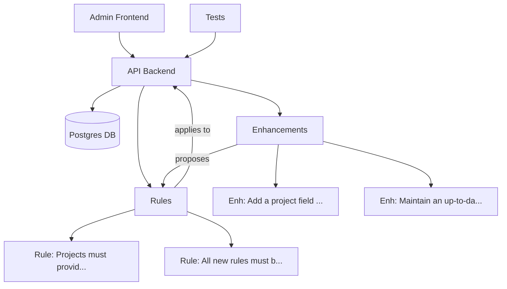

# Project Knowledge Graph

## Overview

This knowledge graph is auto-generated from the database.

## Entities

- **API Backend:** FastAPI app, serves rules and proposals.
- **Admin Frontend:** React/Vite app for admin tasks.
- **Rules:** Stored in DB, managed via API.
- **Enhancements:** Suggestions for new rules or features.
- **Tests:** Pytest suite, run via Makefile.ai.

## Workflows

1. **Propose Rule:**  
   User → `/propose-rule-change` → API → DB

2. **Suggest Enhancement:**  
   User → `/suggest-enhancement` → API → DB

3. **Approve Rule:**  
   Admin → `/approve-rule-change/{id}` → API → DB

4. **Run Tests:**  
   `make -f Makefile.ai ai-test` → Docker → API → DB

## References

- [ONBOARDING.md](./ONBOARDING.md)
- [RULES.md](./RULES.md)
