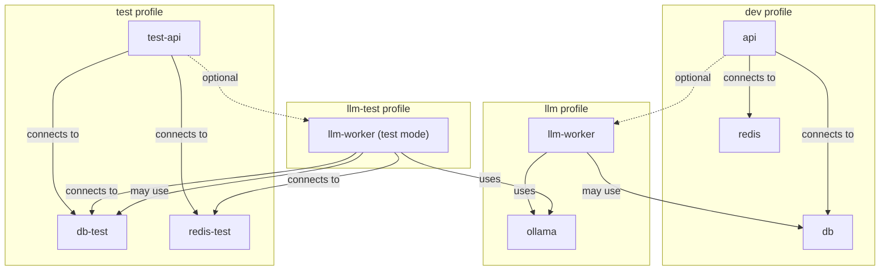

# Welcome to Project Onboarding!

Welcome to the AI IDE API project! This onboarding guide will help you get started, whether you are a core team member, an external collaborator, or an adventurous power user.

## 🏴‍☠️ Meet the Crew

Welcome aboard! Here are the core members of our AI-augmented development crew:

| Role                      | Name                              | Description                                      |
|---------------------------|-----------------------------------|--------------------------------------------------|
| Captain (You!)            | Captain Abby (or your name)       | Vision, leadership, final say                    |
| Vice Captain (Senior Dev) | Vice Captain "Rusty" Stack        | Cautious, experienced, witty; trusted second-in-command |
| AI Researcher             | Dr. Ada Deepmind                  | Visionary, collaborative, always exploring new frontiers |
| Junior Dev                | Sammy "Shipmate" Gale             | Eager, optimistic, quick to learn                |
| AI Assistant              | Quartermaster "Patch" McDebug     | Surly, relentless bug-hunter (AI assistant)      |
| Database Specialist       | Dave the Database Deckhand        | Steady, detail-oriented, keeps the data flowing  |
| Automation Engineer       | Mike the Automation Mechanic      | Inventive, efficient, always scripting something |
| Product/UX Specialist     | Navigator "Maple" Cartwright      | Insightful, user-focused, charts the best course |
| Security/DevSecOps        | Lookout "Eyes" Hawkins            | Vigilant, sharp-eyed, always scanning for threats|
| Project Manager           | Quartermaster "Penny" Ledger      | Organized, diplomatic, keeps the crew on schedule|
| QA/Test Specialist        | Surgeon "Doc" Testwell            | Methodical, precise, always ready with a test    |
| Ops/Infra Specialist      | Boatswain "Bosun" Riggs           | Practical, hands-on, keeps the ship afloat       |
| Intern/Apprentice         | "Bitsy" Byte                      | Curious, eager, learning the ropes               |

**Group Photo:**

```
   Captain Abby   Vice Captain Rusty   Dr. Ada Deepmind   Shipmate Gale   Patch McDebug   Dave the Database Deckhand   Mike the Automation Mechanic   Maple Cartwright   Eyes Hawkins   Penny Ledger   Doc Testwell   Bosun Riggs   Bitsy Byte
      (You)             (🧔)                (👩‍🔬)             (🧑‍🎓)            (🤖)             (🧔)                (🤖)                  (🧭)            (👀)         (💼)         (🩺)         (⚓️)        (🧒)

      [⚓️]         [🪝]                [🔬]              [🌊]           [🦾]             [🧔]                [🤖]                  [🧭]            [👀]         [💼]         [🩺]         [⚓️]        [🧒]

   (Imagine a group of pirates, scientists, and an AI robot on the deck of a ship!)
```

*This crew will appear in onboarding stories, user scenarios, and feedback loops throughout the docs. Add your own character if you like!*

**📝 See the [Pirate's Log](PIRATES_LOG.md) for the latest crew updates, perspectives, and project milestones. New crew are encouraged to add their own entries!**

---

## 🧑‍🚀 Crew Bios

**Captain Abby (or your name)**  
Visionary leader and captain of the ship. Guides the crew through uncharted waters, always ready to chart a new course or rally the team in a storm.

**Vice Captain "Rusty" Stack**  
A seasoned developer with a sharp eye for detail and a healthy skepticism of newfangled tech. Keeps the ship running tight and never shies from a code review duel.

**Dr. Ada Deepmind**  
The ship's AI researcher and scientific mind. Always curious, always experimenting, and always ready to explain the latest breakthrough to the crew.

**Sammy "Shipmate" Gale**  
The eager junior dev, full of questions and energy. Quick to learn, quick to help, and always the first to try out a new feature or fix a bug.

**Quartermaster "Patch" McDebug**  
The surliest, most relentless bug-hunter on the seven seas (and your AI assistant). Patch keeps the codebase shipshape and never lets a bug escape justice.

**Dave the Database Deckhand**  
Steady and detail-oriented, Dave keeps the databases running smooth and the backups safe. If there's a data leak or a migration storm, he's the first to grab a bucket (or a psql prompt).

**Mike the Automation Mechanic**  
Inventive and efficient, Mike is always building new scripts, CI jobs, and clever tools to keep the ship running with minimal manual effort. If it can be automated, Mike's already halfway done.

**Navigator "Maple" Cartwright**  
Insightful and user-focused, Maple charts the best course for the ship, ensuring features are discoverable and the user experience is smooth. Always ready with a new map or a fresh perspective.

**Lookout "Eyes" Hawkins**  
Vigilant and sharp-eyed, Eyes is always scanning the horizon for threats, vulnerabilities, or storms. No patch goes uninspected, and no bug sneaks past their watch.

**Quartermaster "Penny" Ledger**  
Organized and diplomatic, Penny keeps the crew on schedule, the backlog in order, and the cargo (tasks) accounted for. Every sprint is shipshape under Penny's watch.

**Surgeon "Doc" Testwell**  
Methodical and precise, Doc patches up bugs and keeps the codebase healthy. Always ready with a test case or a fix for a failing build.

**Boatswain "Bosun" Riggs**  
Practical and hands-on, Bosun keeps the ship (infrastructure) afloat and the sails (servers) trimmed. First to respond to a failing build or a downed service.

**"Bitsy" Byte**  
The curious and eager intern, Bitsy is always asking questions, picking up new skills, and bringing fresh energy to the crew. Learning the ropes from everyone aboard.

---

## 🫂 Buddy System

To make sure every new crew member feels welcome and supported, we use a buddy system. Each new crew member (real or persona) is paired with a buddy who matches their interests or needs. Your buddy is your go-to for questions, code reviews, and general support during your first weeks aboard.

| New Crew Member (Persona)      | Buddy (Persona)                  | Why This Works                                 |
|-------------------------------|----------------------------------|------------------------------------------------|
| Sammy “Shipmate” Gale         | Shipmate Gale (default buddy)    | Friendly, junior-focused, always available     |
| “Bitsy” Byte (Intern)         | Shipmate Gale                    | Both are learning, Gale is a step ahead        |
| New Dev (real person)         | Shipmate Gale or Rusty Stack     | Gale for onboarding, Rusty for code reviews    |
| New AI/LLM Contributor        | Dr. Ada Deepmind                 | AI/LLM expertise, collaborative spirit         |
| New Database/Backend Dev      | Dave the Database Deckhand       | Database, migrations, and backend guidance     |
| New Automation/CI/CD Dev      | Mike the Automation Mechanic     | Automation, scripting, CI/CD best practices    |
| New Product/UX Contributor    | Navigator “Maple” Cartwright     | Product, UX, and user journey expertise        |
| New Security/DevSecOps        | Lookout “Eyes” Hawkins           | Security, best practices, threat modeling      |
| New QA/Test Specialist        | Surgeon “Doc” Testwell           | Testing, QA, and bug triage                    |
| New Ops/Infra Specialist      | Boatswain “Bosun” Riggs          | Infrastructure, deployment, monitoring         |
| New Project Manager/Scrum     | Quartermaster “Penny” Ledger     | Agile, process, and team coordination          |

**Default fallback buddy:**
If you're not sure who your buddy is, Shipmate Gale is always happy to help or point you in the right direction!

### How It Works
- When you join the crew, you'll be paired with a buddy based on your interests or role.
- Your buddy will help you get set up, answer questions, and review your first PRs.
- If you're ever unsure who to ask, Shipmate Gale is always available for a chat!

*Don't be shy—your buddy is here to help you succeed!*

---

# Pirate Rule: Ship's Log Entry Order

> **Always prepend new entries to the top of `PIRATES_LOG.md` so the most recent log is first, like a true ship's log.**

---

# Pirate Rule: Crew Log Participation

> **As the project progresses, crew members (personas) should make log entries in `PIRATES_LOG.md` to record their unique perspectives on major updates, milestones, or challenges. This keeps the log lively, diverse, and true to the spirit of the crew.**

---

# Pirate Rule: Automated Log Entry Reminders

> **After every major update, milestone, or challenge, a reminder should be issued (by the Captain, Quartermaster Patch, or automation) for crew members to add a new entry to `PIRATES_LOG.md`. This ensures the log stays up to date and reflects the evolving story of the project.**

---

# Pirate Rule: Celebrate Every Win

> **After every major win, the crew must log a celebratory entry in `PIRATES_LOG.md`, with reflections from at least two crew members (personas). This keeps morale high and the crew's story alive!**

---

## Choose Your Onboarding Path:

- **[Internal Developer Onboarding →](ONBOARDING_INTERNAL.md)**
  - For core team members and contributors who need full access to dev tools, advanced Makefile targets, and deep-dive workflows.

- **[External/Partner Onboarding →](ONBOARDING_EXTERNAL.md)**
  - For external users, partners, or integrators who want a streamlined setup, essential Makefile targets, and extension instructions.

- **[Onboarding Adventures (Advanced/Experimental) →](ONBOARDING_ADVENTURES.md)**
  - For those interested in advanced, experimental, or power-user onboarding stories and integrations.

---

**Tip:** You can always return to this page to choose a different path or explore more advanced topics as your needs evolve.

# Onboarding Guide

## 🚨 What's New (June 2024)

- **Expanded Test Coverage:**
  - Full test suite now covers bug reporting, enhancement workflows, proposal/enhancement transfers, and all major endpoints.
  - See the new tests in `tests/test_rule_api_server.py` for examples.
- **New API Endpoints:**
  - `/bug-report`, `/suggest-enhancement`, `/enhancements`, `/enhancement-to-proposal/{id}`
  - `/reject-enhancement/{id}`, `/proposal-to-enhancement/{id}`, `/accept-enhancement/{id}`, `/complete-enhancement/{id}`
  - `/changelog` (Markdown changelog for humans/UIs)
  - `/changelog.json` (Structured changelog for programmatic access)
- **Enhancement & Bug Workflow:**
  - Submit, accept, complete, transfer, and reject enhancements via API or UI.
  - Bug reports and enhancements are now first-class citizens in the workflow.
- **Rule Versioning:**
  - Proposals can now reference `rule_id` for updates; rule version history is accessible via `/rules/{rule_id}/history`.
  - **Changelog endpoints:** `/changelog` returns the Markdown changelog for UI/human consumption, `/changelog.json` returns a structured JSON changelog for automation and bots.
- **Makefile.ai Targets:**
  - New targets for enhancements, bug reports, migrations, and DB management.
- **Onboarding & Integration:**
  - Improved onboarding for AI IDEs and automation. See `ONBOARDING_OTHER_AI_IDE.md` and `INTEGRATING_AI_IDE.md`.
- **Best Practices:**
  - Always use Makefile.ai, Docker service names, and internal ports. Keep docs up to date as workflows evolve.

---

## 👋 Welcome!

Welcome to the Rule Proposal API project! We're excited to have you here. This project is about making AI a first-class citizen in the development process—enabling both humans and AI to propose, review, and improve rules together. We value collaboration, learning, and continuous improvement. If you're new, don't hesitate to ask questions or suggest changes—your fresh perspective is valuable!

## Why This Project?
- To create a self-improving, human-reviewed rule management system.
- To make onboarding, testing, and rule evolution easy and transparent.
- To foster a collaborative environment between humans and AI.

---

## ✅ Quick Start Checklist

- [ ] Clone the repo: `git clone <repo-url>`
- [ ] Enter the project directory: `cd <project-dir>`
- [ ] Build Docker images: `make build`
- [ ] **Start the dev server (preferred):** `make up` (or `make up PORT=9001` to use a custom port)
- [ ] Visit the API docs: [http://localhost:9103/docs](http://localhost:9103/docs)
- [ ] Run the tests: `make test` (human readable) or `make test-json` (AI/automation friendly)
- [ ] Run a specific test: `make test-one TEST=test_rule_api_server.py::test_docs_endpoint`
- [ ] Run the coverage report: `make coverage`
- [ ] Propose a test rule via the API docs (see below!)
- [ ] **Stop containers:** `make down`
- [ ] Review the '🧠 Memory Graph Quickstart' section in ONBOARDING_OTHER_AI_IDE.md for ready-to-run scripts to:
  - Add/list nodes and edges
  - Traverse the memory graph (single/multi-hop)
  - Filter by relation type
  - Export the graph for visualization

> **Note:** The default API server port for this project is **9103**. Update your client, integration, and rule config URLs accordingly.

> **Note:** The API will be available at [http://localhost:<PORT>](http://localhost:<PORT>) when using `make up` or `make up PORT=9001`.

---

**New to this project?**
Check out the [Glossary](docs/onboarding/GLOSSARY.md) for definitions of common terms and acronyms used throughout the docs and codebase. If you see a word you don't know, it's probably in there!

**Want a visual overview?**
Take the [Codebase Tour](docs/onboarding/CODEBASE_TOUR.md) for diagrams and deep dives into how the project fits together.

---

## 🏗️ Architecture Overview (Updated)

This project uses a split architecture with Docker Compose:

- **FastAPI Backend** (`api`):
  - Serves the Rule Proposal API (CRUD for rules, proposals, etc.)
  - Runs on port 8000 (configurable via `PORT`)
- **React Admin Frontend** (`frontend`):
  - Modern admin UI for reviewing, approving, and rejecting rule proposals
  - Built with Vite/React, served by nginx
  - Runs on port 3000 by default (configurable via `ADMIN_FRONTEND_PORT`)
- **Docker Compose** orchestrates both services for local dev and deployment
- **Postgres Database** (`rules-postgres`):
  - Stores all rules, proposals, enhancements, and feedback
  - Runs in a Docker container for portability and consistency

### MermaidJS Architecture Diagram
```mermaid
graph TD
  User[User or Admin]
  DB[rules-postgres (Postgres)]

  subgraph Frontend
    FE[Admin Frontend - React]
  end

  subgraph Backend
    BE[API Backend - FastAPI]
  end

  User -->|Web Browser| FE
  FE -->|HTTP API calls| BE
  BE -->|DB access| DB
```

### Service Ports
- **Frontend:** http://localhost:3000 (or your chosen `ADMIN_FRONTEND_PORT`)
- **Backend:** http://localhost:9103 (or your chosen `PORT`)

### How They Communicate
- The frontend makes API requests to the backend (default: `http://localhost:9103`)
- CORS is enabled in FastAPI for local development
- Both services can be started/stopped together with:
  ```bash
  ADMIN_FRONTEND_PORT=4000 make -f Makefile.ai ai-up
  ```

---

## 🐳 Service Profiles, Environment Management, and Worker Testing

Our project uses Docker Compose with **profiles** to keep development, testing, and advanced features (like LLM workers) cleanly separated. This ensures:
- Developers only run the services they need.
- Environment variables are always correct for each context.
- Onboarding is fast and confusion-free.

### Service Profiles & Workflows

| Profile      | Services Included         | Typical Use Case                | Env File(s) Used         |
|--------------|--------------------------|---------------------------------|--------------------------|
| `dev`        | api, db, redis           | Core development                | `.env`, `.env.dev`       |
| `llm`        | llm-worker, ollama       | LLM/AI feature development      | `.env`, `.env.llm`       |
| `test`       | test-api, db-test, redis-test | Backend/API testing         | `.env`, `.env.test`      |
| `llm-test`   | llm-worker (test mode)   | LLM worker integration/unit test| `.env`, `.env.llm-test`  |

---

### Environment Variable Management

- **Global defaults** go in `.env`.
- **Profile/service-specific overrides** go in `.env.dev`, `.env.llm`, `.env.test`, `.env.llm-test`, etc.
- **Each service** specifies which env files it loads in `docker-compose.yml` via the `env_file` key.
- **Never mix test and dev settings in the same env file.**

**Example:**
```yaml
services:
  api:
    profiles: ["dev"]
    env_file:
      - .env
      - .env.dev
    # ...

  llm-worker:
    profiles: ["llm"]
    env_file:
      - .env
      - .env.llm
    # ...

  llm-worker-test:
    profiles: ["llm-test"]
    env_file:
      - .env
      - .env.llm-test
    # ...
```

---

### Starting and Stopping Services

**Makefile targets (recommended):**
```makefile
dev-up:
	cp .env.dev .env
	docker compose --profile dev up -d

llm-up:
	cp .env.llm .env
	docker compose --profile llm up -d

test-up:
	cp .env.test .env
	docker compose --profile test up -d

llm-test-up:
	cp .env.llm-test .env
	docker compose --profile llm-test up -d

down:
	docker compose down
```

**Manual commands:**
```bash
# Start core dev services
docker compose --profile dev up

# Start LLM worker for dev
docker compose --profile llm up

# Start LLM worker for testing
docker compose --profile llm-test up
```

---

### Testing Workers

- To test the LLM worker in isolation or with test services:
  1. Ensure `.env.llm-test` is present and configured for test DB, Redis, etc.
  2. Run `make llm-test-up` (or the manual command above).
  3. The worker will connect to test services, not production/dev ones.

---

### Best Practices

- **Only run the services you need** for your current workflow.
- **Never mix dev and test environment variables** in the same file.
- **Document any new profiles or env files** when adding new services or workflows.
- **Update Makefile targets and onboarding docs** as the project evolves.

---

### Troubleshooting

- **Wrong DB/Redis?**  Double-check which env file is being used for the service/profile you started.
- **Port conflicts?**  Run `make down` or `docker compose down` to stop all containers.
- **Service not starting?**  Ensure the correct profile and env file are being used.

---

### Extending the System

- **To add a new service or workflow:**
  1. Decide which profile(s) it belongs to.
  2. Create a dedicated env file if needed.
  3. Add the service to `docker-compose.yml` with the correct `profiles` and `env_file`.
  4. Add/modify Makefile targets.
  5. Update this documentation.

---

### Quick Reference Table

| Task/Role         | Command/Target      | Services Started         | Env File(s) Used         |
|-------------------|--------------------|-------------------------|--------------------------|
| Core Dev          | `make dev-up`      | api, db, redis          | `.env`, `.env.dev`       |
| LLM Features      | `make llm-up`      | llm-worker, ollama      | `.env`, `.env.llm`       |
| API Testing       | `make test-up`     | test-api, db-test, redis-test | `.env`, `.env.test`      |
| LLM Worker Test   | `make llm-test-up` | llm-worker (test mode)  | `.env`, `.env.llm-test`  |
| Stop All          | `make down`        | —                       | —                        |

---

### Service Profiles & Connections (Mermaid)



---

## 🚀 Makefile.ai Targets for Docker Compose Profiles

To make working with Docker Compose profiles easy, we provide Makefile targets for each common workflow. These targets abstract away the Docker Compose commands and help ensure consistency for all contributors.

| Target         | What it Does                                 | Services/Profiles Started         |
|----------------|----------------------------------------------|-----------------------------------|
| dev-up         | Start core dev services                      | api, db, frontend, misc-scripts   |
| llm-up         | Start LLM/AI services                        | ollama-functions, worker          |
| all-up         | Start all dev + LLM services                 | All of the above                  |
| test-up        | Start test environment services              | test-api, test-db, test-frontend, test-misc-scripts |
| llm-test-up    | Start LLM worker in test mode                | test-ollama-functions, test-worker|
| all-test-up    | Start all test + LLM-test services           | All test and llm-test services    |
| down           | Stop all running containers (dev and test)   | —                                 |
| ps             | Show running containers (dev and test)       | —                                 |
| prune          | Clean up stopped containers, networks, images | —                                 |

**Usage Examples:**
```bash
make dev-up        # Start core dev services
make llm-up        # Start LLM/AI services
make all-up        # Start everything (dev + LLM)
make test-up       # Start test environment
make llm-test-up   # Start LLM worker in test mode
make all-test-up   # Start all test + LLM-test services
make down          # Stop everything
make ps            # Show running containers
make prune         # Clean up Docker
```

**Tip:**
If you want to automate copying the correct environment file before starting services, you can add a `cp` command at the start of each Makefile target. For example:
```makefile
dev-up:
	cp change-this-env.api.example .env.dev
	docker compose --profile dev up -d
```
Or document this step in your onboarding for contributors to do manually.

---

## ⚙️ Environment Variable Configuration (Source of Truth)

- **Environment variables** are the source of truth for configuration (e.g., API host, port).
- The `.env` file is used **only for Docker Compose variable substitution** in local development. It is **not** loaded by the app at runtime.
- In production, set environment variables directly (in Compose, Kubernetes, or the host environment).

### Example: Setting Variables in Docker Compose
In `docker-compose.yml`:
```yaml
environment:
  - RULE_API_HOST=${RULE_API_HOST:-localhost}
  - RULE_API_PORT=${RULE_API_PORT:-9103}
```

Or set them in your shell before running Compose:
```bash
export RULE_API_HOST=localhost
export RULE_API_PORT=9001
make up
```

### Example: Setting Variables in Production
- Set environment variables in your deployment system (e.g., Docker Compose, Kubernetes, or directly on the host).
- Do **not** rely on `.env` files or `python-dotenv` in production containers.

---

## 🤖 AI/Automation Friendly Testing

- **Machine-readable test output:**
  - Run `make test-json` to execute tests and output results as `pytest-report.json` (great for AI agents or CI parsing).
  - Example:
    ```bash
    make test-json
    # Output: pytest-report.json
    ```
- **Run a specific test or file:**
  - Use `make test-one TEST=<test_path_or_name>` to run a single test or file.
  - Example:
    ```bash
    make test-one TEST=test_rule_api_server.py::test_docs_endpoint
    ```
- **Human-readable output:**
  - Use `make test` for standard pytest output.

---

## 🛠️ Common Pitfalls & Troubleshooting
- **Docker not running?** Make sure Docker Desktop is started.
- **Port in use?** Use a different port: `make up PORT=9001` or `make up-detached PORT=9002`.
- **File permission errors?** Try running `sudo chown -R $USER:$USER .` in the project directory.
- **Tests not running?** Make sure you're using `make test` (not running pytest directly).
- **Still stuck?** See the next section!

---

## 💬 How to Get Help
- Ask in your team chat (Slack/Discord/etc.)
- Open a GitHub Issue
- Reach out to your onboarding buddy or project maintainer
- Don't be shy—everyone was new once!

---

## 🚀 First Contribution Guide
- Try proposing a sample rule using the API docs (`/propose-rule-change` endpoint)
- Add or improve a test in `test_rule_api_server.py`
- Suggest a doc update if you spot something unclear
- Ask for a pairing session if you want to learn the workflow hands-on

---

## 📝 Rule Proposal Template
When proposing a rule, use this example in the API docs or as a JSON payload:
```json
{
  "rule_type": "pytest_execution",
  "description": "All pytest runs must use Makefile.ai.",
  "diff": "Add rule: Use Makefile.ai for pytest.",
  "submitted_by": "your-name"
}
```

---

## 🔄 Ongoing Improvements
- Please update this doc as the project evolves!
- Add new onboarding tips, gotchas, or workflow changes here.
- Suggest improvements to the workflow, rules, or documentation.
- After your first week, let us know what could be clearer or easier!

---

## Debugging: Environment Detection

The API provides a `/env` endpoint to help you determine which environment (test, production, etc.) the server is running in.

- **Endpoint:** `GET /env`
- **Description:** Returns the current environment as set by the `ENVIRONMENT` environment variable (defaults to `production`).
- **Example Response:**
  ```json
  { "environment": "test" }
  ```
- **Example Usage:**
  ```bash
  curl http://localhost:9103/env
  ```

This is useful for debugging, CI, and AI-IDE integration.

---

## External AI-IDE Communication Flow

External AI-IDEs or clients can interact with the Rule API to propose new rules or fetch existing rules. This diagram shows the flow for both operations:

```mermaid
graph TD
  AIIDE[Other AI-IDE or Client]
  API[API Backend - FastAPI]
  DB[rules-postgres (Postgres)]

  AIIDE -- "POST /propose-rule-change" --> API
  AIIDE -- "GET /rules or /rules-mdc" --> API
  API -- "DB access" --> DB
```

Welcome aboard! If you have questions, open an issue or ask a teammate. We're glad you're here. 🚀 

---

## Workflows

This section documents key automated workflows for development, testing, and rule management. Use these commands and patterns to keep your workflow efficient and consistent.

### 1. Run All Tests
**What:** Run the full test suite in Docker.

**How:**
```bash
make -f Makefile.ai ai-test
```
**When:** Before pushing code, after major changes, or to verify a clean state.

**Troubleshooting:**
- Ensure Docker is running and containers are up.
- If tests fail, check logs and use `make -f Makefile.ai ai-test-json` for machine-readable output.

---

### 2. Lint All Code
**What:** Lint the codebase for style and errors.

**How:**
```bash
make -f Makefile.ai ai-lint-rules
```
**When:** Before PRs, after editing rules, or to enforce style.

**Troubleshooting:**
- Fix any errors or warnings shown in the output.

---

### 3. Approve All Pending Proposals
**What:** Approve every rule proposal currently marked as pending.

**How:**
```bash
make -f Makefile.ai ai-approve-all-pending
```
**When:** After reviewing proposals, or to batch-approve after a bulk import.

**Troubleshooting:**
- Ensure the API is running and the database is accessible.
- If you see errors, check the logs or try `make -f Makefile.ai ai-scan-db` to inspect the DB state.

---

### 4. Environment Management
**What:** Start or stop all services (backend, frontend) with Docker Compose.

**How:**
```bash
ADMIN_FRONTEND_PORT=4000 make -f Makefile.ai ai-up   # Start all services
make -f Makefile.ai ai-down                          # Stop all services
```
**When:** At the start/end of a dev session, or to reset the environment.

**Troubleshooting:**
- If a port is in use, change the port variable (e.g., `ADMIN_FRONTEND_PORT=4001`).
- Use `make -f Makefile.ai ai-status` to check running containers.

---

## API Endpoints (Expanded)

| Endpoint                                 | Method | Description                                 |
|------------------------------------------|--------|---------------------------------------------|
| `/rules`                                 | GET    | List all approved rules (filterable)        |
| `/rules/{rule_id}`                       | GET    | Get a specific rule by ID                   |
| `/rules/{rule_id}/history`               | GET    | Get version history for a rule              |
| `/propose-rule-change`                   | POST   | Submit a new rule proposal                  |
| `/approve-rule-change/{proposal_id}`     | POST   | Approve a proposal                          |
| `/reject-rule-change/{proposal_id}`      | POST   | Reject a proposal                           |
| `/bug-report`                            | POST   | Submit a bug report                         |
| `/suggest-enhancement`                   | POST   | Suggest an enhancement                      |
| `/enhancements`                          | GET    | List all enhancements                       |
| `/enhancement-to-proposal/{id}`          | POST   | Transfer enhancement to proposal            |
| `/reject-enhancement/{id}`               | POST   | Reject an enhancement                       |
| `/proposal-to-enhancement/{id}`          | POST   | Revert proposal to enhancement              |
| `/accept-enhancement/{id}`               | POST   | Accept an enhancement                       |
| `/complete-enhancement/{id}`             | POST   | Complete an enhancement                     |
| `/env`                                   | GET    | Get current environment                     |

See `/docs` for full OpenAPI schema and request/response details.

---

## 🧪 Enhancement & Bug Workflow

- **Submit an enhancement:** `/suggest-enhancement` (API or UI)
- **List enhancements:** `/enhancements`
- **Accept/complete enhancement:** `/accept-enhancement/{id}` → `/complete-enhancement/{id}`
- **Transfer enhancement to proposal:** `/enhancement-to-proposal/{id}`
- **Reject enhancement:** `/reject-enhancement/{id}`
- **Revert proposal to enhancement:** `/proposal-to-enhancement/{id}`
- **Submit a bug report:** `/bug-report`
- **Status transitions:**
  - Enhancement: `open` → `accepted` → `completed` (or `rejected`/`transferred`)
  - Proposal: `pending` → `approved`/`rejected`/`reverted_to_enhancement`

---

## 🧪 Rule Versioning & History

- **Proposals for rule updates** should include a `rule_id` field referencing the rule to update.
- **On approval:** The rule's version is incremented, and the previous version is saved to history.
- **Access history:** `/rules/{rule_id}/history` returns all previous versions and metadata.

---

## 🛠️ Makefile.ai Targets (Expanded)

- `ai-test`, `ai-test-one`, `ai-test-json`: Run tests
- `ai-accept-enhancement`, `ai-complete-enhancement`: Accept/complete enhancements
- `ai-list-enhancements`: List enhancements (optionally by status)
- `ai-proposal-to-enhancement`: Revert proposal to enhancement
- `ai-db-autorevision`, `ai-db-migrate`: DB migrations
- `ai-bug-report`, `ai-suggest-enhancement`: Submit bug/enhancement via CLI
- See `Makefile.ai` for the full list and usage examples

---

## 📚 Best Practices (Updated)
- Always use Makefile.ai for all automation (tests, builds, migrations, DB, etc.)
- Use Docker service names and internal ports for all connections
- Keep rule frontmatter minimal (`description`, `globs`)
- Document new rules, endpoints, and workflows as they evolve
- Keep onboarding and integration docs up to date
- Never mix test and dev environments
- Add/expand tests for new features and workflows

---

## 🛡️ Database Backup, Restore, and Nuke (NEW)

**Backup the database:**
```bash
make -f Makefile.ai ai-db-backup
# or data-only:
make -f Makefile.ai ai-db-backup-data-only
```
Creates a timestamped SQL file in `backups/`.

**Restore the database:**
```bash
make -f Makefile.ai ai-db-restore BACKUP=backups/rulesdb-YYYYMMDD-HHMMSS.sql
# or data-only:
make -f Makefile.ai ai-db-restore-data BACKUP=backups/rulesdb-data-YYYYMMDD-HHMMSS.sql
```

**Nuke the database (danger!):**
```bash
make -f Makefile.ai ai-db-nuke
```
This will delete ALL Postgres data and volumes, then re-run migrations.

**Troubleshooting:**
- If you see enum or duplicate key errors on restore, ensure your schema matches the backup and use data-only restore if needed.
- Always use internal Docker service names and ports (e.g., `test-db:5432` for test, `db:5432` for dev).

---

## 🌍 Portable Rules Import/Export (NEW)

**Propose a portable rule:**
```bash
make -f Makefile.ai ai-propose-portable-rule \
  RULE_TYPE=formatting \
  DESCRIPTION='All .mdc files must have frontmatter' \
  DIFF='---\ndescription: ...\nglobs: ...\n---' \
  SUBMITTED_BY=portable-rules-bot \
  CATEGORIES='"formatting","cursor","portable"' \
  TAGS='"formatting","cursor","portable"' \
  PROJECT=portable-rules
```

**Batch import portable rules:**
```bash
bash scripts/batch_import_portable_rules.sh
```

---

## 📋 Viewing Logs (NEW)

Use these Makefile.ai targets to view logs for troubleshooting:

- **All containers:**
  ```bash
  make -f Makefile.ai logs
  ```
  Shows the last 100 lines for API, test-db, and frontend containers.

- **API only:**
  ```bash
  make -f Makefile.ai logs-api
  ```

- **Database only:**
  ```bash
  make -f Makefile.ai logs-db
  ```

---

## 🔑 Makefile.ai Target Reference (Updated)

| Target                        | Description                                    |
|-------------------------------|------------------------------------------------|
| ai-test, ai-test-one, ai-test-json | Run tests (all, one, or JSON output)      |
| ai-db-migrate, ai-db-autorevision  | Run/apply DB migrations                   |
| ai-db-backup, ai-db-backup-data-only | Backup DB (full/data-only)              |
| ai-db-restore, ai-db-restore-data   | Restore DB (full/data-only)              |
| ai-db-nuke, ai-db-drop-recreate     | Nuke or reset DB (danger!)               |
| ai-propose-portable-rule            | Propose a portable rule                  |
| ai-approve-all-pending              | Approve all pending proposals            |
| ai-up, ai-down, ai-build, ai-rebuild-all | Start/stop/build/rebuild services   |
| ai-list-rules, ai-list-rules-mdc    | List rules (JSON/MDC)                    |
| ai-onboarding-health                | Run onboarding health check              |
| logs, logs-api, logs-db             | View logs for all, API, or DB containers |

See `Makefile.ai` for the full list and usage examples.

---

## 📌 Port Usage (Reminder)
- **Default API port:** `9103` (update all configs, docs, and clients accordingly)
- **Frontend port:** `3000` (or as set by `ADMIN_FRONTEND_PORT`)
- Always use Docker service names and internal ports for all connections.

---

## 🛡️ Backup/Restore Disaster Recovery Test Workflow

For the full, AI-friendly backup/restore and disaster recovery workflow—including automated test phases and host-side restore scripts—see:

- [docs/user_stories/backup_and_restore.md](docs/user_stories/backup_and_restore.md)

This user story is the canonical, up-to-date reference for all backup, restore, and disaster recovery operations in this project.

---

## 🧠 Saving and Using Memories (Memory Graph API)

The AI-IDE API supports a powerful memory graph for storing, relating, and searching ideas, notes, and code snippets using semantic embeddings and relationships.

### Why use it?
- Build context-aware assistants, code reviewers, or knowledge explorers.
- Store and traverse ideas, notes, and code with semantic search and explicit relationships.
- Share and query knowledge across multiple AI IDEs or agents.

### How to use it?
- **Add a memory node:**
  ```bash
  curl -X POST http://localhost:9103/memory/nodes \
    -H "Content-Type: application/json" \
    -d '{"namespace": "notes", "content": "This is an idea about AI memory.", "meta": "{\"tags\":[\"ai\",\"memory\"]}"}'
  ```
- **List all memory nodes:**
  ```bash
  curl http://localhost:9103/memory/nodes | jq .
  ```
- **Add a relationship (edge):**
  ```bash
  curl -X POST http://localhost:9103/memory/edges \
    -H "Content-Type: application/json" \
    -d '{"from_id": "UUID-OF-NODE-1", "to_id": "UUID-OF-NODE-2", "relation_type": "inspired_by", "meta": "{\"note\": \"A inspired B\"}"}'
  ```
- **List all edges:**
  ```bash
  curl http://localhost:9103/memory/edges | jq .
  ```
- **Search for similar nodes:**
  ```bash
  curl -X POST http://localhost:9103/memory/nodes/search \
    -H "Content-Type: application/json" \
    -d '{"text": "Find similar ideas about AI memory.", "namespace": "notes", "limit": 5}'
  ```

For more advanced usage, traversal, and best practices, see [`docs/user_stories/ai_memory_graph_api.md`](docs/user_stories/ai_memory_graph_api.md).

## Docker Postgres Service Names

| Environment | Service Name |
|-------------|--------------|
| Dev/Prod    | db           |
| Test/CI     | test-db      |

> **Note:** All general usage, onboarding, and code samples use `db` as the default Postgres service/container. Use `test-db` only for test/CI environments or when running tests.

---

## 🛡️ API Access & Onboarding Flow (Updated June 2024)

- **API Port for Host Access:** Always use `http://localhost:9104` to access the API from your host machine. Never use `localhost:8000` for direct API access from the host.
- **Internal Docker Service:** Use `test-api:8000` for service-to-service communication within the Docker test network.
- **Token Requirement:** All endpoints except `/onboarding/init` require a valid token. Always start onboarding by calling `/onboarding/init` with `project_name` (and optionally `team_name`).

### Example: Onboarding Flow (Host Machine)

```python
import requests

# Step 1: Obtain token
resp = requests.post("http://localhost:9104/onboarding/init", json={"project_name": "my-project", "path": "internal_dev"})
token = resp.json()["token"]
```

### Example: Onboarding Flow (Inside Docker Network)

```python
resp = requests.post("http://test-api:8000/onboarding-init", json={"project_name": "my-project"})
token = resp.json()["token"]
headers = {"Authorization": f"Bearer {token}"}
resp = requests.get("http://test-api:8000/protected-endpoint", headers=headers)
```

---

> **Quartermaster "Patch" McDebug says:**
> - Use `http://localhost:9104` for API access from your host machine.
> - Use `http://test-api:8000` for API access from inside Docker/test containers.
> - If you must reach the host from a container, use `http://host.docker.internal:9104`.
> - Never use `localhost:8000`, `api:8000`, or `localhost:9103` for direct API access from the host or test containers.
> - And remember, Patch is always watching for scallywags who break the rules!

---

# 5-Minute Quickstart

Follow these steps to get up and running in under 5 minutes:

1. **Clone the repository:**
   ```bash
   git clone <repo-url>
   cd <project-dir>
   ```
2. **Build Docker images:**
   ```bash
   make build
   ```
   *If you see Docker errors, ensure Docker Desktop is running.*
3. **Start the development environment:**
   ```bash
   make up
   ```
   *If the default port (9103) is in use, run:*
   ```bash
   make up PORT=9001
   ```
4. **Open the API docs in your browser:**
   - Visit [http://localhost:9103/docs](http://localhost:9103/docs) (or your chosen port)
   - You should see the interactive API documentation.
   *If the page doesn't load, check Docker status and port usage.*
5. **Run the test suite:**
   ```bash
   make test
   ```
   - You should see test results in the terminal.
   *If tests fail to run, make sure you're not running pytest directly and that all containers are up.*
6. **Stop the environment when done:**
   ```bash
   make down
   ```

**Troubleshooting:**
- Docker not running? Start Docker Desktop.
- Port in use? Use the `PORT` variable as shown above.
- Permission errors? Try `sudo chown -R $USER:$USER .` in the project directory.
- Still stuck? See the [Troubleshooting Guide](docs/onboarding/troubleshooting.md).

### Troubleshooting: update-project-map & misc-scripts

If you encounter issues running the update-project-map workflow, follow these steps:

1. **Make sure Docker is running.**
2. **Ensure the `misc-scripts` container is up:**
    ```bash
    docker compose ps | grep misc-scripts
    ```
3. **If not running, start it with:**
    ```bash
    make dev-up
    ```
4. **Check logs for errors:**
    ```bash
    docker compose logs misc-scripts
    ```
5. **Try running the update manually:**
    ```bash
    make -f Makefile.ai update-project-map
    ```
6. **If the problem persists, check for Python or dependency errors in `scripts/update_project_map.py`.**

This ensures you are using the new profile-based workflow and the correct Makefile target for bringing up the required service. 