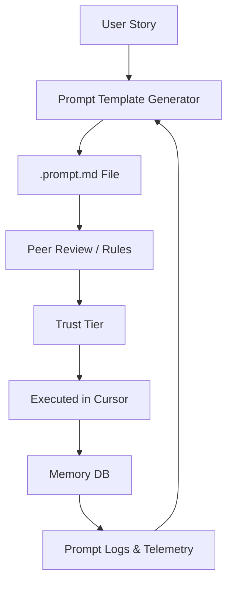

# 🧠 What We Built When AI Development Got Too Messy  
*An engineer's guide to taming the prompt wilderness*

## 1. The Problem: Prompt Sprawl, Fragile Memory, and AI Guesswork

AI is writing code now—but we haven’t built the workflows to manage *how* it does that.

In our team, we hit friction fast:
- Prompts were inconsistent, scattered across terminals, Slack, and memory
- Developers didn’t know what the AI knew—or worse, thought they did
- Onboarding new contributors into “AI-assisted” flows meant sending them docs and hoping they wouldn’t ask

We were supposed to be accelerating. Instead, it felt like we were duct-taping magic.

## 2. What We Needed

We didn’t want an AI assistant—we needed **a system**:
- With versioned prompts  
- With trust levels  
- With memory that persisted across devs, not just sessions  
- With onboarding that actually *taught* prompt fluency  
- With audit trails—not because we don’t trust AI, but because we need to understand it

## 3. What We Built

We built an API-backed framework for **AI-assisted development that scales with teams**. It includes:

- **Prompt versioning**: Stored in-repo, with trust levels (experimental → approved → locked)  
- **Memory DB**: Shared project context for AI agents and humans alike  
- **Pre-commit hooks**: Auto-summarize code into memory for prompt-ready access  
- **Automated onboarding**: AI-readable scripts that train both new devs *and* the AI  
- **Soft governance**: Reviewable, traceable prompts with rule compliance checks—but no rigidity unless we want it

This isn’t a tool. It’s a pattern: treat AI like a junior engineer who needs mentorship, memory, and constraints.

## 4. What Surprised Us

- Onboarding is the hardest part—not technically, but *linguistically*. It has to speak to humans *and* the AI.  
- Developers don’t need more AI—they need better habits. We baked those into the onboarding flow via prompt templates.  
- Rules don’t slow people down when they’re visible, inspectable, and correctable.  
- Logging prompt usage felt weird… until we realized it was just Git history for conversation.

## 5. What’s Next

We’re iterating on:
- Prompt quality feedback loops  
- Trust-level promotion workflows  
- In-editor tips for onboarding within Cursor  
- Prompt→memory→output lineage graphs

Even if no one else wants this yet, we *need* it. And we’re building it for the team we want to be.

## 📈 Diagram: Prompt Lifecycle Flow (example)

## 🔍 Lessons Learned

- Build the AI interface you wish you had—not the one everyone else is using.
- Prompts are code: version them, lint them, review them.
- Memory is strategy. Persistence beats magic.
- You don’t need AI-first workflows. You need AI-augmented developers with *traceable influence*.

## 📌 Coming soon

- [ ] Open-source modules for memory sync and prompt trust management  
- [ ] CLI tools for story→prompt→lineage mapping  
- [ ] Team onboarding dashboard with resume support  

> *“AI can write the code. But only we can teach it how to contribute.”*
