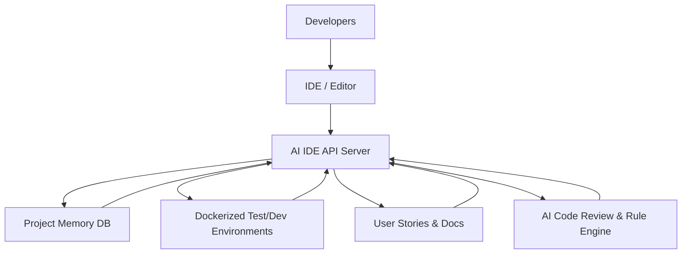
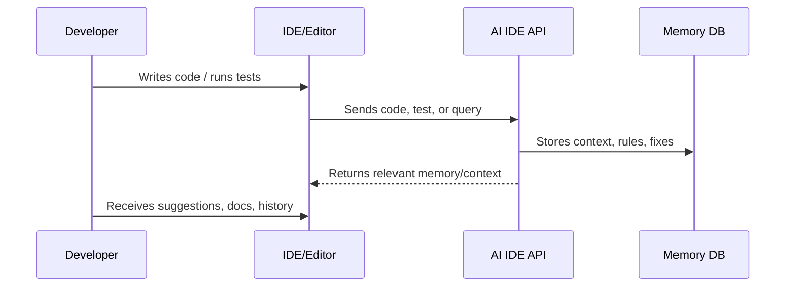
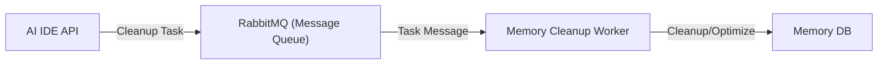

# ⚡️ AI IDE API: Supercharge Your Engineering Workflow

---

## Why Do Engineering Teams Struggle?

- Context switching kills flow
- Onboarding is slow and painful
- Knowledge gets lost
- Teams repeat mistakes
- Testing and debugging are a hassle

---

## The Solution:  
# AI IDE API

- Contextual memory system
- AI-augmented code review
- Frictionless onboarding
- Seamless test & environment management
- Automated error handling

---

## System Architecture Overview

---

## 🧠 Contextual Memory System

- Captures decisions, code patterns, troubleshooting steps
- Surfaces relevant context in your workflow
- Knowledge graph links rules, code, and user stories

---

## Memory System Flow

---

## 🧹 Self-Maintaining Memory

- **Background Workers & Queues:**  
  The system uses message queues (RabbitMQ) and background workers to automatically clean up, archive, and optimize project memory.
- **Always Fast, Always Relevant:**  
  Maintenance tasks run behind the scenes, so your workflow is never interrupted—even as your knowledge base grows.
- **Scales with Your Team:**  
  No manual cleanup or slowdowns—just a lean, high-performing memory system.

---

## 🤖 AI-Augmented Code Review

- Enforces best practices and standards
- Suggests rule and doc updates as patterns emerge
- Catches issues before they hit PRs

---

## 🚀 Frictionless Onboarding

- Guided onboarding paths
- Context-aware tips and memory-driven guidance
- User stories for every workflow and script

---

## 🧪 Seamless Test & Environment Management

- AI-optimized test runs in Docker
- Standardized real vs. mock service usage
- No more "works on my machine" headaches

---

## 🛠️ Error Handling & Debugging

- Descriptive, actionable error responses
- Automated troubleshooting and surfacing of common pitfalls

---

## The Memory System:  
# Your Team's Second Brain

- Never forget a lesson
- Surface what matters, when it matters
- Continuously improves as your project evolves

---

## Who Benefits?

- **Developers:** Less searching, more building
- **Team Leads:** Faster onboarding, consistent best practices
- **The Whole Crew:** Lower support costs, continuous learning

---

## Ready to Ship Faster?

> The AI IDE API isn't just another tool—it's your crew's secret weapon for building better software, faster, and with less pain.
