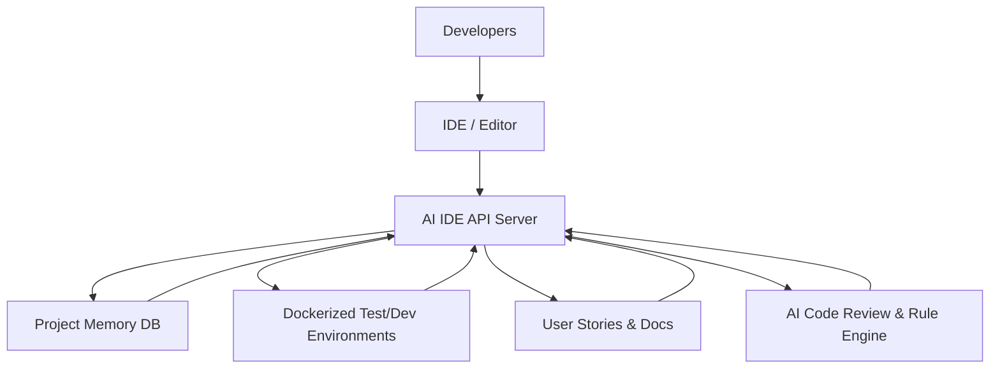
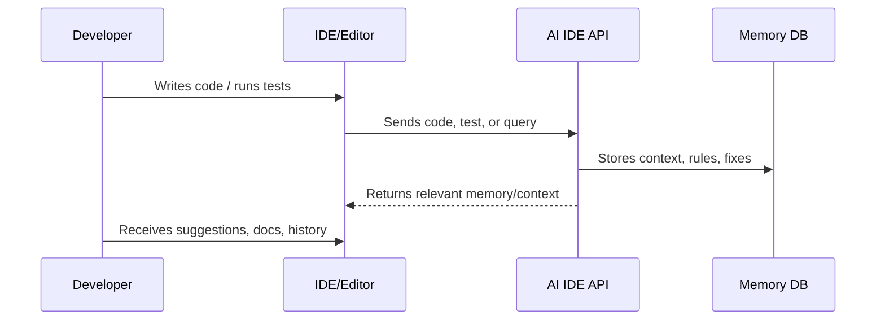
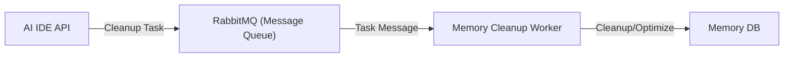
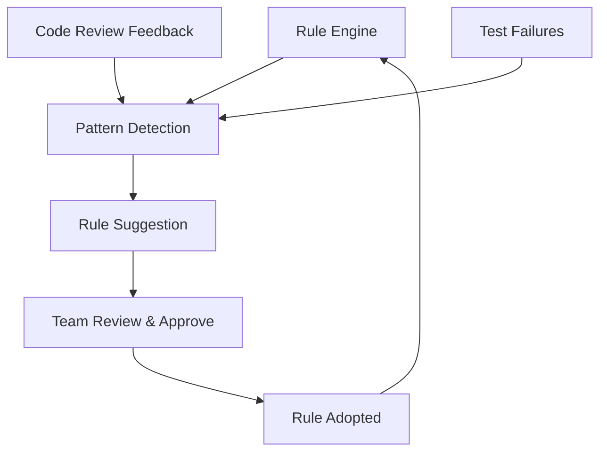
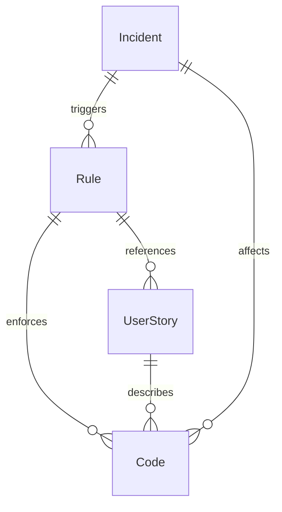
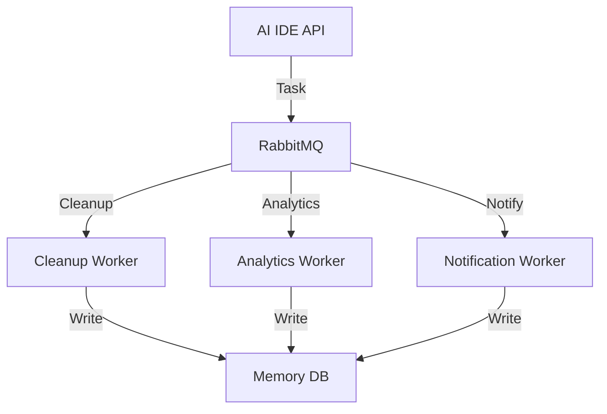
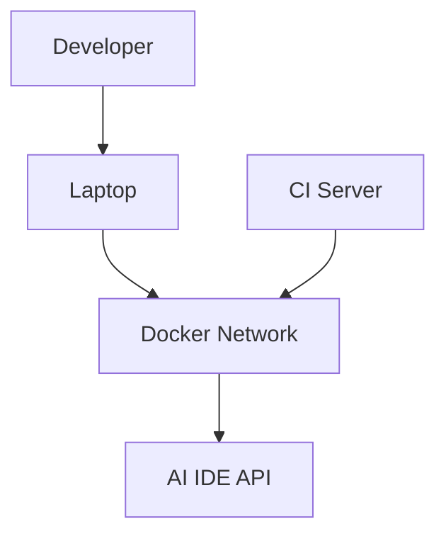
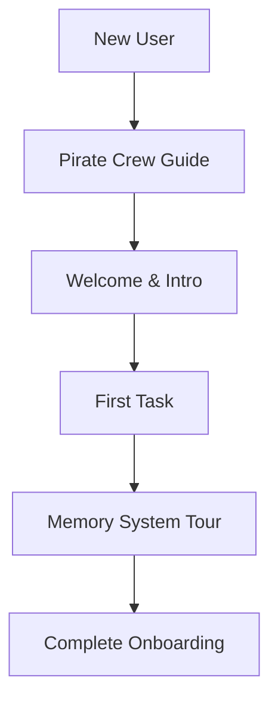
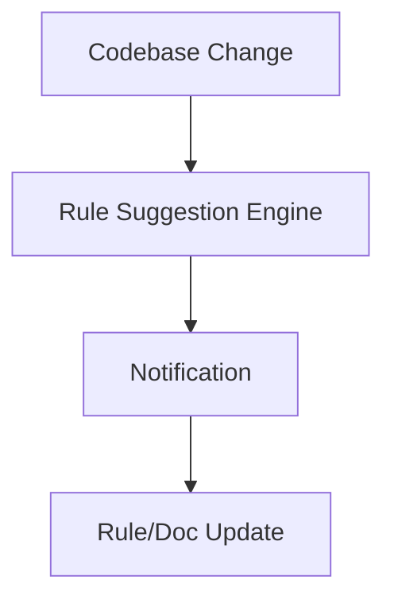

# ⚡️ AI IDE API: Supercharge Your Engineering Workflow

---

## Why Do Engineering Teams Struggle?

- Context switching kills flow
- Onboarding is slow and painful
- Knowledge gets lost
- Teams repeat mistakes
- Testing and debugging are a hassle

---

## The Solution:  
# AI IDE API

- Contextual memory system
- AI-augmented code review
- Frictionless onboarding
- Seamless test & environment management
- Automated error handling

---

## System Architecture Overview



---

## 🧠 Contextual Memory System

- Captures decisions, code patterns, troubleshooting steps
- Surfaces relevant context in your workflow
- Knowledge graph links rules, code, and user stories

---

## Memory System Flow



---

## 🧹 Self-Maintaining Memory

- **Background Workers & Queues:**  
  The system uses message queues (RabbitMQ) and background workers to automatically clean up, archive, and optimize project memory.
- **Always Fast, Always Relevant:**  
  Maintenance tasks run behind the scenes, so your workflow is never interrupted—even as your knowledge base grows.
- **Scales with Your Team:**  
  No manual cleanup or slowdowns—just a lean, high-performing memory system.



---

## 🤖 AI-Augmented Code Review

- Enforces best practices and standards
- Suggests rule and doc updates as patterns emerge
- Catches issues before they hit PRs

---

## 🚀 Frictionless Onboarding

- Guided onboarding paths
- Context-aware tips and memory-driven guidance
- User stories for every workflow and script

---

## 🧪 Seamless Test & Environment Management

- AI-optimized test runs in Docker
- Standardized real vs. mock service usage
- No more "works on my machine" headaches

---

## 🛠️ Error Handling & Debugging

- Descriptive, actionable error responses
- Automated troubleshooting and surfacing of common pitfalls

---

## The Memory System:  
# Your Team's Second Brain

- Never forget a lesson
- Surface what matters, when it matters
- Continuously improves as your project evolves

---

## Who Benefits?

- **Developers:** Less searching, more building
- **Team Leads:** Faster onboarding, consistent best practices
- **The Whole Crew:** Lower support costs, continuous learning

---

## Ready to Ship Faster?

> The AI IDE API isn't just another tool—it's your crew's secret weapon for building better software, faster, and with less pain.

---

## DEMO: Automated Rule Evolution & Feedback Loop

- The system not only enforces rules but also suggests new ones as patterns emerge.
- Feedback from code reviews, test failures, and user actions refines best practices automatically.



- **DEMO:** Show how a new anti-pattern is detected and a rule is proposed, reviewed, and adopted.

---

## DEMO: User Story-Driven Documentation

- Every workflow, script, and Makefile target is linked to a user story.
- Documentation is always up-to-date and discoverable, reducing onboarding friction and tribal knowledge loss.

```shell
# Example: Search for a workflow
$ ai-ide-api search-user-story "test environment setup"

# Output:
User Story: Setting Up the Test Environment
- Motivation: Ensure all tests run in a clean, isolated environment
- Steps: ...
- Related Rules: pytest_flags, environments
- Linked Code: Makefile.ai-test, docker-compose.test.yml
```

- **DEMO:** Search for a workflow and instantly see the user story, related rules, and code.

---

## DEMO: AI-Assisted Troubleshooting

- When errors occur, the system surfaces not just the error, but also related past incidents, fixes, and relevant documentation.
- Reduces time spent searching for solutions and prevents repeated mistakes.

```shell
# Example: Error response
{
  "error": "Connection refused to db-test:5432",
  "suggested_fix": "Check if the db-test container is running and accessible via Docker network.",
  "related_incidents": [
    {
      "date": "2024-05-10",
      "resolution": "Restarted db-test container."
    }
  ],
  "docs": ["testing_docker.mdc", "environments.mdc"]
}
```

- **DEMO:** Trigger a common error and show how the system suggests a fix and links to previous resolutions.

---

## DEMO: Knowledge Graph Visualization

- Visualize relationships between rules, code, user stories, and incidents.
- Makes it easy to trace the "why" behind decisions and see the impact of changes.



- **DEMO:** Show a Mermaid or interactive graph of a rule and its connected entities.

---

## DEMO: Pluggable Worker Architecture

- New background tasks (e.g., for analytics, notifications, or custom cleanups) can be added easily.
- Workers are decoupled and communicate via RabbitMQ, making the system extensible and scalable.



- **DEMO:** Add a new worker for a custom task and show it running in the background.

---

## DEMO: Environment & Service Abstraction

- Developers never have to worry about local vs. Docker vs. CI environments—everything is abstracted and standardized.
- Service names, ports, and environment variables are managed automatically.



```python
# Example: Environment config
POSTGRES_HOST = "db-test"  # Always use Docker service name
POSTGRES_PORT = 5432        # Internal port
```

- **DEMO:** Show how a test runs identically on a laptop and in CI, with no config changes.

---

## DEMO: Security & Auditability

- All rule changes, memory updates, and critical actions are logged and auditable.
- Makes compliance and debugging much easier.

```shell
# Example: Audit log entry
2024-06-10T12:34:56Z | user=abby | action=update_rule | rule=pytest_flags | details="Added -x flag enforcement"
```

- **DEMO:** Show an audit log of rule changes and memory updates.

---

## DEMO: Pirate-Themed Onboarding Adventures

- Unique, engaging onboarding experiences with different "crew members" as guides.
- Makes learning the system fun and memorable, not just another boring checklist.



```json
// Example onboarding step
{
  "step": "Welcome aboard, matey! I'm Quartermaster Patch McDebug. Let's chart yer first course through the AI IDE API!"
}
```

- **DEMO:** Walk through a new user's onboarding adventure.

---

## DEMO: API-First Design

- All features are accessible via a well-documented API, enabling integration with other tools, bots, or custom UIs.

```shell
# Example: Retrieve memory node via API
$ curl -X GET http://localhost:9104/api/memory/node/123
{
  "id": "123",
  "type": "rule",
  "content": "Always use Docker service names in test configs."
}
```

- **DEMO:** Use a simple script or Postman to interact with the API and retrieve memory, rules, or onboarding steps.

---

## DEMO: Continuous Improvement & Rule Suggestion Engine

- The system monitors codebase evolution and suggests when rules or docs should be updated.
- Prevents drift between code and documentation.



- **DEMO:** Show a notification or suggestion triggered by a new code pattern.

---
