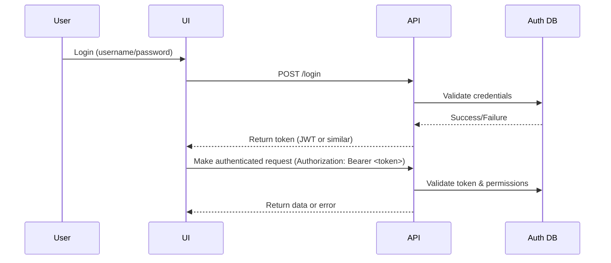

# Authentication & Authorization Guide

This guide explains how authentication and authorization work in this project: what they are, why they matter, how tokens are issued and validated, and how to avoid common pitfalls.

---

## 1. What is Authentication & Authorization?
- **Authentication**: Verifying who a user is ("Are you really who you say you are?").
- **Authorization**: Determining what an authenticated user is allowed to do ("Do you have permission to do this?").

---

## 2. Why Does It Matter?
- **Security**: Protects sensitive data and actions from unauthorized access.
- **Separation of Concerns**: Ensures only admins can perform admin actions, and users can only access their own data.
- **Auditability**: Tracks who did what and when.

---

## 3. Key Concepts & Roles
- **Admin Token**: Special authentication token with admin privileges. Required for certain API actions.
- **User Token**: Standard authentication token for regular users.
- **Fixtures**: Test helpers that provide valid tokens and headers for tests.
- **Headers**: Tokens are sent in the `Authorization` header as `Bearer <token>`.

---

## 4. Authentication Flow Diagram



---

## 5. How Tokens Are Issued & Used
- **Token Generation:** To generate an API token, send a POST request to `/admin/generate-token`.
  - For the first user token, no authentication is required (bootstrapping).
  - After the first token is created, an admin token is required in the Authorization header to generate additional tokens.
- **Sample curl command:**
  ```bash
  curl -X POST <api_url>/admin/generate-token \
    -H 'Content-Type: application/json' \
    -d '{"description": "My first user token", "role": "user"}'
  ```
  The response will include your new token. Save it securely!
- **Authenticated Requests:** All protected API calls must include the token in the `Authorization` header as `Bearer <token>`.
- **Token Validation:** Backend checks token validity and permissions on every request.

---

## 6. Admin vs User Roles
- **Admin**: Can perform privileged actions (e.g., manage users, approve rules, run migrations).
- **User**: Can perform standard actions (e.g., propose rules, view docs).
- **Role Checks**: Enforced in backend endpoints and in test fixtures.

---

## 7. Test Tokens & Fixtures
- **admin_token**: Fixture that provides a valid admin token for tests.
- **admin_headers**: Fixture that provides headers with a valid admin token.
- **user_token**: Fixture for a standard user token.
- **Usage Example:**
  ```python
  def test_admin_action(admin_token, client):
      response = client.post("/admin-only-endpoint", headers={"Authorization": f"Bearer {admin_token}"})
      assert response.status_code == 200
  ```

---

## 8. Security Best Practices
- **Never share tokens** in code, logs, or screenshots.
- **Always use fixtures** for tokens in tests—never hardcode.
- **Validate tokens on every request** in the backend.
- **Use HTTPS** in production to protect tokens in transit.
- **Rotate tokens** if compromised.
- **Limit token lifetime** if possible.

---

## 9. Common Pitfalls & Troubleshooting
| Symptom                        | Likely Cause                                  | Solution                                      |
|--------------------------------|-----------------------------------------------|-----------------------------------------------|
| "401 Unauthorized"             | Missing or invalid token                      | Use correct fixture, check token validity     |
| "403 Forbidden"                | Insufficient role/permissions                 | Use admin token for admin actions             |
| "Token expired"                | Token lifetime exceeded                       | Re-login or refresh token                     |
| "Token not found after DB reset"| Test DB reset wiped tokens                    | Use fixture to re-bootstrap token             |
| "Token in logs/code"           | Token accidentally exposed                    | Rotate token, remove from logs/code           |

---

## 10. Additional Resources
- See the [Testing Workflow Guide](TESTING_WORKFLOW.md) for how to use auth fixtures in tests.
- See the [API docs](../public_endpoints.py) for available endpoints and required permissions.

---

*See something missing? Please add your tips or examples!* 