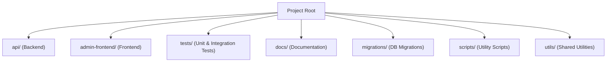
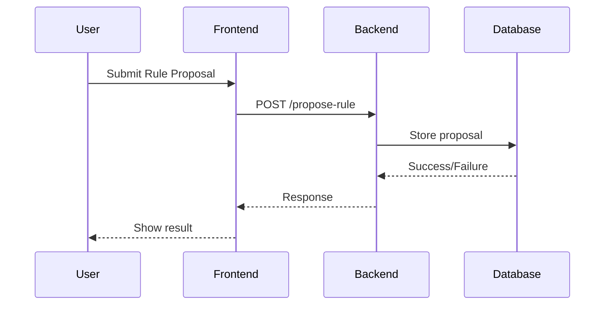

# Codebase Tour

Welcome to the project codebase tour! This guide will help you understand how the main parts of the project fit together, where to find things, and how data flows through the system. If you want a deep dive on any area, check the sections below or contribute your own!

---

## High-Level Architecture

```mermaid
graph TD
  User[User/Admin]
  FE[Admin Frontend (React)]
  BE[API Backend (FastAPI)]
  DB[Postgres Database]
  User --> FE
  FE --> BE
  BE --> DB
```

---

## Directory Structure



---

## Data Flow Example: Submitting a Rule Proposal



---

# Deep Dive Sections

Below are stubs for detailed tours of specific areas. Expand these as needed!

## Section: Rule Proposal Workflow
Learn how rule proposals are created, reviewed, and accepted in the [Rule Proposal Workflow Guide](RULE_PROPOSAL_WORKFLOW.md).

## Section: Testing Flow
Learn how tests are organized, run, and how the test environment is set up in the [Testing Workflow Guide](TESTING_WORKFLOW.md).

## Section: Migrations
*Coming soon: How database migrations are managed and applied.*

See the [Database Migrations Guide](DB_MIGRATIONS.md) for a full walkthrough, best practices, and troubleshooting.

## Section: Frontend-Backend Communication
*Coming soon: How the frontend and backend interact, including API endpoints and data formats.*

## Section: Memory System
Learn how the memory system works, why it matters, and how to use it for AI context and discovery in the [Memory System Guide](MEMORY_SYSTEM.md).

## Section: Authentication & Authorization
Learn how authentication and authorization work, how to use tokens and roles, and how to avoid common pitfalls in the [Authentication & Authorization Guide](AUTHENTICATION_AUTHORIZATION.md).

## Section: Error Handling & Logging
Learn how errors are caught, logged, and surfaced in the [Error Handling & Logging Guide](ERROR_HANDLING.md).

## Section: User Stories & Documentation
Learn how user stories are created, organized, and kept up to date in the [User Stories & Documentation Workflow Guide](USER_STORIES_AND_DOCS.md).

---

*Want to add a deep dive? Copy a section above, add your diagram and notes, and submit a PR!* 