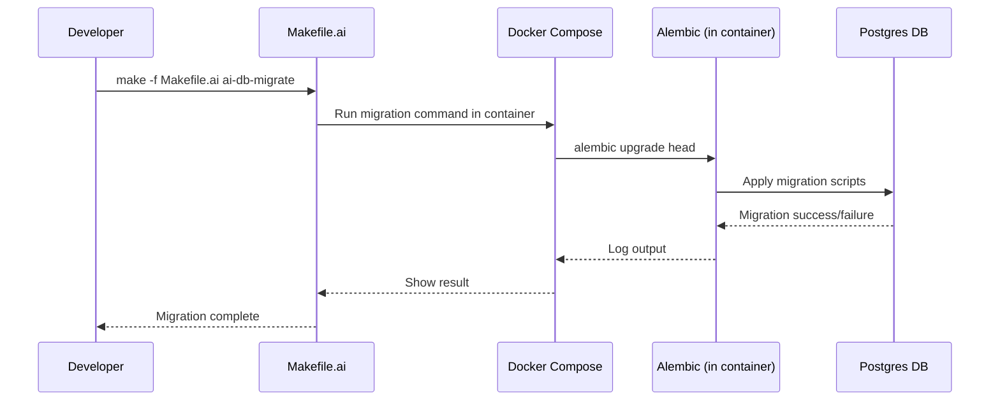

# Database Migrations Guide

This guide explains how to safely evolve the database schema using Alembic migrations, Docker, and Makefile.ai. It covers the workflow, key commands, best practices, and troubleshooting—perfect for new contributors!

---

## 1. Overview

Migrations are version-controlled scripts that change the database schema (add tables, columns, indexes, etc.) in a safe, repeatable way. We use Alembic for migrations, always running commands inside Docker for consistency.

---

## 2. Key Files & Directories

- `migrations/` – Main Alembic migration scripts for the rules database.
- `alembic.ini` – Alembic config file (points to DB, migration folder, etc.).
- `docker-compose.test.yml` – Defines the test DB container.
- `Makefile.ai` and sub-makefiles – Provide migration commands (always run inside Docker).

---

## 3. Migration Workflow Diagram



---

## 4. Step-by-Step: Creating & Applying Migrations

1. **Make schema changes in your SQLAlchemy models.**
2. **Generate a new migration script:**
   ```bash
   make -f Makefile.ai ai-db-migration MESSAGE="describe change"
   ```
   - This runs Alembic's `revision --autogenerate` inside the correct Docker container.
3. **Review and edit the generated migration script** in `migrations/versions/` for accuracy.
4. **Apply migrations to the database:**
   ```bash
   make -f Makefile.ai ai-db-migrate
   ```
   - This runs `alembic upgrade head` inside Docker.
5. **Verify the schema:**
   - Use `make -f Makefile.ai ai-db-status` or inspect via psql in the container.

---

## 5. Best Practices

- **Always run migration commands via Makefile.ai** (never directly on your host).
- **Never edit the database schema manually**—always use migrations.
- **Review autogenerated scripts**—Alembic can miss or misinterpret changes.
- **Keep migrations small and focused**—one logical change per migration.
- **Test migrations in a fresh container** to catch issues before production.

---

## 6. Common Errors & Troubleshooting

| Symptom                                 | Likely Cause                                 | Solution                                      |
|------------------------------------------|----------------------------------------------|-----------------------------------------------|
| "Connection refused"                     | Not running in Docker, wrong DB host/port    | Use Makefile.ai, check service names/ports    |
| "No changes detected"                    | Alembic didn't see model changes             | Check model imports, ensure models are updated|
| "Migration failed: duplicate column"     | Migration already applied, or out of order   | Check migration history, resolve conflicts    |
| "alembic.ini not found"                  | Running outside container or wrong path      | Use Makefile.ai targets                       |
| "psycopg2.OperationalError"              | DB not up, wrong credentials                 | Ensure DB container is running, check env vars|

---

## 7. Advanced: Multiple Databases

If you have more than one DB (e.g., memorydb), use the correct Alembic config and Makefile target for each. Check the Makefile.ai and migration directories for details.

---

## 8. Sample Commands

- **Create migration:**  
  `make -f Makefile.ai ai-db-migration MESSAGE="add new table"`
- **Apply migrations:**  
  `make -f Makefile.ai ai-db-migrate`
- **Check DB status:**  
  `make -f Makefile.ai ai-db-status`
- **Reset test DB:**  
  `make -f Makefile.ai ai-db-reset`

---

*See something missing? Please add your tips or examples!* 