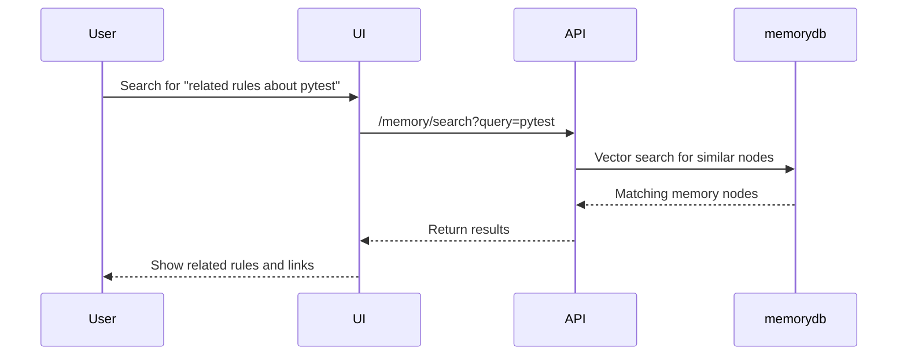

# Memory System Guide

This guide explains the memory system: what it is, why it matters, how it works, and how you can use it to improve AI context, discovery, and collaboration.

---

## 1. What is the Memory System?
The memory system is a specialized subsystem for storing, searching, and relating "memory nodes" and vector data. It helps both AI and humans remember, retrieve, and reason about past events, rules, proposals, and more.

---

## 2. Why is it Important?
- **Contextual Awareness:** The AI can reference past decisions, proposals, or user actions, making its responses more relevant and less repetitive.
- **Discovery:** Users and AI can search for related rules, proposals, or feedback, surfacing hidden connections and insights.
- **Collaboration:** Both humans and AI can add, update, and traverse the memory graph, building a shared knowledge base over time.
- **Explainability:** By tracing memory nodes and their relationships, you can explain why the AI made a certain suggestion or decision.

---

## 3. Key Components
- **memorydb:** Dedicated database for memory nodes and vector data (kept separate from rulesdb).
- **Memory Endpoints:** API endpoints for adding, searching, and traversing memory nodes and edges.
- **Vector Search:** Enables semantic search—finds similar nodes based on meaning, not just keywords.
- **Graph Traversal:** Supports multi-hop queries to discover indirect relationships.

---

## 4. How It Can Be Used

| Use Case                        | Example Scenario                                                                 |
|----------------------------------|---------------------------------------------------------------------------------|
| **AI Context Expansion**         | When reviewing a rule proposal, the AI can pull in related past proposals, feedback, or similar rules to provide richer suggestions. |
| **User Discovery**               | A user can search for all rules related to a specific topic, or see the history of changes to a rule. |
| **Automated Reasoning**          | The AI can traverse the memory graph to justify a recommendation ("This rule was accepted because X, which relates to Y"). |
| **Onboarding & Documentation**   | New users can explore the memory graph to see how decisions were made and how the system evolved. |

---

## 5. Memory System Architecture Diagram

```mermaid
graph TD
  User[User/Admin/AI]
  API[Memory API Endpoints]
  MDB[memorydb (Postgres + pgvector)]
  UI[Admin Frontend (Memory Explorer)]
  User --> UI
  UI --> API
  API --> MDB
  API -->|Vector Search| MDB
  API -->|Graph Traversal| MDB
```

---

## 6. Sample Data Flow: Semantic Search



---

## 7. Best Practices & Tips
- **Use the memory endpoints** for all memory operations—don't access memorydb directly.
- **Leverage vector search** for semantic queries (e.g., "find similar rules").
- **Use graph traversal** to explore relationships and build explainable AI features.
- **Keep memory and rules data separate** for clarity and maintainability.

---

## 8. Common Pitfalls
| Symptom                        | Likely Cause                                  | Solution                                      |
|--------------------------------|-----------------------------------------------|-----------------------------------------------|
| "No results from search"       | Query too narrow or data not indexed          | Try a broader query, check vector indexing    |
| "Memory node not found"        | Wrong ID or missing node                      | Double-check node IDs and creation            |
| "Slow search performance"      | Large dataset, missing vector index           | Ensure pgvector is enabled and indexed        |
| "Mixing memory and rules data" | Using wrong DB or endpoint                    | Use memory endpoints for memory, rules for rules|

---

## 9. Sample API Usage

- **Add a memory node:**  
  `POST /memory/node` with node data
- **Search for similar nodes:**  
  `GET /memory/search?query=pytest`
- **Traverse the memory graph:**  
  `GET /memory/traverse?start_id=123&hops=2`

---

## 10. Why This Matters for AI Context & Discovery
- The memory system lets the AI "remember" and "connect the dots," making it smarter, more helpful, and more explainable.
- It's a foundation for advanced features like context-aware suggestions, automated documentation, and collaborative knowledge building.

---

## Advanced: Memory Hygiene, Time-Based Expiry, and Confidence Scoring
Learn how to keep your memory system clean, relevant, and trustworthy by using timestamps, expiry, and confidence scores in the [Memory Hygiene, Time-Based Expiry, and Confidence Scoring Guide](MEMORY_HYGIENE_AND_CONFIDENCE.md).

## Advanced: Expanding the Memory System
Learn how to generalize and scale your memory system to handle a wide variety of knowledge types and events in the [Expanding the Memory System Guide](EXPANDING_MEMORY_SYSTEM.md).

*See something missing? Please add your tips or examples!* 