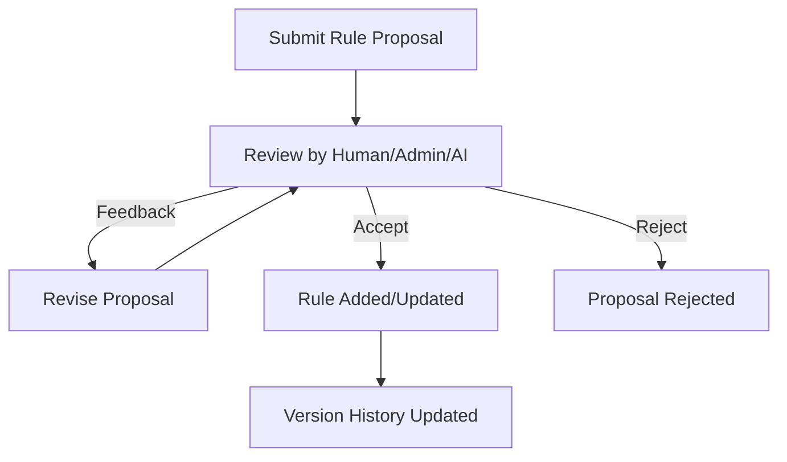

# Rule Proposal Workflow Guide

This guide explains how rule proposals are created, reviewed, and accepted in the project—covering the full lifecycle, best practices, and troubleshooting tips.

---

## 1. Overview
- **Purpose:** Enable both humans and AI to propose, review, and improve rules collaboratively.
- **Scope:** Covers the full lifecycle: submission, review, feedback, approval/rejection, and versioning.

---

## 2. Key Concepts
- **Rule Proposal:** A suggestion for a new or updated rule, submitted via the API or UI.
- **Enhancement:** A proposed improvement to an existing rule.
- **Feedback:** Comments or suggestions from reviewers (human or AI).
- **Status:** Proposals and enhancements move through statuses: submitted, under review, accepted, rejected, completed.

---

## 3. Workflow Diagram

---

## 4. Step-by-Step: Submitting and Reviewing a Rule Proposal

1. **Submit Proposal:**
   - Via API (`/propose-rule-change`) or UI form.
   - Include type, description, diff, and submitter info.
2. **Review:**
   - Admins, reviewers, or AI agents review the proposal.
   - Feedback can be added (comments, suggestions).
3. **Revise (Optional):**
   - Submitter can update the proposal based on feedback.
4. **Decision:**
   - Proposal is accepted (becomes a rule), rejected, or sent back for more changes.
5. **Versioning:**
   - Accepted proposals update the rule set and version history.

---

## 5. API Endpoints Involved
- `POST /propose-rule-change` — Submit a new proposal.
- `GET /proposals` — List all proposals.
- `POST /proposals/{id}/feedback` — Add feedback to a proposal.
- `POST /proposals/{id}/accept` — Accept a proposal.
- `POST /proposals/{id}/reject` — Reject a proposal.
- `GET /rules/{rule_id}/history` — View rule version history.

---

## 6. Best Practices
- Provide clear, actionable descriptions and diffs in proposals.
- Use feedback constructively—collaboration is key.
- Keep proposals focused (one change per proposal).
- Reference related rules or proposals for context.
- Use the version history to track changes and rationale.

---

## 7. Common Pitfalls & Troubleshooting

| Symptom                        | Likely Cause                                  | Solution                                      |
|--------------------------------|-----------------------------------------------|-----------------------------------------------|
| "Proposal stuck in review"     | No reviewer assigned or unclear feedback      | Ping reviewers, clarify feedback, or escalate |
| "Feedback not visible"         | Not using the correct endpoint or UI          | Use `/proposals/{id}/feedback`                |
| "Rule not updated after accept"| Backend error or versioning issue             | Check logs, ensure migration/versioning works |
| "Duplicate proposals"          | Lack of search before submitting              | Search existing proposals before submitting   |

---

## 8. Advanced: AI-Assisted Proposals
- The AI can suggest proposals, review submissions, and provide feedback.
- Use the memory system to reference similar past proposals or related rules.

---

## 9. Further Reading
- [API docs](../public_endpoints.py) for full endpoint details.
- [Memory System Guide](MEMORY_SYSTEM.md) for context-aware suggestions.

---

*Examples of API payloads and more technical details can be added here later. See something missing? Please add your tips or examples!* 