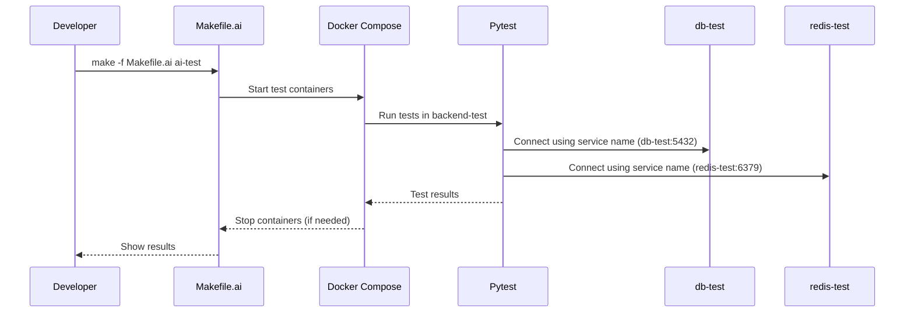

# Testing Workflow Guide

This guide explains how to run, debug, and extend tests in this project. It covers the workflow, key commands, fixtures, common errors, and best practices—perfect for new contributors!

---

## 1. Overview

Testing is fully containerized and automated. All tests are run via Makefile.ai targets, ensuring a consistent environment and reliable results. There are both unit and integration tests, with clear separation and best practices enforced.

---

## 2. Testing Workflow Diagram



---

## 3. Step-by-Step: Running Tests

1. **Start the test environment:**
   ```bash
   make -f Makefile.ai ai-env-up
   ```
2. **Run all tests:**
   ```bash
   make -f Makefile.ai ai-test PYTEST_ARGS="-x"
   ```
3. **Run only unit or integration tests:**
   ```bash
   make -f Makefile.ai ai-test-unit PYTEST_ARGS="-x"
   make -f Makefile.ai ai-test-integration PYTEST_ARGS="-x"
   ```
4. **Stop the test environment:**
   ```bash
   make -f Makefile.ai ai-env-down
   ```

---

## 4. Fixtures: What They Are & How to Use Them

**Fixtures** are reusable setup/teardown helpers for tests. They provide things like database connections, tokens, and mock services.

| Fixture Name      | What It Provides / When to Use                                      |
|-------------------|---------------------------------------------------------------------|
| `admin_token`     | A valid admin API token. Use in tests that require admin privileges. |
| `admin_headers`   | HTTP headers with a valid admin token. Use for authenticated API calls. |
| `client`          | A test client for making API requests.                              |
| `db_session`      | A database session, rolled back after each test.                    |
| `mock_redis`      | A mock Redis service for unit tests.                                |
| `redis_client`    | A real Redis client (for integration tests).                        |
| `test_user`       | A sample user object for tests.                                     |

**How to use a fixture:**
```python
def test_something(admin_token, client):
    response = client.get("/protected-endpoint", headers={"Authorization": f"Bearer {admin_token}"})
    assert response.status_code == 200
```
- **Unit tests** use mock services (e.g., `mock_redis`).
- **Integration tests** use real services (e.g., `redis_client`).

---

## 5. Common Errors & Troubleshooting

| Symptom                        | Likely Cause                                  | Solution                                      |
|--------------------------------|-----------------------------------------------|-----------------------------------------------|
| "Connection refused"           | Using `localhost` instead of service name     | Use `db-test`/`redis-test` as host            |
| "Address already in use"       | Port conflict (container already running)     | Stop other containers, use internal ports     |
| "Tests keep running after fail"| Missing `-x` flag in `PYTEST_ARGS`            | Always use `-x`                               |
| "Invalid or missing token"     | Using stale/cached token after DB reset       | Use `admin_token` fixture, don't cache tokens |
| "Fixture not found"            | Misspelled or missing fixture import          | Check fixture name and imports                |
| "pytest not found"             | Running outside container/venv                | Use Makefile.ai targets, not direct pytest    |

---

## 6. Best Practices

- **Always** use Makefile.ai targets for running tests.
- **Never** run pytest directly.
- Use Docker service names and internal ports.
- Use fixtures for all setup/teardown and tokens.
- Clean up the environment between runs.
- Add new fixtures for reusable test setup.

---

*See something missing? Please add your tips or examples!* 