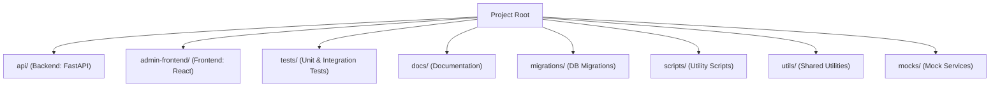

# Where Do I Start? Project Map

This guide helps new contributors quickly find where to make changes, add features, or debug issues. It covers the main directories, their purposes, and common entry points for different types of work.

---

## 1. Overview
- **Purpose:** Help new contributors quickly find where to make changes, add features, or debug issues.
- **Scope:** Covers the main directories, their purposes, and common entry points for different types of work.

---

## 2. Project Directory Map

---

## 3. Directory Cheat Sheet

| Directory         | What's Inside / When to Go Here                                      |
|-------------------|---------------------------------------------------------------------|
| `api/`            | FastAPI backend code. Add/modify API endpoints, business logic, schemas. |
| `admin-frontend/` | React admin UI. Add/modify pages, components, or connect to API.    |
| `tests/`          | All tests. `unit/` for isolated tests, `integration/` for real services. |
| `docs/`           | All documentation, onboarding, user stories, and guides.            |
| `migrations/`     | Alembic migration scripts for database schema changes.              |
| `scripts/`        | Utility scripts for automation, data migration, etc.                |
| `utils/`          | Shared Python utilities used across the project.                    |
| `mocks/`          | Mock services for testing and development.                          |

---

## 4. Common Tasks: Where to Start

| Task / Goal                        | Where to Start / What to Edit                        |
|-------------------------------------|-----------------------------------------------------|
| Add a new API endpoint              | `api/` (backend code, schemas, routes)              |
| Add a new UI page or component      | `admin-frontend/src/pages/` or `admin-frontend/src/components/` |
| Write or update a test              | `tests/unit/` or `tests/integration/`               |
| Update documentation                | `docs/` (onboarding, user stories, guides)          |
| Change the database schema          | `api/models/` (models), then `migrations/` (generate migration) |
| Add a utility function              | `utils/`                                            |
| Add a mock service                  | `mocks/`                                            |

---

## 5. Tips for Navigating the Codebase
- Use the [Codebase Tour](CODEBASE_TOUR.md) for deep dives and diagrams.
- Search for keywords or function names with your editor's search tool.
- Read the README and onboarding docs for high-level context.
- Don't be afraid to ask questions or request a pairing session!

---

## 6. Further Reading
- [Codebase Tour](CODEBASE_TOUR.md)
- [Debugging & Troubleshooting Guide](DEBUGGING_AND_TROUBLESHOOTING.md)
- [User Stories & Documentation Workflow Guide](USER_STORIES_AND_DOCS.md)

---

*See something missing? Please add your tips or examples!* 