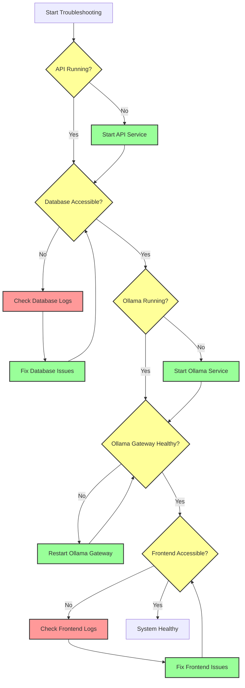

# Troubleshooting Guide

## System Health Check Flow



## Common Issues and Solutions

### 1. API Service Issues
- **Symptoms:**
  - Cannot access API endpoints
  - 500 Internal Server Error
  - Connection refused on port 9103
- **Solutions:**
  ```bash
  # Check API logs
  make -f Makefile.ai logs-api
  
  # Restart API service
  make -f Makefile.ai ai-api-restart-wait
  
  # Check API health
  curl http://localhost:9103/healthz
  ```

### 2. Database Issues
- **Symptoms:**
  - Database connection errors
  - Migration failures
  - Data inconsistency
- **Solutions:**
  ```bash
  # Check database logs
  make -f Makefile.ai logs-db
  
  # Run migrations
  make -f Makefile.ai ai-db-migrate
  
  # Backup and restore if needed
  make -f Makefile.ai ai-db-backup-data-only
  make -f Makefile.ai ai-db-restore-data BACKUP=backups/yourfile.sql
  ```

### 3. Ollama Service Issues
- **Symptoms:**
  - LLM features not working
  - Timeout errors
  - Model not found
- **Solutions:**
  ```bash
  # Check Ollama logs
  make -f Makefile.ai ai-ollama-logs
  
  # Restart Ollama service
  make -f Makefile.ai ai-ollama-restart-docker-gateway
  
  # Pull model if missing
  make -f Makefile.ai ai-ollama-pull-model
  ```

### 4. Frontend Issues
- **Symptoms:**
  - White screen
  - API connection errors
  - UI not loading
- **Solutions:**
  ```bash
  # Check frontend logs
  make -f Makefile.ai logs-frontend
  
  # Rebuild frontend
  make -f Makefile.ai ai-rebuild-frontend
  
  # Clear browser cache
  ```

## Quick Commands

```bash
# Full system restart
make -f Makefile.ai ai-restart-all

# Check all service status
make -f Makefile.ai ai-status

# View all logs
make -f Makefile.ai logs-all

# Backup all data
make -f Makefile.ai ai-db-backup-data-only
```

## Emergency Recovery

If the system is completely down:

1. Stop all services:
   ```bash
   make -f Makefile.ai ai-down
   ```

2. Backup data:
   ```bash
   make -f Makefile.ai ai-db-backup-data-only
   ```

3. Rebuild everything:
   ```bash
   make -f Makefile.ai ai-rebuild-all NOCACHE=1
   ```

4. Start fresh:
   ```bash
   make -f Makefile.ai ai-up
   ```

5. Run migrations:
   ```bash
   make -f Makefile.ai ai-db-migrate
   ```

## Need More Help?

- Check the [User Stories Index](docs/user_stories/INDEX.md) for detailed workflows
- Review the [Architecture Documentation](docs/architecture.md)
- Open an issue on GitHub for persistent problems 