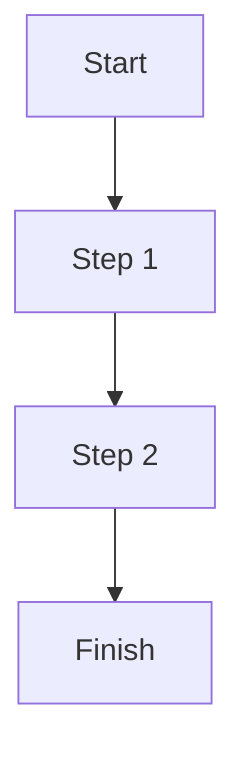

# <User Story Title>

## Motivation
<Describe the motivation for this user story.>

## Actors
- <Actor 1>
- <Actor 2>

## Preconditions
- <Precondition 1>
- <Precondition 2>

## Step-by-Step Actions
1. <Step 1>
2. <Step 2>

## Expected Outcomes
- <Outcome 1>
- <Outcome 2>

## Best Practices
- <Best practice 1>
- <Best practice 2>

## Workflow Diagram

## References
- <Reference 1>
- <Reference 2> 