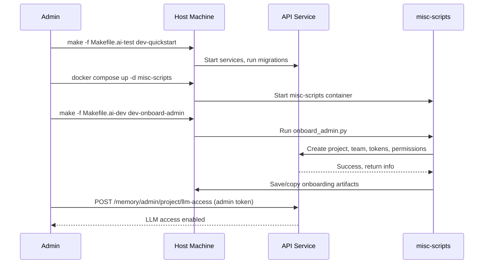

# Project Admin Onboarding and Enabling LLM Access

This user story describes the process for onboarding a new project admin, enabling LLM access, and preparing the system for memory node creation.

## Steps

1. **Run Migrations and Start Services**
   - `make -f Makefile.ai-test dev-quickstart`
2. **Start the misc-scripts Service**
   - `docker compose up -d misc-scripts`
3. **Run Admin Onboarding**
   - `make -f Makefile.ai-dev dev-onboard-admin`
   - Enter API URL, project name, team name, and onboarding path when prompted.
   - Onboarding script creates project, team, admin/user tokens, and grants wildcard namespace permissions.
   - Artifacts are saved to `/code/` and copied to the host.
4. **Enable LLM Access for the Project**
   - Use the admin token to POST to `/memory/admin/project/llm-access` with the project ID and `has_llm_access: true`.
   - Confirm LLM access is enabled in the API response.
5. **(Optional) Create First Memory Node**
   - With permissions and LLM access in place, proceed to create memory nodes or use LLM features.

## Mermaid Diagram

## Expected Outcomes
- Project, team, and admin/user tokens are created and saved.
- Namespace permissions (including wildcards) are granted.
- LLM access is enabled for the project.
- The system is ready for memory node creation and advanced AI features.

## Best Practices
- Always nuke and migrate the DB before onboarding a new project.
- Use Makefile targets and scripts for consistency and automation.
- Save all onboarding artifacts for future reference.
- Confirm LLM access before attempting memory operations. 