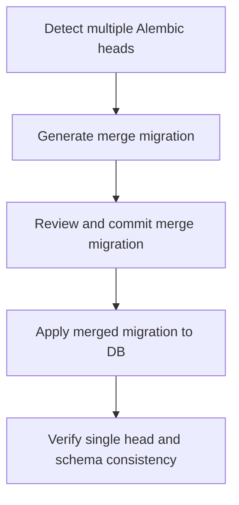

# User Story: Alembic Head Merge Process

## Motivation
As a developer or database maintainer, I want a clear, safe process for merging multiple Alembic heads so that schema migrations remain linear, reproducible, and easy to manage across branches and teams.

## Actors
- Developer
- Database Maintainer
- CI/CD Pipeline

## Preconditions
- Multiple Alembic heads exist (e.g., after parallel feature development).
- The developer has access to the migrations directory and Alembic CLI.
- All migrations are committed and pushed to version control.

## Step-by-Step Actions
1. Identify the current Alembic heads using the Alembic CLI:
   ```bash
   alembic heads
   ```
2. Generate a merge migration to unify the heads:
   ```bash
   alembic merge -m "merge heads" <head1> <head2> [...]
   ```
3. Review and edit the generated merge migration if needed.
4. Commit the merge migration to version control and push.
5. Apply the merged migration to the database:
   ```bash
   alembic upgrade head
   ```
6. Verify that the database schema is up to date and no heads remain.

## Expected Outcomes
- All Alembic heads are merged into a single linear history.
- The database schema is consistent across all environments.
- Future migrations can be applied without conflict.

## Best Practices
- Always run `alembic heads` before and after merging to verify the state.
- Communicate with teammates before merging heads to avoid conflicts.
- Review merge migrations for correctness and completeness.
- Keep migrations directory clean and well-documented.
- Use Docker containers for running Alembic commands in team environments.

## Workflow Diagram

