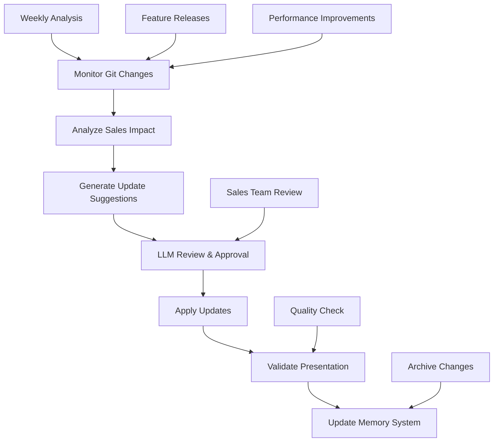

# Automated Sales Presentation Updater

## Overview
The Automated Sales Presentation Updater is a background worker system that continuously monitors project changes, analyzes new features and capabilities, and automatically updates the sales presentation to reflect the current state of the AI IDE API. This ensures the sales presentation remains accurate, compelling, and up-to-date without manual intervention.

## Motivation
- **Accuracy**: Keep sales presentation synchronized with actual project capabilities
- **Completeness**: Ensure new features are highlighted in sales materials
- **Consistency**: Maintain alignment between code, documentation, and sales messaging
- **Efficiency**: Reduce manual effort in maintaining sales materials
- **Competitive Advantage**: Always showcase the latest and greatest features

## Actors
- **Sales Team**: Benefits from always-current presentation materials
- **Development Team**: Ensures their work is properly represented in sales materials
- **Prospects/Customers**: Receive accurate information about current capabilities
- **Automated Worker**: Monitors changes and updates presentation
- **LLM Service**: Analyzes changes and generates presentation updates

## Preconditions
- Sales presentation exists in `docs/ai_ide_api_sales_presentation.md`
- Git history analysis system is running
- Memory system is operational
- LLM service is available for content analysis
- Worker infrastructure is deployed

## Step-by-Step Actions

### 1. Change Detection
The system monitors for relevant changes:
```bash
# Monitor git history for significant changes
make -f Makefile.ai misc-git-history-trigger SINCE='1 week ago' CREATE_MEMORY=true MEMORY_NAMESPACE=sales_analysis

# Analyze new features and capabilities
make -f Makefile.ai memory-trigger-enrichment SCOPE=new MEMORY_TAGS='feature capability'
```

### 2. Content Analysis
The worker analyzes changes to identify sales-relevant updates:
```python
# Example job payload for sales presentation analysis
{
  "type": "sales_presentation_update",
  "scope": "recent_changes",
  "since": "1 week ago",
  "analysis_focus": [
    "new_features",
    "capability_improvements", 
    "performance_enhancements",
    "user_experience_updates"
  ],
  "presentation_sections": [
    "system_architecture",
    "memory_system",
    "ai_augmented_features",
    "onboarding_experience",
    "demo_examples"
  ]
}
```

### 3. Presentation Update Generation
The LLM analyzes changes and generates presentation updates:
```python
# LLM analyzes changes and suggests updates
def analyze_sales_impact(changes):
    """Analyze changes for sales presentation impact"""
    sales_updates = []
    
    for change in changes:
        if is_sales_relevant(change):
            update = generate_presentation_update(change)
            sales_updates.append(update)
    
    return sales_updates
```

### 4. Automated Update Application
The worker applies approved updates to the presentation:
```bash
# Apply sales presentation updates
make -f Makefile.ai sales-apply-presentation-updates

# Preview changes before applying
make -f Makefile.ai sales-preview-presentation-updates DRY_RUN=true
```

### 5. Quality Assurance
The system validates updates and ensures presentation quality:
```bash
# Validate presentation structure and content
make -f Makefile.ai sales-validate-presentation

# Check for broken links and references
make -f Makefile.ai sales-check-presentation-links
```

## Expected Outcomes

### Automated Updates
- **Feature Additions**: New capabilities automatically added to relevant sections
- **Performance Improvements**: Updated metrics and benchmarks
- **User Experience**: Enhanced onboarding and workflow descriptions
- **Technical Architecture**: Updated diagrams and system descriptions
- **Demo Examples**: New or improved demonstration scenarios

### Quality Assurance
- **Content Accuracy**: All claims verified against actual implementation
- **Presentation Flow**: Logical structure and compelling narrative maintained
- **Visual Elements**: Mermaid diagrams and code examples updated
- **Consistency**: Messaging aligned across all sections

### Monitoring and Reporting
- **Update History**: Track of all automated changes
- **Impact Analysis**: Metrics on presentation effectiveness
- **Change Log**: Detailed record of what was updated and why

## Makefile Usage

### Trigger Sales Presentation Analysis
```bash
# Analyze recent changes for sales impact
make -f Makefile.ai sales-analyze-changes SINCE='1 week ago'

# Full sales presentation analysis
make -f Makefile.ai sales-analyze-presentation

# Preview potential updates
make -f Makefile.ai sales-preview-updates DRY_RUN=true
```

### Apply Presentation Updates
```bash
# Apply approved updates
make -f Makefile.ai sales-apply-updates

# Apply with human review
make -f Makefile.ai sales-apply-updates REVIEW=true

# Rollback recent changes if needed
make -f Makefile.ai sales-rollback-updates
```

### Monitor and Validate
```bash
# Check presentation health
make -f Makefile.ai sales-health-check

# Validate all links and references
make -f Makefile.ai sales-validate-links

# Generate sales presentation report
make -f Makefile.ai sales-generate-report
```

## Workflow Diagram



## Integration with Existing Systems

### Git History Analysis Integration
```bash
# Use existing git history analysis for change detection
make -f Makefile.ai misc-git-history-trigger SINCE='1 week ago' CREATE_MEMORY=true MEMORY_NAMESPACE=sales_analysis MEMORY_TAGS='sales presentation'
```

### Memory System Integration
```bash
# Store sales presentation updates in memory
make -f Makefile.ai memory-create-node NAMESPACE=sales_presentation CONTENT="Updated feature X in sales presentation" TAGS='sales presentation update'
```

### Worker Infrastructure Integration
```python
# Use existing RabbitMQ infrastructure
QUEUE_NAME = "sales.presentation.update"

# Leverage existing worker patterns
class SalesPresentationWorker(BaseWorker):
    async def process_sales_update_job(self, job_config):
        # Process sales presentation update job
        pass
```

## Best Practices

### Content Management
- **Version Control**: All changes tracked in git with clear commit messages
- **Backup Strategy**: Maintain backup of previous presentation versions
- **Review Process**: Human review for major changes or sensitive updates
- **Rollback Capability**: Easy rollback to previous versions if needed

### Quality Assurance
- **Automated Testing**: Validate presentation structure and links
- **Content Verification**: Ensure claims match actual implementation
- **Consistency Checks**: Maintain messaging consistency across sections
- **Performance Monitoring**: Track presentation effectiveness metrics

### Update Frequency
- **Weekly Analysis**: Regular analysis of recent changes
- **Feature Releases**: Immediate updates for major feature releases
- **Performance Improvements**: Updates for significant performance gains
- **User Experience**: Updates for onboarding and workflow improvements

## Troubleshooting

### Common Issues

1. **Update Conflicts**
   ```bash
   # Resolve conflicts manually
   make -f Makefile.ai sales-resolve-conflicts
   
   # Use backup version
   make -f Makefile.ai sales-restore-backup
   ```

2. **LLM Analysis Failures**
   ```bash
   # Check LLM service health
   make -f Makefile.ai sales-check-llm-health
   
   # Retry analysis with different parameters
   make -f Makefile.ai sales-retry-analysis
   ```

3. **Presentation Validation Failures**
   ```bash
   # Check for broken links
   make -f Makefile.ai sales-check-links
   
   # Validate markdown structure
   make -f Makefile.ai sales-validate-markdown
   ```

### Performance Optimization
- Use incremental updates for efficiency
- Cache analysis results to avoid redundant processing
- Batch updates to reduce system load
- Monitor worker performance and resource usage

## Success Metrics

### Update Quality
- **Accuracy**: 95%+ of claims verified against implementation
- **Completeness**: All new features represented in presentation
- **Timeliness**: Updates applied within 24 hours of significant changes
- **Consistency**: Messaging aligned across all presentation sections

### System Performance
- **Processing Time**: Analysis completed within 30 minutes
- **Update Success Rate**: 99%+ successful update applications
- **Error Rate**: <1% failed update attempts
- **Resource Usage**: Minimal impact on system performance

### Business Impact
- **Sales Effectiveness**: Improved conversion rates with current materials
- **Customer Satisfaction**: More accurate expectations from prospects
- **Team Efficiency**: Reduced manual effort in maintaining materials
- **Competitive Advantage**: Always showcasing latest capabilities

## Future Enhancements

### Advanced Features
- **A/B Testing**: Test different presentation versions for effectiveness
- **Personalization**: Tailor presentation content for different audiences
- **Multi-language Support**: Automatic translation and localization
- **Interactive Elements**: Dynamic content based on user interaction

### Integration Opportunities
- **CRM Integration**: Track presentation usage and effectiveness
- **Analytics Integration**: Measure presentation impact on sales pipeline
- **Marketing Automation**: Integrate with marketing campaign materials
- **Customer Feedback**: Incorporate customer feedback into updates

## References
- [Sales Presentation](../ai_ide_api_sales_presentation.md)
- [Git History Analysis](git_history_analysis.md)
- [Memory System](../onboarding/MEMORY_SYSTEM.md)
- [Worker Management](memory_worker_management.md)
- [Automated Progress Reporting](automated_progress_report.md)

---

**This automated system ensures the sales presentation remains a powerful, accurate, and compelling tool that always reflects the current state of the AI IDE API!** 