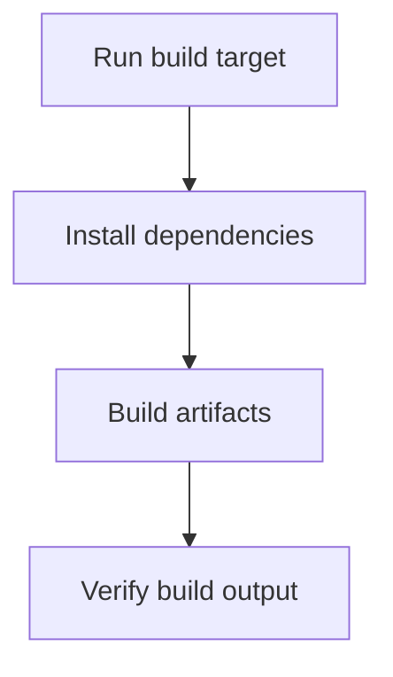

# User Story: build

## Motivation
To provide a standardized way to build the project, ensuring all dependencies are installed and artifacts are generated for deployment or testing.

## Actors
- Developers
- CI/CD systems
- Project maintainers

## Preconditions
- The project includes a build target in the Makefile or a build script.
- All dependencies are specified in requirements files or configuration.

## Step-by-Step Actions
1. Run the build target:
   ```bash
   make build
   ```
2. The system installs dependencies and builds all required artifacts.
3. The user or CI system verifies the build output.

## Expected Outcomes
- The project is built successfully with all dependencies and artifacts.
- Build output is available for deployment or testing.

## Best Practices
- Keep build scripts and targets up to date with project changes.
- Automate verification of build output.
- Log build steps and results for troubleshooting.

## Workflow Diagram


