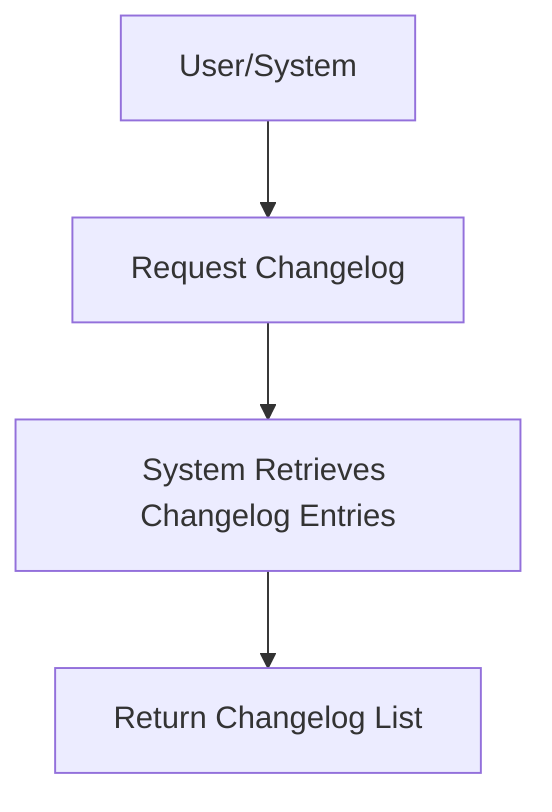

# User Story: /changelog

## Motivation
To provide users and systems with a record of recent changes, updates, and releases, supporting transparency, auditing, and troubleshooting.

## Actors
- End users
- Developers
- System administrators

## Preconditions
- The system maintains a changelog of updates and releases.
- The user or system has access to the /changelog endpoint.

## Step-by-Step Actions
1. User or system sends a request to /changelog.
2. The system retrieves the changelog entries.
3. The system returns a list of recent changes, updates, and releases.

## Expected Outcomes
- The requester receives a list of recent changes and updates.
- The data can be used for auditing, troubleshooting, or user communication.

## Best Practices
- Keep changelog entries clear, concise, and up to date.
- Include timestamps and author information for each entry.
- Log access for auditing.

## Workflow Diagram

