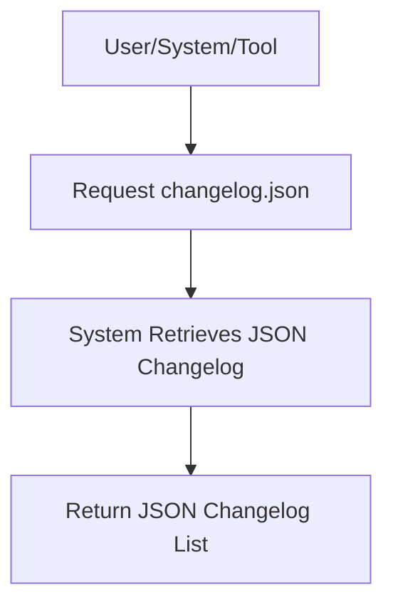

# User Story: /changelog.json

## Motivation
To provide users and systems with a machine-readable record of recent changes, updates, and releases, supporting automation, integration, and auditing.

## Actors
- Developers
- System administrators
- Automation tools

## Preconditions
- The system maintains a changelog in JSON format.
- The user or system has access to the /changelog.json endpoint.

## Step-by-Step Actions
1. User, system, or tool sends a request to /changelog.json.
2. The system retrieves the changelog entries in JSON format.
3. The system returns a structured list of recent changes, updates, and releases.

## Expected Outcomes
- The requester receives a machine-readable list of recent changes and updates.
- The data can be used for automation, integration, or auditing.

## Best Practices
- Keep changelog entries clear, concise, and up to date.
- Use standard JSON structure for compatibility.
- Log access for auditing.

## Workflow Diagram

