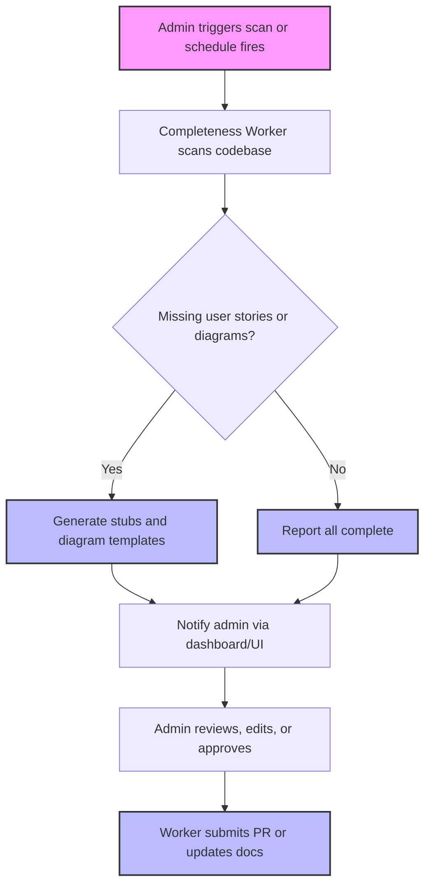

# User Story: Automated Completeness Worker for User Stories & Mermaid Diagrams

## Motivation
To maintain high-quality, up-to-date documentation and onboarding materials, the system should proactively identify and help resolve gaps in user stories and workflow diagrams. An automated worker ensures that new features, Makefile targets, and API endpoints are always accompanied by complete user stories and visual workflow diagrams, reducing manual oversight and improving team efficiency.

---

## Actors
- **Admins:** Trigger scans, review reports, and approve or edit generated stubs/diagrams.
- **Completeness Worker:** Background service that scans, reports, and generates documentation stubs.
- **Developers:** Benefit from improved onboarding and documentation completeness.

---

## Preconditions
- The codebase contains Makefile targets, API endpoints, and user story markdown files.
- The worker is deployed and can access the relevant directories.
- Admin interface or trigger mechanism is available (manual or scheduled).

---

## Step-by-Step Actions
1. **Trigger:** Admin triggers a scan (or a scheduled job fires).
2. **Scan:** The worker scans the codebase for:
   - Missing user stories for Makefile targets and API endpoints.
   - User stories missing Mermaid diagrams.
3. **Generate:** For each gap found, the worker:
   - Suggests or generates markdown stubs for missing user stories.
   - Suggests or generates Mermaid diagram templates for stories missing diagrams.
4. **Notify:** The worker reports findings and suggestions to the admin via a dashboard, UI, or notification system.
5. **Review:** Admin reviews, edits, or approves the generated stubs/diagrams.
6. **Update:** The worker (or admin) submits a PR or directly updates the documentation.

---

## Workflow Diagram

Below is a Mermaid diagram illustrating the completeness worker's workflow:

---

## Expected Outcomes
- All Makefile targets and API endpoints have corresponding user stories.
- All user stories include a Mermaid workflow diagram.
- Admins are promptly notified of documentation gaps and can quickly address them.
- Documentation quality and onboarding experience are consistently high.

---

## Best Practices
- Run the completeness worker regularly (e.g., after merges, on a schedule, or before releases).
- Review and edit generated stubs/diagrams for clarity and accuracy before publishing.
- Use the admin interface to track and resolve outstanding documentation tasks.

---

## Rationale
Automating the detection and remediation of documentation gaps reduces manual effort, prevents knowledge silos, and ensures that the codebase remains well-documented as it evolves. Visual workflow diagrams further enhance understanding and onboarding for new team members. 