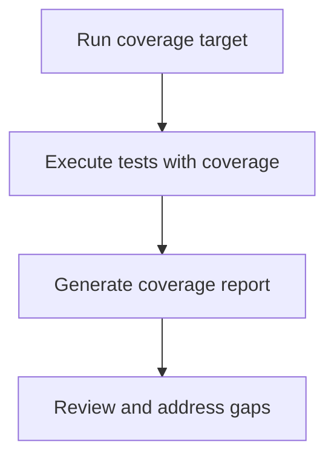

# User Story: coverage

## Motivation
To provide developers and maintainers with a quick way to measure and report code coverage, supporting code quality, test completeness, and continuous improvement.

## Actors
- Developers
- Project maintainers
- CI/CD systems

## Preconditions
- The project includes a Makefile target or script for running coverage analysis.
- The test suite is implemented and passing.

## Step-by-Step Actions
1. Run the coverage target:
   ```bash
   make -f Makefile.ai-test coverage
   ```
2. The target executes the test suite with coverage tracking enabled.
3. The system generates a coverage report (e.g., HTML, terminal output).
4. Developers review the coverage report and identify untested code.

## Expected Outcomes
- A coverage report is generated and available for review.
- Developers can identify and address gaps in test coverage.

## Best Practices
- Run coverage regularly, especially before merging changes.
- Aim for high coverage, but focus on meaningful tests.
- Review coverage trends over time to spot regressions.
- Save coverage reports for future reference or CI/CD integration.

## Workflow Diagram


