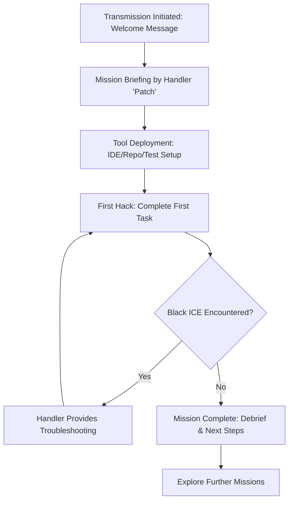

# User Story: Cyberpunk Onboarding Experience

## Motivation
To immerse new users in a high-tech, cyberpunk-themed onboarding journey that makes learning the system engaging, memorable, and aligned with the team's narrative style. This approach aims to boost engagement, retention, and a sense of belonging in the digital crew.

## Actors
- **Operative (User):** The new team member or user being onboarded.
- **Handler (AI Assistant, Codename: "Patch"):** Guides the Operative through the onboarding process, provides mission briefings, and offers support.
- **Rival Syndicates (Optional):** Represent challenges, bugs, or obstacles in the onboarding process.

## Preconditions
- The system's theme is set to "cyberpunk" in `config/theme.json`.
- The Operative has access to the onboarding portal or application.

## Step-by-Step Actions
1. **Transmission Initiated:**
   - Operative receives a welcome message: "[Encrypted Channel Opened] Welcome, Operative."
2. **Mission Briefing:**
   - Handler "Patch" outlines the onboarding objectives (e.g., environment setup, first test run, codebase tour).
3. **Tool Deployment:**
   - Operative is guided to set up their neural interface (IDE), connect to the CodeGrid (repository), and configure ghost protocols (test suites).
4. **First Hack:**
   - Operative completes their first task (e.g., running a test, making a commit), earning an achievement: "🏆 Achievement Unlocked: 'Ghost in the Machine'."
5. **Encountering Black ICE:**
   - If errors occur, the Handler provides cyberpunk-styled troubleshooting tips (e.g., "[ALERT] Black ICE triggered! Rollback initiated.").
6. **Mission Complete:**
   - Operative receives a debrief and next steps, with encouragement to explore further missions (advanced features, team rituals).

## Expected Outcomes
- Operative completes onboarding with a clear understanding of the system.
- The experience is memorable and engaging, increasing the likelihood of retention and active participation.
- The Operative feels like part of a high-tech, elite team.

## Best Practices
- Keep language and visuals consistent with the cyberpunk theme.
- Use achievements and narrative milestones to reinforce progress.
- Provide clear, actionable troubleshooting in the same narrative style.
- Allow for easy switching to other themes if the user prefers a different experience.

## Workflow Diagram

The following Mermaid diagram illustrates the cyberpunk onboarding workflow:

**Explanation:**
- The onboarding begins with a transmission and welcome message.
- Handler "Patch" briefs the Operative on objectives.
- The Operative sets up tools and completes their first task.
- If errors (Black ICE) are encountered, troubleshooting is provided and the Operative retries.
- On success, the mission is completed and the Operative is encouraged to explore further features.

---

*This user story ensures that the cyberpunk onboarding experience is both functional and immersive, supporting a strong team culture and smooth ramp-up for new Operatives.* 