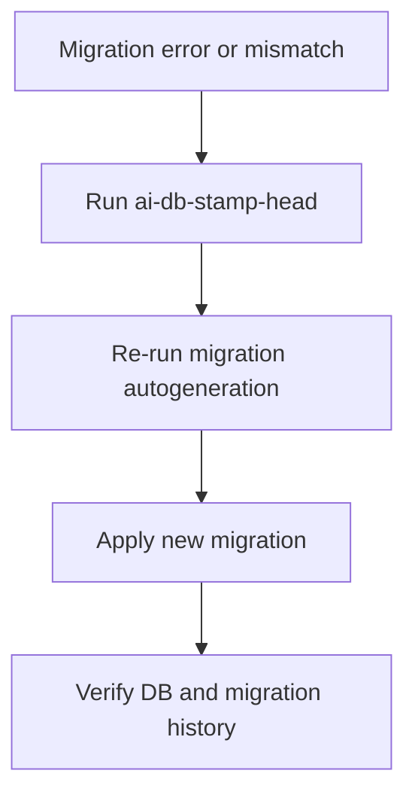

# User Story: Database Migration Recovery & Alembic Stamping

## Motivation
As a developer or admin, I want to quickly recover from Alembic migration mismatches or missing revision errors, so that I can keep the database and migration history in sync and continue development without downtime.

## Actors
- **Developer/Admin:** Maintains the database and migration history.
- **Docker Compose Services:** Provide a reproducible environment for migrations.

## Preconditions
- The database and Alembic migration history are out of sync (e.g., after a failed migration, missing file, or manual DB change).
- You see errors like `Can't locate revision identified by ...` when running Alembic commands.

## Step-by-Step Actions
1. **Stamp the database to the current Alembic head:**
   - Command:
     ```bash
     make -f Makefile.ai ai-db-stamp-head
     ```
   - This marks the database as being at the latest migration, without running migrations.

2. **Re-run migration autogeneration:**
   - Command:
     ```bash
     make -f Makefile.ai ai-db-autorevision
     ```

3. **Apply the new migration:**
   - Command:
     ```bash
     make -f Makefile.ai ai-db-migrate
     ```

4. **Verify:**
   - Ensure the database and migration history are now in sync.
   - Run your app/tests to confirm.

5. **For test DB or memorydb, use the corresponding Makefile targets (e.g., `test-db-stamp-head`, `ai-memorydb-stamp`):**

## Expected Outcomes
- The database is marked as up-to-date with the latest migration.
- New migrations can be generated and applied without errors.
- Development can continue without downtime.

## Best Practices
- Always use Makefile targets for migration management.
- Avoid manual DB changes outside of migrations.
- Keep migration files under version control.
- Document any manual recovery steps in the user stories or onboarding docs.

## Workflow Diagram



## References
- Makefile.ai targets: `ai-db-stamp-head`, `ai-db-autorevision`, `ai-db-migrate`
- Typical error: `Can't locate revision identified by ...`

## Stamping and Recovery for Test DB (Dockerized Test Environment)

If you need to recover or synchronize the test database (used in CI or local Docker test runs), use the following Makefile targets:

- **Stamp the test DB to the latest migration:**
  ```bash
  make -f Makefile.ai-test test-db-stamp-head
  ```
  This marks the test database as being at the latest migration, without running migrations.

- **Check the current Alembic version in the test DB:**
  ```bash
  make -f Makefile.ai-test test-db-current
  ```
  This shows the current migration version in the test database.

**When to use:**
- After a failed migration or connection error in the test environment
- If `alembic current` returns nothing, but the schema is correct
- To manually synchronize the test DB's migration history with the codebase

**Best Practices:**
- Always use the test Makefile (`Makefile.ai-test`) for test DB operations
- Document any manual stamping in PRs or team notes

## Stamping MemoryDB to Resolve Migration Divergence or Missing Revisions

If you encounter errors like missing revision files, broken migration chains, or parallel migration histories in the memorydb (often due to development on multiple machines or lost files), you can stamp the memorydb to the latest available revision to resolve the issue.

### Step-by-Step Recovery for MemoryDB

1. **Identify the latest available revision in `migrations_memorydb/versions/`:**
   - Example: `20240527_fix_memory_vector_uuids.py` → revision `20240527_fix_memory_vector_uuids`
2. **Use the new Makefile target to stamp memorydb:**
   ```bash
   make -f Makefile.ai-db ai-memorydb-stamp REV=20240527_fix_memory_vector_uuids
   ```
   - This marks the memorydb as being at the specified revision, skipping any missing or broken migrations.
3. **Re-run your setup or migrations as needed.**

#### When to Use This
- You see errors like `KeyError: '<revision>'` or `Revision <hash> is not present` during Alembic operations on memorydb.
- You know your schema is correct or have reset the DB and want to move forward.
- You need to resolve migration divergence after parallel development.

#### Best Practices
- Only use stamping if you are confident the DB schema matches the intended state.
- After stamping, consider generating a new migration to capture any missing schema changes.
- Document the use of stamping in your PRs or team notes for future reference. 