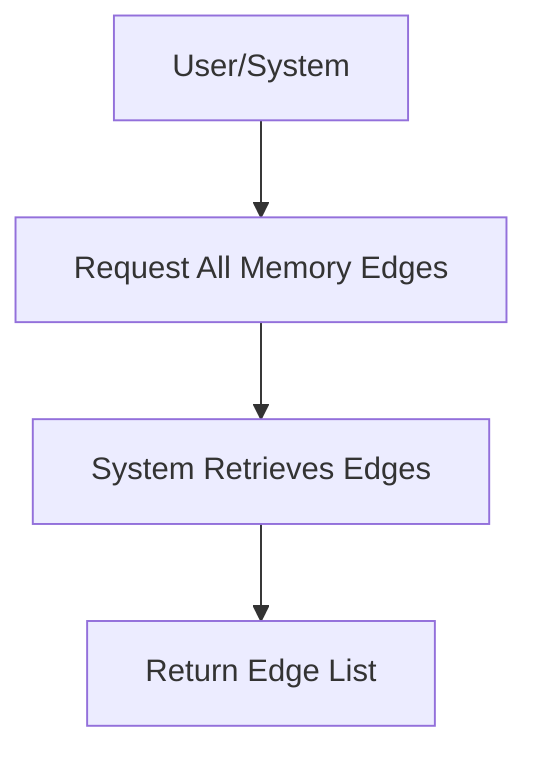

# User Story: /memory/edges

## Motivation
To provide users and systems with the ability to list and explore all edges (relationships) in the memory knowledge graph, supporting data analysis and visualization.

## Actors
- End users
- Developers
- AI assistants

## Preconditions
- The memory knowledge graph contains edges between nodes.
- The user or system has access to the /memory/edges endpoint.

## Step-by-Step Actions
1. User or system sends a request to /memory/edges.
2. The system retrieves all edges from the memory knowledge graph.
3. The system returns a list of edges, including source, target, and relationship type.

## Expected Outcomes
- The requester receives a comprehensive list of all edges in the memory knowledge graph.
- The data can be used for visualization, analysis, or further queries.

## Best Practices
- Support filtering by node, relationship type, or other criteria.
- Paginate results for large graphs.
- Include metadata for each edge (e.g., creation date, last updated).

## Workflow Diagram

