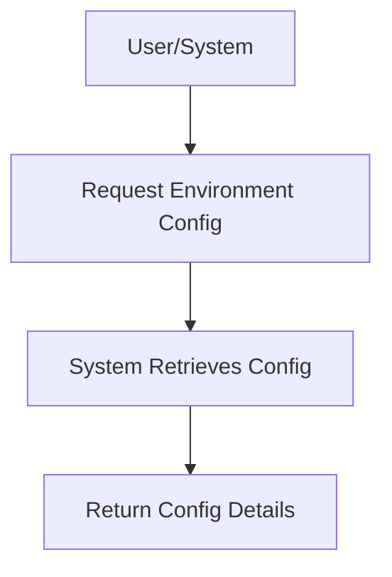

# User Story: /env

## Motivation
To provide users and systems with the ability to retrieve the current environment configuration, supporting debugging, deployment, and automation.

## Actors
- Developers
- System administrators
- AI assistants

## Preconditions
- The environment configuration is accessible via the /env endpoint.
- The user or system has appropriate permissions.

## Step-by-Step Actions
1. User or system sends a request to /env.
2. The system retrieves the current environment configuration.
3. The system returns the configuration details.

## Expected Outcomes
- The requester receives the current environment configuration.
- The data can be used for debugging, deployment, or automation.

## Best Practices
- Mask sensitive information in the response.
- Provide clear documentation of all environment variables.
- Log access for auditing.

## Workflow Diagram

