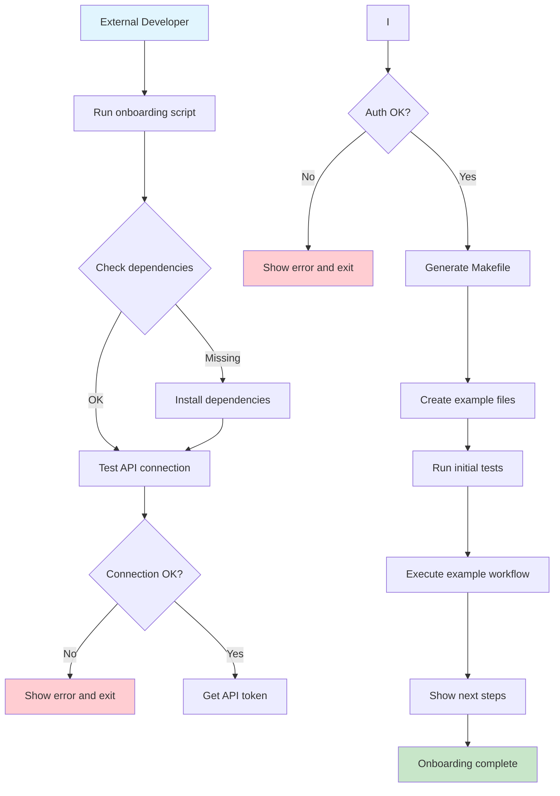

# External Project Onboarding with Makefile

## Motivation

External developers need a streamlined way to integrate with the AI-IDE-API system. The current onboarding process requires manual setup of API tokens, understanding of endpoints, and creation of custom scripts. This creates friction and reduces adoption.

## User Story

**As an** external project developer  
**I want to** easily onboard my project to the AI-IDE-API system  
**So that** I can integrate AI-powered development tools into my workflow

## Acceptance Criteria

- [x] External projects can download onboarding package
- [x] Onboarding script creates project, team, and API token
- [x] Generated Makefile provides essential operations
- [x] Authentication works immediately after onboarding
- [x] LLM access can be requested through Makefile
- [x] Simple, focused interface for common operations

## Implementation

### Onboarding Process

1. **Download Package**
   ```bash
   curl -H 'Authorization: Bearer YOUR_TOKEN' \
     http://localhost:9103/external/onboarding/download/all \
     -o ai-ide-api-onboarding.zip
   ```

2. **Extract and Run**
   ```bash
   unzip ai-ide-api-onboarding.zip
   chmod +x onboard_external.sh
   ./onboard_external.sh
   ```

3. **Use Generated Makefile**
   ```bash
   make -f Makefile.external test-connection
   make -f Makefile.external check-llm-access
   make -f Makefile.external help
   ```

### Generated Files

- `Makefile.external` - Focused Makefile with essential operations
- `USAGE.md` - Simple usage guide
- `.apitoken` - API token for authentication

### Makefile Operations

The generated Makefile provides these essential operations:

```bash
# Test connection and authentication
make -f Makefile.external test-connection

# Check LLM access status
make -f Makefile.external check-llm-access

# Get instructions for requesting LLM access
make -f Makefile.external request-llm-access

# Check API health
make -f Makefile.external health

# Show all available commands
make -f Makefile.external help
```

### API Endpoints

- `GET /external/onboarding/files` - List available files
- `GET /external/onboarding/download/{type}` - Download files
- `POST /external/onboarding/generate` - Generate custom Makefile
- `GET /external/onboarding/quick-start` - Quick start guide

### Custom Makefile Generation

For project-specific needs, generate a custom Makefile:

```bash
curl -X POST "http://localhost:9103/external/onboarding/generate" \
  -H "Authorization: Bearer YOUR_TOKEN" \
  -H "Content-Type: application/json" \
  -d '{"api_base": "http://localhost:9103", "output_name": "Makefile.custom"}'
```

## Benefits

- **Simplified**: Focused on essential operations only
- **Custom**: Generated per project with specific configuration
- **Immediate**: Works right after onboarding
- **Extensible**: Can be customized for specific needs
- **Maintainable**: Simple, clean interface

## Success Metrics

- [ ] External developers can complete onboarding in <5 minutes
- [ ] Zero manual configuration required
- [ ] All common API operations available via Makefile
- [ ] Clear error messages and troubleshooting guidance
- [ ] Example workflows work out of the box

## Future Enhancements

- [ ] Interactive mode for guided setup
- [ ] Custom Makefile templates
- [ ] Integration with CI/CD pipelines
- [ ] Multi-environment support (dev/staging/prod)
- [ ] Advanced configuration options
- [ ] Plugin system for custom operations

## Related Documentation

- [External Project Management](admin_external_projects.md)
- [API Authentication](AUTHENTICATION_AUTHORIZATION.md)
- [Memory System](MEMORY_SYSTEM.md)

## Workflow Diagram

