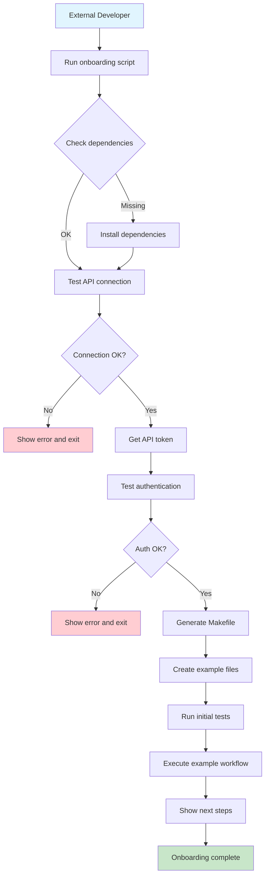

# External Onboarding with Makefile Generation

## Motivation

External developers need a streamlined way to integrate with the AI-IDE-API system. The current onboarding process requires manual setup of API tokens, understanding of endpoints, and creation of custom scripts. This creates friction and reduces adoption.

## User Story

As an **External Developer**, I want to **run a single onboarding script** so that I can **quickly set up API integration with a comprehensive Makefile** that provides easy access to all common operations.

## Acceptance Criteria

- [ ] Single command onboarding process
- [ ] Automatic dependency checking and installation
- [ ] API connection testing
- [ ] Token management and authentication
- [ ] Comprehensive Makefile generation
- [ ] Example files creation
- [ ] Initial workflow testing
- [ ] Clear next steps documentation

## Implementation

### Scripts Created

1. **`scripts/generate_external_makefile.py`** - Core Makefile generator
2. **`scripts/onboard_external_updated.py`** - Complete onboarding process
3. **`scripts/onboard_external.sh`** - Shell wrapper for easy execution

### Generated Files

- `Makefile.external` - Comprehensive Makefile with all API operations
- `README.external.md` - Complete usage documentation
- `example_memory.txt` - Sample memory content
- `example_rule.mdc` - Sample rule file
- `.apitoken` - API authentication token

### Makefile Features

The generated Makefile includes targets for:

#### Memory Operations
- `memory-search` - Search memories with RAG
- `memory-create` - Create new memory nodes
- `memory-list` - List all namespaces
- `memory-nodes` - List nodes in namespace

#### Rule Operations
- `rule-propose` - Propose new rules
- `rule-list` - List all rules
- `rule-get` - Get specific rule
- `rule-update` - Update existing rule
- `rule-delete` - Delete rule
- `rule-feedback` - Submit rule feedback

#### Git History Operations
- `git-history` - Analyze recent commits
- `git-history-full` - Full repository analysis
- `git-history-summary` - Get analysis summary

#### Worker Operations
- `worker-trigger-enrichment` - Trigger memory enrichment
- `worker-trigger-cleanup` - Trigger memory cleanup
- `worker-trigger-similarity` - Trigger similarity analysis
- `worker-status` - Get worker status
- `worker-logs` - Get worker logs

#### System Operations
- `health-check` - Check system health
- `api-status` - Get detailed status
- `system-info` - Get system information

#### Backup and Restore
- `backup-memories` - Backup all memories
- `backup-rules` - Backup all rules
- `restore-memories` - Restore from backup
- `restore-rules` - Restore rules from backup

#### Export and Import
- `export-rules` - Export to portable format
- `import-rules` - Import from portable format

#### Testing and Utilities
- `test-connection` - Test API connectivity
- `test-memory` - Test memory API
- `test-rules` - Test rules API
- `test-workers` - Test worker API
- `install-deps` - Install dependencies
- `clean` - Clean temporary files

## Usage Examples

### Quick Start
```bash
# Run onboarding
./scripts/onboard_external.sh

# Use the generated Makefile
make -f Makefile.external help
make -f Makefile.external memory-search QUERY="docker configuration"
make -f Makefile.external memory-create FILE=content.txt NAMESPACE=myproject
```

### Advanced Usage
```bash
# Custom API endpoints
./scripts/onboard_external.sh --api-base http://my-api:9103 --project myproject

# With existing token
./scripts/onboard_external.sh --token my-existing-token

# Full git history analysis
make -f Makefile.external git-history-full

# Trigger worker jobs
make -f Makefile.external worker-trigger-enrichment SCOPE=all
make -f Makefile.external worker-trigger-cleanup SCOPE=all
```

## Workflow Diagram



## Benefits

1. **Reduced Friction** - Single command setup
2. **Comprehensive Coverage** - All API operations included
3. **Self-Documenting** - Clear help and examples
4. **Error Handling** - Robust error checking and recovery
5. **Extensible** - Easy to add new operations
6. **Consistent** - Standardized interface across users

## Success Metrics

- [ ] External developers can complete onboarding in <5 minutes
- [ ] Zero manual configuration required
- [ ] All common API operations available via Makefile
- [ ] Clear error messages and troubleshooting guidance
- [ ] Example workflows work out of the box

## Future Enhancements

- [ ] Interactive mode for guided setup
- [ ] Custom Makefile templates
- [ ] Integration with CI/CD pipelines
- [ ] Multi-environment support (dev/staging/prod)
- [ ] Advanced configuration options
- [ ] Plugin system for custom operations

## Related Documentation

- [API Documentation](../api_access.md)
- [Memory System](../onboarding/MEMORY_SYSTEM.md)
- [Rule Management](../onboarding/EXPANDING_MEMORY_SYSTEM.md)
- [Git History Analysis](../git_history_analysis_process.md) 