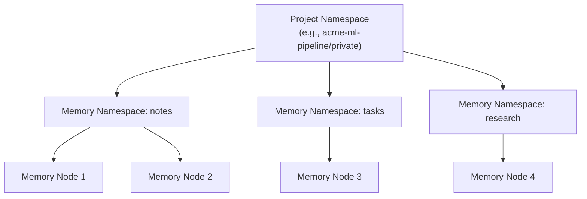
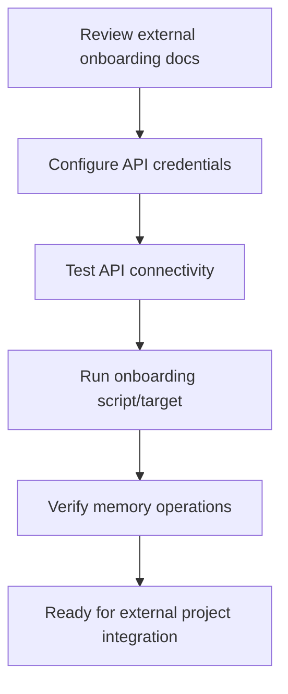

# User Story: External Project Onboarding via API

## Motivation
As an external project owner or integrator, I want a simple, automated way to initialize and track onboarding progress for my project, so I can ensure all required steps are completed and visible to my team.

---

## Actors
- External project owner
- API integrator
- Automation scripts

---

## Preconditions
- The API is running and accessible
- The onboarding_paths.json file defines the steps for 'external_project'

---

## 🚀 Quickstart: One-Command Onboarding

If you're new or want to get started fast, use this script to onboard your project in seconds:

```bash
#!/bin/bash
read -p "Enter a unique, descriptive project name: " PROJECT_NAME
read -p "Enter your team or organization name: " TEAM_NAME

RESPONSE=$(curl -s -X POST http://localhost:9103/onboarding/init \
  -H "Content-Type: application/json" \
  -d "{\"project_name\": \"${PROJECT_NAME}\", \"team_name\": \"${TEAM_NAME}\", \"journey\": \"external_project\"}")

echo "Onboarding response:"
echo "$RESPONSE"

# Optionally extract and display key info (requires jq)
API_TOKEN=$(echo $RESPONSE | jq -r '.api_token')
PROJECT_UUID=$(echo $RESPONSE | jq -r '.project_uuid')
TEAM_ID=$(echo $RESPONSE | jq -r '.team_id')
NAMESPACE=$(echo $RESPONSE | jq -r '.namespace')

echo "Your API token: $API_TOKEN"
echo "Your project UUID: $PROJECT_UUID"
echo "Your team ID: $TEAM_ID"
echo "Your namespace: $NAMESPACE"
```

- **Instructions:** Copy and paste this into your terminal, or save as `onboard.sh` and run with `bash onboard.sh`.
- **Note:** This script requires [`jq`](https://stedolan.github.io/jq/) for JSON parsing (install with `brew install jq` or `apt-get install jq`).
- **What next?** Use the API token and namespace in the rest of the onboarding steps below!

---

## 🛡️ Project Token Registration (for External Projects)

To connect your project to the AI IDE API, you need to register your project and obtain a project-specific API token.

**Follow these steps:**

### 1. Choose a Unique Project Name and Team Name
Pick a project name that clearly identifies your project (e.g., `acme-ml-pipeline`, `customer-xyz-data`).
Pick a team name that represents your team or organization (e.g., `acme-ml-team`, `customer-xyz`).
Avoid generic names like `test` or `my-project`.

> **Sample Prompt:**
> Before proceeding, make sure you have all the required information. If you are unsure about any item (such as project name, team name, permissions, onboarding journey, or LLM access), **ask the user or your team for clarification now**. This will help avoid errors in the next steps.

> **Example questions to ask:**
> - What should we use for the project name?
> - What is the correct team or organization name?
> - What level of permissions are needed (read_only or read_write)?
> - Which onboarding journey should we follow? (e.g., external_project)
> - Do you need LLM (Large Language Model) access for this project?

### 2. Register Your Project and Get a Token
Run the following command in your terminal (replace the values as needed):

```bash
curl -X POST http://localhost:9103/onboarding/init \
  -H 'Content-Type: application/json' \
  -d '{
    "project_name": "acme-ml-pipeline",   # <-- Your unique project name
    "team_name": "acme-ml-team",          # <-- Your team or organization name
    "maintainer": "Your Name",            # <-- Who is responsible for this project?
    "permissions": "read_write",          # <-- Access level: read_only or read_write
    "journey": "external_project"         # <-- Onboarding journey
  }'
```

### 3. What Happens Next?
- The API will create your project and return a response like:
  ```json
  {
    "project_id": "acme-ml-pipeline",
    "team_id": "acme-ml-team",
    "namespace": "acme-ml-pipeline/private",
    "api_token": "eyJhbGciOiJIUzI1NiIsInR5cCI6IkpXVCJ9..."
  }
  ```
- **Save your API token** somewhere secure—you'll need it to access the API.

### 4. Next Steps
- Use your API token and namespace in all future API requests.
- See the onboarding documentation for how to add memory nodes, set up permissions, and more.

### 5. Need Help?
If you have questions or run into issues, reach out to the support team or check the [full onboarding guide](docs/user_stories/external_project_onboarding.md).

---

## 🤖 LLM (Large Language Model) Access

Some features, such as LLM-powered endpoints, may require special access. Here's what you need to know:

### How is LLM Access Granted?
- **During onboarding:**
  - You may request LLM access by including a flag in your onboarding/init payload (if supported):
    ```json
    {
      "project_name": "acme-ml-pipeline",
      "team_name": "acme-ml-team",
      "permissions": "read_write",
      "has_llm_access": true,  // <-- Request LLM access
      "journey": "external_project"
    }
    ```
  - If your project is approved for LLM access, your API token will allow LLM endpoints.
- **By admin/manual enablement:**
  - LLM access may be a premium or restricted feature. An admin may need to enable it for your project or team after onboarding.

### How to Check If You Have LLM Access
- **Check your onboarding/init response:**
  - Look for a field like `"has_llm_access": true` in the response.
- **Check your project settings:**
  - Use `/projects/{project_id}` to see if LLM access is enabled.
- **Try an LLM endpoint:**
  - If you get a 403/401 or "LLM access required" error, you likely don't have access.
- **Ask your admin or support:**
  - If unsure, contact your project admin or support team.

### What to Do If You Need LLM Access
- **If not enabled:**
  - Re-run onboarding with the correct flag (if supported)
  - Request access from your admin or support team
  - Upgrade your plan (if LLM is a premium feature)

### Example Onboarding Response
```json
{
  "project_id": "acme-ml-pipeline",
  "team_id": "acme-ml-team",
  "namespace": "acme-ml-pipeline/private",
  "api_token": "...",
  "has_llm_access": true
}
```

### Summary Table
| How LLM Access is Granted         | Where to Check/Request                |
|-----------------------------------|---------------------------------------|
| Onboarding/init flag              | onboarding/init payload & response    |
| Admin/manual enablement           | Admin dashboard or support            |
| Token scopes/claims               | Token details or project settings     |

> **Note:** LLM access may be a premium or restricted feature. If you need it and don't have it, contact your admin or support team.

---

## 🛠️ How Admins Approve LLM Access

If you are an admin and need to approve LLM access for a project (after a user has requested it):

> **Admin Endpoint:**
> To update LLM access, use the following endpoint:
> 
> **PUT /projects/{project_id}**
> 
> - Replace `{project_id}` with the actual project UUID. You can find this in the onboarding response or by listing all projects via the admin dashboard or API.
> - You must use an **admin token** for authorization.

### Step-by-Step Example

1. **Find the Project ID:**
   - You can get the project ID from the onboarding response, or by listing projects:
     ```bash
     curl -X GET http://localhost:9103/projects \
       -H "Authorization: Bearer <admin-token>"
     ```
2. **Update the Project to Enable LLM Access:**
   ```bash
   curl -X PUT http://localhost:9103/projects/{project_id} \
     -H "Authorization: Bearer <admin-token>" \
     -H "Content-Type: application/json" \
     -d '{
       "name": "acme-ml-pipeline",
       "description": "Project description",
       "has_llm_access": true
     }'
   ```
   - Set `"has_llm_access": true` in the payload.

> **Note:** Only admins can approve or change LLM access for a project. Regular users must request this change from an admin.

### Alternate: Admin Dashboard (if available)
If your system has an admin dashboard, you may be able to:
- Find the project
- Edit its settings
- Enable LLM access with a checkbox or toggle

### Not Recommended: Direct Database Update
As a last resort, an admin could update the `has_llm_access` field directly in the database, but this is not recommended for normal operations.

---

## ✨ Choosing an Onboarding Journey

The `journey` parameter in onboarding requests selects which onboarding workflow to use. 
**It is not a file path.**

**Available onboarding journeys:**
- `external_project`
- `internal_project`
- `quickstart`
- `advanced_admin`

> **Note:**
> The `journey` parameter is a string that determines which onboarding flow you will follow. Choose the one that best fits your use case.

**Example:**
```bash
curl -X POST http://localhost:9103/onboarding/init \
  -H "Content-Type: application/json" \
  -d '{
    "project_name": "acme-ml-pipeline",
    "journey": "external_project"   # <-- This is the onboarding journey, not a file path!
  }'
```

---

## Glossary
- **journey (string):** The name of the onboarding workflow to use. Not a file path. See 'Available onboarding journeys' above.

## Step-by-Step Actions
1. **Choose a unique, descriptive project name:**
   - Before starting onboarding, decide on a project name that is unique and meaningful to your team or use case (e.g., `acme-ml-pipeline`, `customer-xyz-data`).
   - **Avoid generic names** like `my-project` or `test` to prevent confusion and collisions.
   - **Prompt example (for scripts):**
     ```bash
     read -p "Enter a unique, descriptive project name (e.g., acme-ml-pipeline): " PROJECT_NAME
     # Optionally, check if the project already exists via API and prompt again if needed
     ```
   - This project name will be used for your namespace, permissions, and API tokens.
2. **Review onboarding and automation docs:**
   - Download and review the onboarding and automation best practices documentation:
     - `GET /onboarding-docs` (automation and Makefile best practices)
     - `GET /onboarding/user_story/external_project` (this user story)
3. **Call the onboarding initialization endpoint:**
   - Send a POST request to `/onboarding/init` with your `project_name` and `path` set to `external_project`.
   - Example:
     ```json
     {
       "project_name": "rebel_container",
       "path": "external_project"
     }
     ```
4. **API creates onboarding steps:**
   - The API reads the steps for 'external_project' from onboarding_paths.json.
   - It creates progress records for each step (if not already present).
5. **Query onboarding progress:**
   - Use `GET /onboarding/progress/rebel_container?path=external_project` to see the checklist and status.
6. **Mark steps as completed:**
   - As you complete each step, update the corresponding progress record via the PATCH endpoint.
7. **Promote rules as needed:**
   - Use `POST /rules/{rule_id}/promote` to promote rules to higher scopes (see [Rule Promotion and Hierarchical Scopes](./rule_promotion_and_hierarchical_scopes.md)).

---

## Onboarding Step Details

| Step                          | Description                                                                                  |
|-------------------------------|----------------------------------------------------------------------------------------------|
| register_project              | Register your project in the system for tracking and access control.                         |
| obtain_api_token              | Generate and securely store an API token for authentication.                                 |
| configure_api_url             | Set the correct API base URL for your environment (Docker, cloud, etc.).                     |
| verify_api_connectivity       | Test connectivity and authentication with a simple API call (e.g., `/env`).                  |
| submit_first_rule             | Submit a rule or resource to verify end-to-end API flow.                                     |
| run_onboarding_health_check   | Use a health check endpoint or script to verify environment, tokens, and connectivity.        |
| complete_code_review_objective| Submit code/config for review, or pass an automated code review/linting step.                |
| setup_webhook_endpoint        | Register a webhook endpoint to receive real-time updates or events from the API.              |
| enable_logging_and_monitoring | Configure logging of API requests/responses and set up monitoring for errors or usage.        |
| review_api_rate_limits        | Understand and test API rate limiting, quotas, and error handling for overages.              |
| accept_terms_of_service       | Confirm you have read and accepted the API usage policies.                                   |
| explore_api_docs_and_user_stories | Visit the OpenAPI docs and user story index to discover available endpoints and best practices. |
| setup_automated_testing       | Integrate API calls into your project's CI/CD pipeline or test suite.                        |

---

## 🏗️ Project Setup and Security

### 1. Self-Service Project Onboarding
External project users can create their own project, namespace, and API token—no admin intervention required. This mirrors the internal onboarding experience, but access is only via the Rules API.

**Step 1: Initiate Onboarding with a unique project name**
- **Prompt for a unique project name if running interactively:**
  ```bash
  read -p "Enter a unique, descriptive project name (e.g., acme-ml-pipeline): " PROJECT_NAME
  ```
- **Or set it directly in automation:**
  ```bash
  PROJECT_NAME="acme-ml-pipeline"
  ```
- **Then call the onboarding endpoint:**
  ```bash
  curl -X POST http://localhost:9103/onboarding/init \
    -H "Content-Type: application/json" \
    -d '{
      "project_name": "'${PROJECT_NAME}'"
    }'
  ```
- This will create your project, namespace, and generate an API token.
- The response will include your project UUID, namespace, and API token.

**Step 2: Use Your API Token**
- Use the provided token to interact with the memory endpoints for your namespace.
- Example usage is shown in the Quickstart section above.

---

## 🧠 Saving and Using Memories (Memory Graph API)

External projects can use the memory graph API to store, relate, and search ideas, notes, and code snippets using semantic embeddings and relationships.

### How to use it?
- **Add a memory node:**
  ```bash
  curl -X POST http://localhost:9103/memory/nodes \
    -H "Content-Type: application/json" \
    -d '{"namespace": "notes", "content": "This is an idea about AI memory.", "meta": "{\"tags\":[\"ai\",\"memory\"]}"}'
  ```
- **List all memory nodes:**
  ```bash
  curl http://localhost:9103/memory/nodes | jq .
  ```
- **Add a relationship (edge):**
  ```bash
  curl -X POST http://localhost:9103/memory/edges \
    -H "Content-Type: application/json" \
    -d '{"from_id": "UUID-OF-NODE-1", "to_id": "UUID-OF-NODE-2", "relation_type": "inspired_by", "meta": "{\"note\": \"A inspired B\"}"}'
  ```
- **List all edges:**
  ```bash
  curl http://localhost:9103/memory/edges | jq .
  ```
- **Search for similar nodes:**
  ```bash
  curl -X POST http://localhost:9103/memory/nodes/search \
    -H "Content-Type: application/json" \
    -d '{"text": "Find similar ideas about AI memory.", "namespace": "notes", "limit": 5}'
  ```

For more advanced usage, traversal, and best practices, see [`docs/user_stories/ai_memory_graph_api.md`](docs/user_stories/ai_memory_graph_api.md).

## 🗂️ Project Namespaces vs. Memory Namespaces

When using the memory API, it's important to understand the difference between **project namespaces** and **memory namespaces**:

### Project Namespaces: Security & Access Control
- Project namespaces (e.g., `acme-ml-pipeline/private`) are the main unit of access control and isolation.
- Your API token is scoped to one or more project namespaces.
- All memory operations are restricted to the project namespaces your token allows.

### Memory Namespaces: Logical Organization
- Memory namespaces (the `"namespace"` field in memory API calls, e.g., `"notes"`, `"tasks"`, `"research"`) are logical folders or categories **within** your project namespace.
- They are not security boundaries, but help you organize your data.
- You can create as many memory namespaces as you want—just use a new name in your API call.

### How They Work Together
- Your API token gives you access to a project namespace (e.g., `acme-ml-pipeline/private`).
- Within that, you can organize your memories using any memory namespace you choose.
- Example: You might have `notes`, `tasks`, and `research` as memory namespaces, all under your project namespace.

### Best Practices
- Use project namespaces for security and isolation.
- Use memory namespaces for organizing different types of data.
- No need to pre-create memory namespaces—just use them in your API calls.

### Example
```bash
# Add a research note to your project namespace
curl -X POST http://localhost:9103/memory/nodes \
  -H "Content-Type: application/json" \
  -d '{
    "namespace": "research",                # memory namespace (organizational)
    "content": "New research idea...",
    "meta": "{\"tags\":[\"ai\",\"memory\"]}"
  }'
# Your API token must be scoped to your project namespace (e.g., acme-ml-pipeline/private)
```

### Summary Table
| Concept             | Example Value                | Purpose                        | Who creates/controls?      |
|---------------------|-----------------------------|--------------------------------|----------------------------|
| Project Namespace   | acme-ml-pipeline/private    | Security, access control       | Created at project setup   |
| Memory Namespace    | notes, tasks, research      | Logical organization of memory | User-defined, on the fly   |

### Visual Diagram



---

## Expected Outcomes
- The project has a visible, trackable onboarding checklist.
- All team members and automation can see and update onboarding status.
- Onboarding is standardized and repeatable for all external projects.

---

## Best Practices
- Follow the onboarding documentation step by step for external project integration.
- Validate API connectivity and permissions before proceeding with memory operations.
- Use provided example scripts or API calls to verify setup.
- Save onboarding output for further analysis:
  ```bash
  make external-onboard > external_onboard_output.txt
  ```

## Troubleshooting
- **API connection errors:** Check endpoint URLs, network access, and authentication tokens.
- **Permission denied:** Ensure the API key or user has the correct permissions for memory operations.
- **Data not syncing:** Verify that the external project is correctly configured to communicate with the AI IDE API.
- **Unexpected errors:** Review the onboarding output and logs for stack traces or error messages.

### Workflow Diagram


---

## References
- Endpoint: `POST /onboarding/init`
- Step template: `onboarding_paths.json`
- Progress: `GET /onboarding/progress/{project_name}?path=external_project`
- Automation docs: `GET /onboarding-docs`
- Rule promotion: `POST /rules/{rule_id}/promote` 