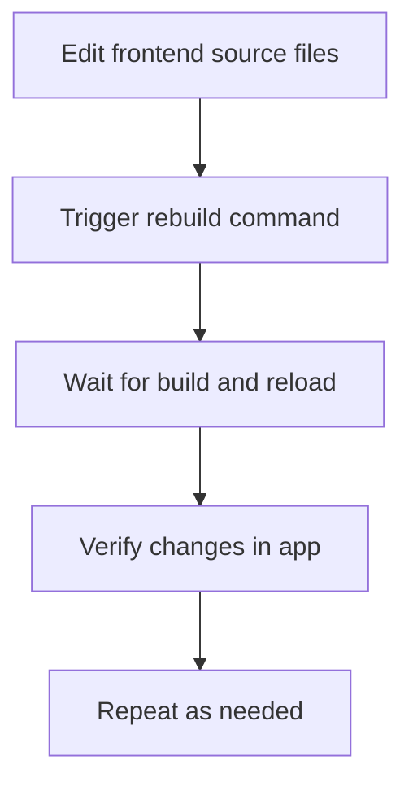

# User Story: Frontend Rebuild and Reload

## Motivation
As a frontend developer, I want to quickly rebuild and reload the frontend application so I can see changes reflected immediately and iterate efficiently during development.

## Actors
- Frontend Developer
- QA Engineer
- New Team Member

## Preconditions
- The frontend codebase and build tools are available.
- The developer has access to the appropriate Docker containers or local environment.
- All dependencies are installed.

## Step-by-Step Actions
1. Make code changes in the frontend source files.
2. Trigger a rebuild using the appropriate Makefile target or build command.
3. Wait for the build to complete and the application to reload.
4. Verify that changes are reflected in the running application.
5. Repeat as needed for further development.

## Expected Outcomes
- The frontend rebuilds and reloads quickly after changes.
- Developers can iterate efficiently with minimal downtime.
- The workflow is documented and reproducible for all team members.

## Best Practices
- Use Makefile targets or scripts to standardize the rebuild process.
- Enable hot-reload or live-reload features if available.
- Document any manual steps required for special cases.
- Regularly test the rebuild workflow in a clean environment.

## Workflow Diagram



## References
- Makefile.ai targets: `ai-admin-frontend-restart`, `ai-admin-frontend-nocache-restart`
- [ONBOARDING.md](../ONBOARDING.md)

## Troubleshooting: When Changes Don't Appear

Sometimes, even after running the correct Makefile targets, frontend changes may not show up in the UI. This can be confusing and has happened before. Here are common causes and steps that have helped:

### Common Causes
- **Docker build cache:** The container may use cached layers and not pick up new code.
- **Volume mounts:** Docker volumes can override built files with old files from the host.
- **Browser cache:** Browsers may serve old JS/CSS bundles. Try a hard refresh or incognito mode.
- **Build context issues:** The Docker build context may not include the latest source code.
- **Multiple containers:** Rare, but check that only one frontend container is running.

### Steps That Have Helped
1. **Full no-cache rebuild:**
   ```bash
   make -f Makefile.ai ai-admin-frontend-nocache-restart
   ```
2. **Remove all containers and volumes:**
   ```bash
   docker compose down -v
   docker system prune -af
   make -f Makefile.ai ai-admin-frontend-nocache-restart
   ```
3. **Check for volume mounts:**
   Inspect `docker-compose.yml` for any `volumes:` under the frontend service.
4. **Hard refresh the browser:**
   Use Cmd+Shift+R (Mac) or Ctrl+Shift+R (Windows/Linux), or try incognito mode.
5. **Add a visible, trivial change:**
   Edit the UI (e.g., add a new heading or emoji) to confirm the new build is running.
6. **Check container status:**
   ```bash
   make -f Makefile.ai ai-status
   ```
7. **Check container logs:**
   ```bash
   docker compose logs --tail=100 frontend
   ```

### Lessons Learned
- Sometimes, after all these steps, things "just work"—the root cause may not always be clear.
- Document what you tried, as this helps future debugging.
- If you're stuck, try a combination of the above steps and ask for help.

## Breadcrumbs & Debugging Tools

To make future troubleshooting easier, we added the following Makefile targets:

- **ai-docker-ps**: Lists all running Docker containers (names, images, status, ports).
- **ai-port-3000-procs**: Shows any processes using port 3000 (finds stray dev servers).
- **ai-docker-stop-all**: Stops all running Docker containers.
- **ai-kill-port-3000**: Kills any process using port 3000 on your host.
- **ai-playwright-build-nocache**: Forces a no-cache build of the Playwright test container to ensure the latest test code is included.

These tools help quickly diagnose issues with multiple containers, port conflicts, or stale processes.

### Real-World Debugging Adventure

During a recent session, we:
- Tried full no-cache rebuilds and restarts
- Checked for browser cache issues
- Wondered about multiple containers or stray dev servers
- Added these Makefile helpers to make future debugging much easier
- **Noticed that sometimes, after a long session, the frontend cache or Docker state resolves itself and the latest code appears—patience and repeated attempts (including no-cache builds, restarts, and time) can eventually resolve stubborn caching issues, even if the exact trigger is unclear.**

If you're stuck, try these tools and document what you find—future you will thank you! 