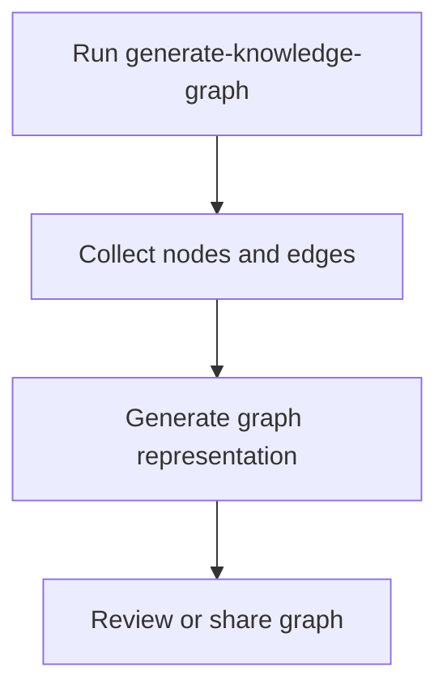

# User Story: generate-knowledge-graph

## Motivation
To enable users and systems to generate a visual or data representation of the knowledge graph, supporting analysis, debugging, and onboarding.

## Actors
- Developers
- Project maintainers
- AI assistants

## Preconditions
- The project includes a Makefile target or script for generating the knowledge graph.
- The knowledge base contains nodes and edges.

## Step-by-Step Actions
1. Run the generate-knowledge-graph target or script:
   ```bash
   make generate-knowledge-graph
   ```
2. The system collects all nodes and edges from the knowledge base.
3. The system generates a graph representation (e.g., DOT, PNG, HTML).
4. The user reviews or shares the generated graph.

## Expected Outcomes
- A knowledge graph is generated and available for review or sharing.
- Users can visualize relationships and structure in the data.

## Best Practices
- Keep the graph up to date with the latest data.
- Use clear labels and layouts for readability.
- Save generated graphs for documentation or onboarding.

## Workflow Diagram


