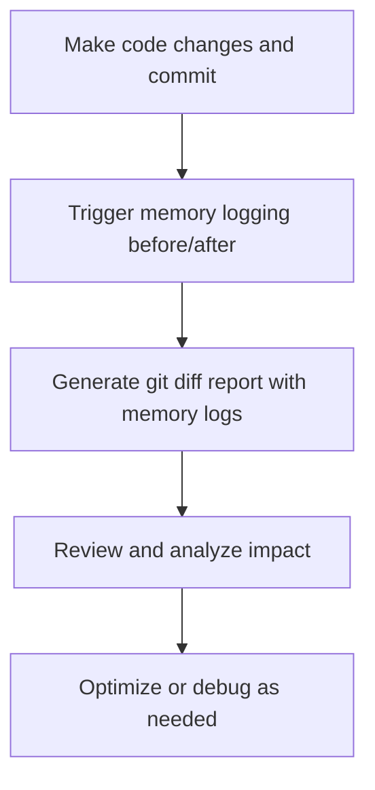

# User Story: Git Diff Memory Logging

## Motivation
As a developer, I want to log and review memory changes associated with git diffs so I can track how code changes impact memory usage and debug regressions more effectively.

## Actors
- Developer
- Code Reviewer
- System Administrator

## Preconditions
- Memory logging and git diff integration are implemented in the codebase.
- The developer has access to the relevant logging and version control tools.

## Step-by-Step Actions
1. Make code changes and commit them to the repository.
2. Trigger the memory logging system to capture memory state before and after the changes.
3. Generate a git diff report linked to memory log entries using the Makefile target:
   ```bash
   make -f Makefile.ai ai-memory-log-git-diff DIFF_RANGE=HEAD
   ```
   - This will generate a git diff, summarize it with the LLM, and store the summary and diff as a memory node.
4. Review the combined report to analyze the impact of code changes on memory.
5. Use findings to optimize code or catch regressions.

> **Quick Start Example (optional):**
> ```bash
> # Log the current git diff as a memory node
> make -f Makefile.ai ai-memory-log-git-diff DIFF_RANGE=HEAD~1..HEAD
> ```

## Expected Outcomes
- Memory logs are linked to specific git diffs.
- Developers and reviewers can easily analyze the impact of changes on memory usage.
- Debugging and optimization are more efficient.

## Best Practices
- Automate memory logging on commit or PR events.
- Store logs in a searchable, persistent location.
- Document the workflow for linking diffs to memory logs.
- Regularly review reports for optimization opportunities.

## Workflow Diagram



---

## References
- Makefile.ai: `ai-memory-log-git-diff`
- API: `/summarize-git-diff`, `/memory/nodes` 