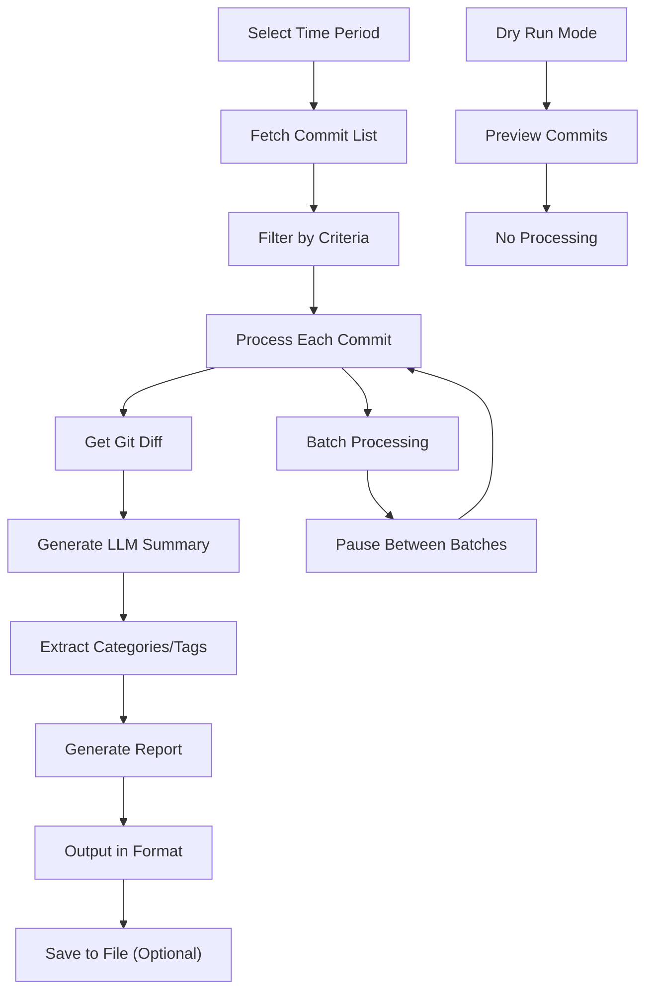

# Git History Analysis Workflow

## Overview
The git history analyzer provides comprehensive analysis of git commits by traversing the repository history and generating AI-powered summaries of changes. This tool builds on the existing git diff functionality to provide insights across multiple commits and time periods.

## Motivation
- Understand the evolution of code changes over time
- Generate summaries for code reviews and retrospectives
- Track development patterns and trends
- Create documentation from commit history
- Analyze impact of changes across multiple commits

## Actors
- **Developers**: Analyze their own or team's commit history
- **Code Reviewers**: Understand changes across multiple commits
- **Project Managers**: Track development progress and patterns
- **Documentation Writers**: Generate change summaries for documentation

## Preconditions
- Git repository with commit history
- Docker environment running with misc-scripts container
- LLM service available for summarization
- Access to the git history analyzer script

## Step-by-Step Actions

### 1. Basic History Analysis
Analyze commits from a specific time period:
```bash
# Analyze last week's commits
make -f Makefile.ai misc-git-history-analyze SINCE='1 week ago' MAX_COMMITS=20

# Analyze commits from specific date range
make -f Makefile.ai misc-git-history-analyze SINCE='2024-01-01' UNTIL='2024-01-31'
```

### 2. Quick Analysis Commands
Use predefined analysis patterns:
```bash
# Quick summary of recent commits
make -f Makefile.ai misc-git-history-quick

# Daily commit analysis
make -f Makefile.ai misc-git-history-daily

# Weekly summary with file output
make -f Makefile.ai misc-git-history-weekly
```

### 3. Advanced Filtering
Filter commits by author or other criteria:
```bash
# Analyze commits by specific author
make -f Makefile.ai misc-git-history-analyze SINCE='2 weeks ago' AUTHOR='John Doe'

# Limit number of commits analyzed
make -f Makefile.ai misc-git-history-analyze SINCE='1 month ago' MAX_COMMITS=50
```

### 4. Output Format Options
Choose different output formats:
```bash
# JSON format (default)
make -f Makefile.ai misc-git-history-analyze SINCE='1 week ago' OUTPUT_FORMAT=json

# Human-readable text format
make -f Makefile.ai misc-git-history-analyze SINCE='1 week ago' OUTPUT_FORMAT=text

# High-level summary only
make -f Makefile.ai misc-git-history-analyze SINCE='1 week ago' OUTPUT_FORMAT=summary
```

### 5. File Output
Save analysis to files:
```bash
# Save detailed analysis to file
make -f Makefile.ai misc-git-history-analyze SINCE='1 week ago' OUTPUT_FILE=analysis.json

# Save summary to file
make -f Makefile.ai misc-git-history-analyze SINCE='1 week ago' OUTPUT_FORMAT=summary OUTPUT_FILE=summary.json
```

### 6. Dry Run Mode
Preview what would be analyzed:
```bash
# See what commits would be analyzed without processing
make -f Makefile.ai misc-git-history-analyze SINCE='1 week ago' DRY_RUN=true
```

## Expected Outcomes

### Analysis Results
- **Commit Metadata**: Hash, author, date, message, files changed
- **AI Summaries**: LLM-generated summaries of changes
- **Categories**: Automatic categorization of changes
- **Tags**: Relevant tags for each commit
- **File Changes**: List of modified files per commit

### Output Formats
- **JSON**: Structured data for programmatic use
- **Text**: Human-readable report format
- **Summary**: High-level statistics and overview

### Sample Output (Summary Format)
```json
{
  "total_commits": 15,
  "total_files_changed": 45,
  "unique_authors": 3,
  "authors": ["John Doe", "Jane Smith", "Bob Wilson"],
  "categories": ["bug-fix", "feature", "refactor", "documentation"],
  "tags": ["api", "frontend", "database", "testing"],
  "date_range": {
    "start": "2024-01-15",
    "end": "2024-01-22"
  }
}
```

## Best Practices

### 1. Time Period Selection
- Use relative dates for recent analysis: `'1 week ago'`, `'2 days ago'`
- Use absolute dates for historical analysis: `'2024-01-01'`
- Limit commit count for large repositories: `MAX_COMMITS=50`

### 2. Performance Optimization
- Use `DRY_RUN=true` to preview before full analysis
- Start with smaller time periods for initial testing
- Use summary format for quick overviews
- Batch processing includes delays to avoid overwhelming LLM service

### 3. Output Management
- Save important analyses to files for future reference
- Use JSON format for programmatic processing
- Use text format for human review
- Use summary format for high-level reporting

### 4. Analysis Patterns
- **Daily Standups**: Use `misc-git-history-daily`
- **Weekly Reviews**: Use `misc-git-history-weekly`
- **Sprint Retrospectives**: Analyze sprint duration
- **Release Notes**: Analyze since last release tag

## Troubleshooting

### Common Issues

1. **No Commits Found**
   ```bash
   # Check git log manually
   git log --since='1 week ago' --oneline
   
   # Verify date format
   make -f Makefile.ai misc-git-history-analyze SINCE='2024-01-01' DRY_RUN=true
   ```

2. **LLM Service Unavailable**
   ```bash
   # Check service status
   docker compose ps ollama-functions
   
   # Restart service if needed
   docker compose restart ollama-functions
   ```

3. **Large Analysis Times Out**
   ```bash
   # Reduce commit count
   make -f Makefile.ai misc-git-history-analyze SINCE='1 month ago' MAX_COMMITS=20
   
   # Use smaller time periods
   make -f Makefile.ai misc-git-history-analyze SINCE='1 week ago'
   ```

4. **Memory Issues with Large Diffs**
   ```bash
   # Exclude diffs for large analysis
   make -f Makefile.ai misc-git-history-analyze SINCE='1 month ago' --no-diff
   ```

### Performance Tips
- Use `--no-summarize` for faster analysis without LLM processing
- Use `--no-diff` to exclude large diff content
- Process in smaller batches with `--batch-size=3`
- Use summary format for quick overviews

## Integration with Existing Workflows

### Memory System Integration
```bash
# Analyze commits and create memory nodes
make -f Makefile.ai misc-git-history-analyze SINCE='1 week ago' OUTPUT_FILE=weekly_analysis.json
# Then use the output to create memory nodes for important patterns
```

### Code Review Integration
```bash
# Generate summary for code review
make -f Makefile.ai misc-git-history-analyze SINCE='HEAD~5' OUTPUT_FORMAT=text
```

### Documentation Generation
```bash
# Generate change log for documentation
make -f Makefile.ai misc-git-history-analyze SINCE='v1.0.0' OUTPUT_FILE=changelog.json
```

## Advanced Usage

### Custom Analysis Scripts
```bash
# Create custom analysis pipeline
make -f Makefile.ai misc-git-history-analyze SINCE='1 month ago' OUTPUT_FILE=monthly.json
python3 scripts/custom_analysis.py monthly.json
```

### Batch Processing
```bash
# Process multiple time periods
for period in "1 week ago" "2 weeks ago" "1 month ago"; do
  make -f Makefile.ai misc-git-history-analyze SINCE="$period" OUTPUT_FILE="analysis_${period// /_}.json"
done
```

### Integration with CI/CD
```bash
# Add to CI pipeline for automated analysis
make -f Makefile.ai misc-git-history-analyze SINCE='${{ github.event.before }}' OUTPUT_FILE=ci_analysis.json
```

## References
- [Git Diff Memory Logging](git_diff_memory_logging.md)
- [Memory System Architecture](../onboarding/MEMORY_SYSTEM.md)
- [Testing Workflow](../onboarding/TESTING_WORKFLOW.md)
- [Maintenance Automation](../../MAINTENANCE_AUTOMATION.md)

## Workflow Diagram



## Future Enhancements
- Integration with issue tracking systems
- Automatic categorization based on commit patterns
- Trend analysis and visualization
- Integration with project management tools
- Automated report generation for stakeholders 