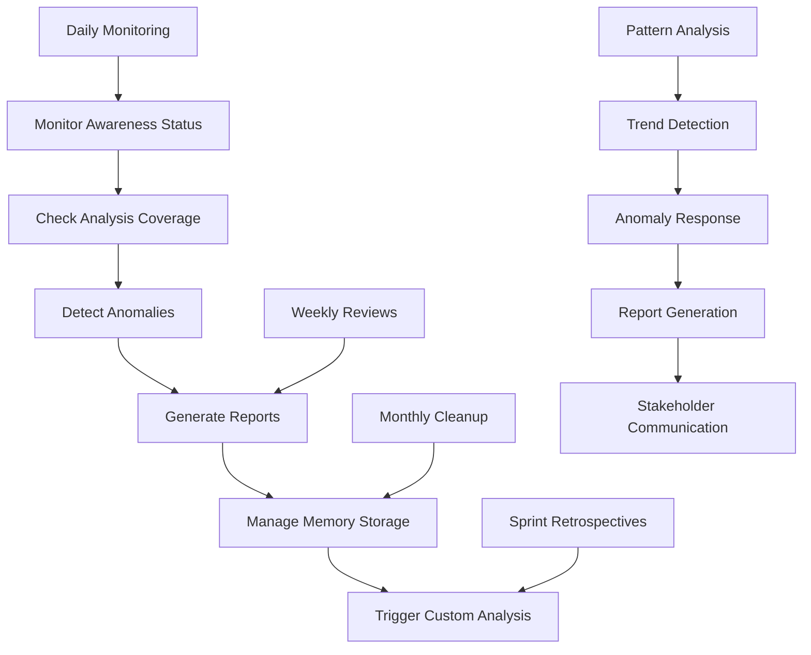

# Git History Awareness Management Workflow

## Overview
The git history awareness management system provides tools to monitor, analyze, and manage the growth of git history analysis awareness over time. This workflow enables teams to track development patterns, detect anomalies, and maintain optimal awareness coverage.

## Motivation
- Monitor the effectiveness of git history analysis over time
- Track development patterns and trends
- Detect anomalies in development activity
- Maintain optimal awareness coverage
- Generate reports for stakeholders and retrospectives
- Manage memory storage and cleanup

## Actors
- **Developers**: Monitor their own development patterns
- **Team Leads**: Track team development velocity and patterns
- **Project Managers**: Generate reports for stakeholders
- **System Administrators**: Manage memory storage and cleanup
- **DevOps Engineers**: Monitor system performance and coverage

## Preconditions
- Git history analysis system running with scheduled jobs
- Memory API accessible and functional
- Analysis nodes being created regularly
- Makefile targets available for management

## Step-by-Step Actions

### 1. Monitor Awareness Growth Status
Check the current state of git history awareness:

```bash
# Check overall awareness status
make -f Makefile.ai memory-git-history-awareness-status

# View analysis timeline
make -f Makefile.ai memory-git-history-awareness-timeline

# Analyze development patterns
make -f Makefile.ai memory-git-history-awareness-patterns
```

### 2. Detect Development Anomalies
Identify unusual patterns in development activity:

```bash
# Check for recent anomalies
make -f Makefile.ai memory-git-history-awareness-anomalies

# Analyze development trends
make -f Makefile.ai memory-git-history-awareness-trends
```

### 3. Generate Awareness Reports
Create comprehensive reports for stakeholders:

```bash
# Generate full awareness report
make -f Makefile.ai memory-git-history-awareness-report

# Export awareness data for external analysis
make -f Makefile.ai memory-git-history-awareness-export
```

### 4. Manage Memory Storage
Maintain optimal memory storage and cleanup:

```bash
# Clean up old analysis nodes (older than 6 months)
make -f Makefile.ai memory-git-history-awareness-cleanup
```

### 5. Trigger Custom Awareness Analysis
Run custom analysis for specific needs:

```bash
# Trigger comprehensive analysis across all time periods
make -f Makefile.ai memory-git-history-awareness-trigger-full

# Trigger custom analysis
make -f Makefile.ai memory-git-history-awareness-trigger-custom SINCE='1 week ago' NAMESPACE=custom_analysis MEMORY_TAGS='sprint1 retrospective'
```

## Expected Outcomes

### Awareness Status Monitoring
- **Analysis Coverage**: Count of analysis nodes by namespace
- **Timeline View**: Chronological view of analysis execution
- **Pattern Recognition**: Statistical analysis of development patterns
- **Growth Summary**: Overview of awareness accumulation

### Anomaly Detection
- **Unusual Activity**: Detection of spikes or drops in commits
- **Pattern Changes**: Identification of shifts in development patterns
- **Missing Analysis**: Detection of gaps in analysis coverage
- **Performance Issues**: Identification of analysis failures

### Report Generation
- **Comprehensive Reports**: Detailed analysis coverage reports
- **Data Export**: JSON export for external analysis tools
- **Trend Analysis**: Long-term development pattern analysis
- **Stakeholder Insights**: High-level summaries for management

### Memory Management
- **Storage Optimization**: Cleanup of old analysis nodes
- **Performance Maintenance**: Optimal memory usage
- **Data Preservation**: Export before cleanup operations
- **Space Recovery**: Free up storage for new analyses

## Best Practices

### 1. Regular Monitoring
- Check awareness status weekly
- Monitor for anomalies daily
- Review patterns monthly
- Generate reports quarterly

### 2. Pattern Analysis
- Track daily commit averages
- Monitor weekly development velocity
- Analyze sprint completion patterns
- Review monthly trend changes

### 3. Anomaly Response
- Investigate unusual commit spikes
- Address gaps in analysis coverage
- Respond to pattern changes
- Document anomaly causes

### 4. Memory Management
- Clean up old nodes quarterly
- Export data before cleanup
- Monitor storage usage
- Preserve important analyses

### 5. Report Utilization
- Use reports in sprint retrospectives
- Share insights with stakeholders
- Include in project planning
- Reference in capacity planning

## Troubleshooting

### Common Issues

1. **No Analysis Nodes Found**
   ```bash
   # Check if analysis is running
   make -f Makefile.ai misc-git-history-worker-logs
   
   # Verify scheduled jobs
   docker compose logs maintenance-scheduler
   
   # Trigger manual analysis
   make -f Makefile.ai memory-git-history-awareness-trigger-full
   ```

2. **Incomplete Analysis Coverage**
   ```bash
   # Check for gaps in timeline
   make -f Makefile.ai memory-git-history-awareness-timeline
   
   # Trigger missing analyses
   make -f Makefile.ai memory-git-history-awareness-trigger-custom SINCE='1 week ago' NAMESPACE=gap_fill
   ```

3. **Memory Storage Issues**
   ```bash
   # Check memory usage
   make -f Makefile.ai memory-git-history-awareness-status
   
   # Clean up old nodes
   make -f Makefile.ai memory-git-history-awareness-cleanup
   
   # Export before cleanup
   make -f Makefile.ai memory-git-history-awareness-export
   ```

4. **Pattern Analysis Failures**
   ```bash
   # Check API connectivity
   curl -s http://localhost:9103/health
   
   # Verify authentication
   cat /code/.apitoken
   
   # Test individual queries
   curl -s -H "Authorization: Bearer $(cat /code/.apitoken)" http://api:8000/memory/nodes | jq '.[0]'
   ```

### Performance Optimization
- Use specific date ranges for large exports
- Clean up old nodes regularly
- Monitor API response times
- Optimize query patterns

## Integration Patterns

### 1. Sprint Retrospectives
```bash
# Generate sprint awareness report
make -f Makefile.ai memory-git-history-awareness-trigger-custom SINCE='2 weeks ago' NAMESPACE=sprint_retro MEMORY_TAGS='sprint retrospective'

# Analyze sprint patterns
make -f Makefile.ai memory-git-history-awareness-patterns
```

### 2. Monthly Reviews
```bash
# Generate monthly report
make -f Makefile.ai memory-git-history-awareness-report

# Analyze monthly trends
make -f Makefile.ai memory-git-history-awareness-trends
```

### 3. Capacity Planning
```bash
# Analyze development velocity
make -f Makefile.ai memory-git-history-awareness-patterns

# Export data for planning tools
make -f Makefile.ai memory-git-history-awareness-export
```

### 4. Stakeholder Reporting
```bash
# Generate comprehensive report
make -f Makefile.ai memory-git-history-awareness-report

# Create custom analysis for specific period
make -f Makefile.ai memory-git-history-awareness-trigger-custom SINCE='1 month ago' NAMESPACE=stakeholder_report MEMORY_TAGS='stakeholder report'
```

## Advanced Usage

### Custom Analysis Scripts
```bash
# Export data for custom analysis
make -f Makefile.ai memory-git-history-awareness-export

# Process with custom scripts
python3 scripts/custom_awareness_analysis.py exports/git_history_awareness_*.json
```

### Automated Monitoring
```bash
# Add to crontab for automated monitoring
0 9 * * 1 make -f Makefile.ai memory-git-history-awareness-status
0 10 * * 1 make -f Makefile.ai memory-git-history-awareness-report
```

### Integration with CI/CD
```bash
# Add to CI pipeline for automated reporting
make -f Makefile.ai memory-git-history-awareness-trigger-custom SINCE='${{ github.event.before }}' NAMESPACE=ci_analysis MEMORY_TAGS='ci automated'
```

## References
- [Git History Analysis Workflow](git_history_analysis.md)
- [Git History RabbitMQ Integration](git_history_rabbitmq_integration.md)
- [Git History Awareness Growth](git_history_awareness_growth.md)
- [Memory System Architecture](../onboarding/MEMORY_SYSTEM.md)
- [Worker Management](../user_stories/memory_worker_management.md)

## Workflow Diagram



## Future Enhancements
- Machine learning for pattern prediction
- Automated anomaly alerts
- Integration with project management tools
- Advanced trend visualization
- Cross-repository pattern analysis
- Predictive capacity planning 