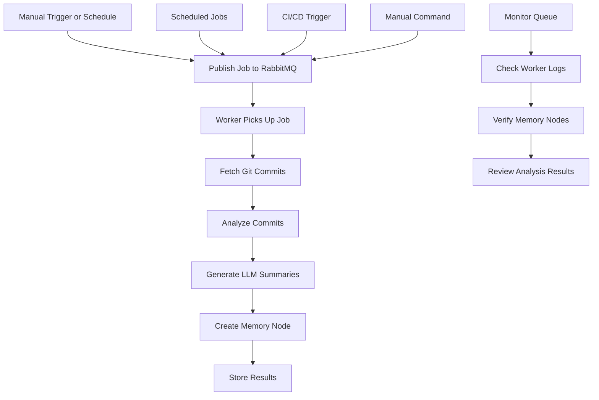

# Git History Analysis RabbitMQ Integration

## Overview
The git history analysis system integrates with the RabbitMQ worker infrastructure to provide automated, scheduled, and on-demand analysis of git commit history. This enables background processing, memory node creation, and integration with the existing worker ecosystem.

## Motivation
- Automate git history analysis for regular reporting
- Integrate analysis results with the memory system
- Enable background processing of large analysis jobs
- Provide scheduled analysis for different time periods
- Allow on-demand analysis triggered by events or manual requests

## Actors
- **Developers**: Trigger on-demand analysis jobs
- **System Administrators**: Monitor worker queues and job processing
- **Project Managers**: Receive automated reports and insights
- **Memory System**: Stores analysis results as memory nodes

## Preconditions
- RabbitMQ service running
- Worker containers deployed and running
- Git history analyzer script available
- Memory API accessible
- LLM service available for summarization

## Step-by-Step Actions

### 1. Manual Job Triggering
Trigger git history analysis jobs manually:
```bash
# Basic analysis job
make -f Makefile.ai misc-git-history-trigger SINCE='1 week ago' CREATE_MEMORY=true

# Author-specific analysis
make -f Makefile.ai misc-git-history-trigger SINCE='1 month ago' AUTHOR='John Doe' CREATE_MEMORY=true

# Detailed analysis with custom tags
make -f Makefile.ai misc-git-history-trigger SINCE='2 weeks ago' CREATE_MEMORY=true MEMORY_NAMESPACE=sprint1 MEMORY_TAGS='sprint1 retrospective'
```

### 2. Predefined Analysis Patterns
Use predefined analysis patterns for common scenarios:
```bash
# Daily analysis (last 24 hours)
make -f Makefile.ai misc-git-history-trigger-daily

# Weekly analysis (last week)
make -f Makefile.ai misc-git-history-trigger-weekly

# Sprint analysis (last 2 weeks)
make -f Makefile.ai misc-git-history-trigger-sprint
```

### 3. Scheduled Analysis
The system automatically runs scheduled analysis:
- **Daily**: 6 AM - Last 24 hours analysis
- **Weekly**: Monday 7 AM - Last week analysis  
- **Sprint**: Monday 8 AM - Last 2 weeks analysis
- **Monthly**: 1st of month 9 AM - Last month detailed analysis

### 4. Monitoring and Management
Monitor job processing and queue status:
```bash
# Check worker logs
make -f Makefile.ai misc-git-history-worker-logs

# Check queue status
make -f Makefile.ai misc-git-history-queue-status

# Restart workers if needed
make -f Makefile.ai restart-workers
```

### 5. Memory Integration
Analysis results are automatically stored as memory nodes:
```bash
# Trigger analysis with memory node creation
make -f Makefile.ai misc-git-history-trigger SINCE='1 week ago' CREATE_MEMORY=true MEMORY_NAMESPACE=weekly_analysis

# View created memory nodes
make -f Makefile.ai misc-list-memory-nodes
```

## Expected Outcomes

### Job Processing
- Jobs are queued in RabbitMQ `git.history.analysis` queue
- Worker processes jobs in background
- Analysis results are generated and stored
- Memory nodes created with analysis metadata

### Memory Node Structure
```json
{
  "content": "Git history analysis completed. Found 15 commits.",
  "meta": {
    "type": "git_history_analysis",
    "output_format": "summary",
    "since": "1 week ago",
    "commits_analyzed": 15,
    "tags": ["weekly", "retrospective", "git-history", "analysis"],
    "categories": ["development", "code-analysis"],
    "full_report": "...",
    "report_length": 2048
  }
}
```

### Scheduled Analysis Results
- **Daily**: Quick summary of yesterday's changes
- **Weekly**: Comprehensive weekly development summary
- **Sprint**: Sprint retrospective with patterns and trends
- **Monthly**: Detailed monthly analysis with full commit data

## Best Practices

### 1. Job Configuration
- Use appropriate time periods for analysis scope
- Set reasonable commit limits to avoid timeouts
- Choose output format based on intended use
- Enable memory node creation for persistent storage

### 2. Performance Optimization
- Use summary format for scheduled jobs
- Exclude diffs for large time periods
- Set appropriate batch sizes
- Monitor worker resource usage

### 3. Memory Management
- Use descriptive namespaces for organization
- Apply relevant tags for easy filtering
- Consider report length for memory storage
- Archive old analysis nodes periodically

### 4. Monitoring
- Check worker logs regularly
- Monitor queue lengths
- Track job completion times
- Verify memory node creation

## Troubleshooting

### Common Issues

1. **Job Not Processing**
   ```bash
   # Check worker status
   docker compose ps worker
   
   # Check queue status
   make -f Makefile.ai misc-git-history-queue-status
   
   # Restart workers
   make -f Makefile.ai restart-workers
   ```

2. **Memory Node Creation Fails**
   ```bash
   # Check API token
   cat /code/.apitoken
   
   # Check memory API status
   curl -s http://localhost:9103/health
   
   # Check worker logs for errors
   make -f Makefile.ai misc-git-history-worker-logs
   ```

3. **LLM Service Unavailable**
   ```bash
   # Check Ollama Functions service
   docker compose ps ollama-functions
   
   # Restart service if needed
   docker compose restart ollama-functions
   ```

4. **Large Analysis Times Out**
   ```bash
   # Reduce commit count
   make -f Makefile.ai misc-git-history-trigger SINCE='1 month ago' MAX_COMMITS=100
   
   # Use smaller time periods
   make -f Makefile.ai misc-git-history-trigger SINCE='1 week ago'
   ```

### Performance Tips
- Use `--no-diff` for large time periods
- Use `--no-summarize` for faster processing
- Process in smaller batches
- Monitor system resources during analysis

## Integration Patterns

### 1. CI/CD Integration
```bash
# Add to CI pipeline for automated analysis
make -f Makefile.ai misc-git-history-trigger SINCE='${{ github.event.before }}' CREATE_MEMORY=true MEMORY_TAGS='ci automated'
```

### 2. Release Management
```bash
# Analyze since last release
make -f Makefile.ai misc-git-history-trigger SINCE='v1.0.0' CREATE_MEMORY=true MEMORY_NAMESPACE=release_analysis MEMORY_TAGS='release v1.1.0'
```

### 3. Sprint Retrospectives
```bash
# Sprint analysis with custom namespace
make -f Makefile.ai misc-git-history-trigger SINCE='2 weeks ago' CREATE_MEMORY=true MEMORY_NAMESPACE=sprint_5 MEMORY_TAGS='sprint5 retrospective'
```

### 4. Team Performance Tracking
```bash
# Analyze team member contributions
make -f Makefile.ai misc-git-history-trigger SINCE='1 month ago' AUTHOR='Team Member' CREATE_MEMORY=true MEMORY_NAMESPACE=team_performance
```

## Advanced Usage

### Custom Scheduling
```bash
# Trigger analysis at specific times
crontab -e
# Add: 0 9 * * 1 make -f Makefile.ai misc-git-history-trigger-weekly
```

### Batch Processing
```bash
# Process multiple time periods
for period in "1 week ago" "2 weeks ago" "1 month ago"; do
  make -f Makefile.ai misc-git-history-trigger SINCE="$period" CREATE_MEMORY=true MEMORY_NAMESPACE="analysis_${period// /_}"
done
```

### Custom Analysis Scripts
```bash
# Create custom analysis pipeline
make -f Makefile.ai misc-git-history-trigger SINCE='1 month ago' OUTPUT_FILE=monthly.json
python3 scripts/custom_analysis.py monthly.json
```

## References
- [Git History Analysis Workflow](git_history_analysis.md)
- [Memory System Architecture](../onboarding/MEMORY_SYSTEM.md)
- [Worker Management](../user_stories/memory_worker_management.md)
- [Maintenance Automation](../../MAINTENANCE_AUTOMATION.md)

## Workflow Diagram



## Future Enhancements
- Integration with issue tracking systems
- Automatic trend analysis and alerts
- Custom analysis templates
- Real-time analysis triggers
- Advanced filtering and search capabilities
- Integration with project management tools 