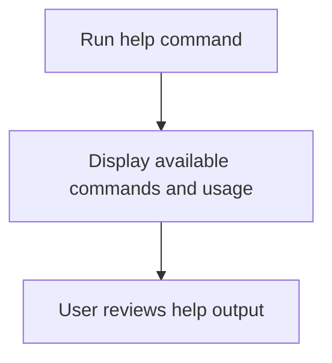

# User Story: help

## Motivation
To provide users and contributors with quick access to documentation, available commands, and usage examples, supporting onboarding and troubleshooting.

## Actors
- End users
- Developers
- Project maintainers

## Preconditions
- The project includes a help target or command in the Makefile or CLI.

## Step-by-Step Actions
1. Run the help target or command:
   ```bash
   make help
   # or
   ./cli.py help
   ```
2. The system displays a list of available commands, targets, and usage examples.
3. The user reviews the output to find the needed information.

## Expected Outcomes
- Users can quickly find documentation and usage examples.
- Onboarding and troubleshooting are streamlined.

## Best Practices
- Keep help output up to date with all available commands.
- Provide clear, concise descriptions for each command or target.
- Link to further documentation where appropriate.

## Workflow Diagram


