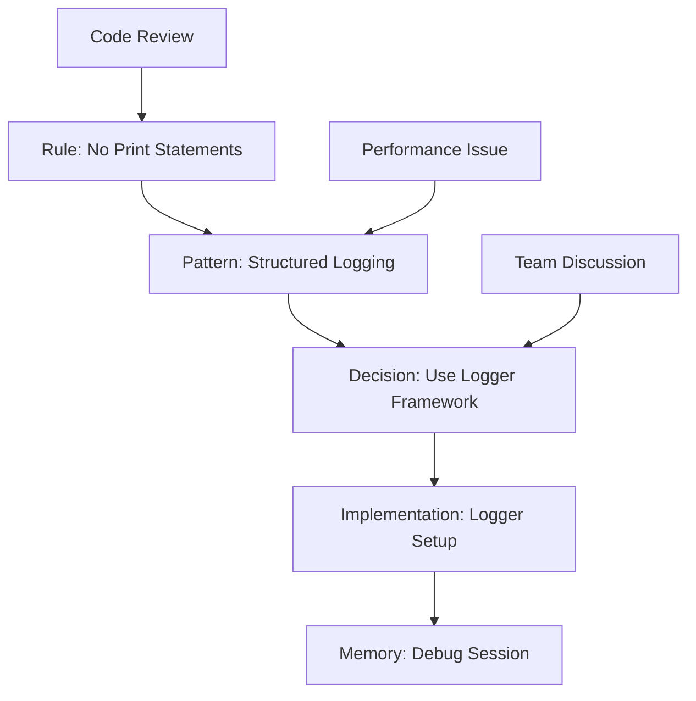

# User Story: Interactive Knowledge Graph Visualization

## Motivation
As a developer, admin, or AI agent, I want to explore and understand the project's knowledge graph through an interactive, visual interface, so I can discover relationships, patterns, and insights that would be difficult to find through text-based queries alone.

## Actors
- **Developer**: Exploring code patterns and best practices
- **Admin**: Managing and understanding the knowledge system
- **AI Agent**: Visualizing decision paths and relationships
- **New Team Member**: Learning project structure and history
- **Project Manager**: Understanding team knowledge and decisions

## Preconditions
- Memory system contains nodes and relationships
- WebSocket support for real-time updates
- Modern web browser with JavaScript enabled
- Valid API token for authentication

## Step-by-Step Actions

### 1. Access the Knowledge Graph Interface
```bash
# Navigate to the interactive graph interface
open http://localhost:3000/knowledge-graph

# Or access via API
curl -H "Authorization: Bearer $TOKEN" \
  http://localhost:9103/graph/visualization
```

### 2. Initial Graph Loading
- **System loads**: All memory nodes and relationships
- **Layout algorithm**: Force-directed graph layout
- **Node clustering**: Automatic grouping by type and tags
- **Performance optimization**: Lazy loading for large graphs

### 3. Interactive Exploration
```javascript
// Example: User interactions
// Click on a node to see details
graph.on('nodeClick', (node) => {
  showNodeDetails(node);
  highlightRelatedNodes(node);
});

// Drag nodes to reorganize
graph.on('nodeDrag', (node, position) => {
  updateNodePosition(node.id, position);
});

// Zoom and pan
graph.on('zoom', (level) => {
  updateZoomLevel(level);
});
```

### 4. Advanced Filtering and Search
```typescript
// Filter by node type
const filters = {
  types: ['rule', 'pattern', 'decision', 'bug'],
  tags: ['python', 'security', 'performance'],
  dateRange: { start: '2024-01-01', end: '2024-12-31' },
  confidence: { min: 0.8 }
};

// Search functionality
const searchResults = await searchGraph({
  query: 'authentication patterns',
  semantic: true,
  fuzzy: true
});
```

### 5. Relationship Exploration


## Expected Outcomes

### Immediate Benefits
- **Visual Discovery**: Find relationships that aren't obvious in text
- **Pattern Recognition**: See clusters and trends at a glance
- **Context Understanding**: Understand how decisions relate to each other
- **Knowledge Navigation**: Intuitive exploration of project knowledge

### Long-term Benefits
- **Better Decision Making**: Visual context for complex decisions
- **Knowledge Retention**: Visual memory aids learning
- **Team Collaboration**: Shared understanding of project knowledge
- **Continuous Learning**: Discover new patterns and relationships

## Technical Implementation

### 1. Frontend Architecture
```typescript
// React-based graph visualization
import { ForceGraph2D } from 'react-force-graph';
import { D3ForceSimulation } from 'd3-force';

interface GraphNode {
  id: string;
  type: 'rule' | 'pattern' | 'decision' | 'memory';
  label: string;
  content: string;
  tags: string[];
  confidence: number;
  created_at: string;
  size: number;
  color: string;
}

interface GraphLink {
  source: string;
  target: string;
  type: 'related_to' | 'supersedes' | 'inspired_by' | 'conflicts_with';
  strength: number;
  label: string;
}

class KnowledgeGraphVisualization extends React.Component {
  private graphRef: any;
  private simulation: D3ForceSimulation;
  
  componentDidMount() {
    this.loadGraphData();
    this.setupInteractions();
  }
  
  private async loadGraphData() {
    const nodes = await this.fetchNodes();
    const links = await this.fetchLinks();
    
    this.setState({ nodes, links });
  }
  
  private setupInteractions() {
    // Node click handling
    this.graphRef.current.onNodeClick((node: GraphNode) => {
      this.showNodeDetails(node);
      this.highlightConnections(node.id);
    });
    
    // Link click handling
    this.graphRef.current.onLinkClick((link: GraphLink) => {
      this.showRelationshipDetails(link);
    });
  }
}
```

### 2. Backend API Endpoints
```python
# Graph visualization endpoints
@router.get("/graph/nodes")
async def get_graph_nodes(
    token: ApiAccessToken = Depends(require_api_token),
    db: Session = Depends(get_db),
    node_type: Optional[str] = Query(None),
    tags: Optional[str] = Query(None),
    namespace: Optional[str] = Query(None)
) -> List[GraphNodeResponse]:
    """Get nodes for graph visualization with filtering."""
    
    query = db.query(MemoryNode)
    
    if node_type:
        query = query.filter(MemoryNode.meta.contains(f'"type": "{node_type}"'))
    
    if tags:
        tag_list = tags.split(',')
        for tag in tag_list:
            query = query.filter(MemoryNode.meta.contains(f'"tags": ["{tag}"]'))
    
    if namespace:
        query = query.filter(MemoryNode.namespace == namespace)
    
    nodes = query.all()
    return [GraphNodeResponse.from_orm(node) for node in nodes]

@router.get("/graph/links")
async def get_graph_links(
    token: ApiAccessToken = Depends(require_api_token),
    db: Session = Depends(get_db),
    from_id: Optional[str] = Query(None),
    to_id: Optional[str] = Query(None),
    relation_type: Optional[str] = Query(None)
) -> List[GraphLinkResponse]:
    """Get relationships for graph visualization."""
    
    query = db.query(MemoryEdge)
    
    if from_id:
        query = query.filter(MemoryEdge.from_id == from_id)
    
    if to_id:
        query = query.filter(MemoryEdge.to_id == to_id)
    
    if relation_type:
        query = query.filter(MemoryEdge.relation_type == relation_type)
    
    edges = query.all()
    return [GraphLinkResponse.from_orm(edge) for edge in edges]

@router.websocket("/ws/graph-updates")
async def graph_updates_websocket(
    websocket: WebSocket,
    token: str = Query(...)
):
    """Real-time graph updates via WebSocket."""
    await websocket.accept()
    
    # Validate token
    if not validate_token(token):
        await websocket.close(code=4001, reason="Invalid token")
        return
    
    try:
        while True:
            # Send graph updates in real-time
            updates = await get_graph_updates()
            await websocket.send_json({
                "type": "graph_update",
                "updates": updates,
                "timestamp": datetime.utcnow().isoformat()
            })
            await asyncio.sleep(5)  # Update every 5 seconds
    except WebSocketDisconnect:
        logger.info("Graph client disconnected")
```

### 3. Graph Layout and Styling
```typescript
// Graph styling and layout configuration
const graphConfig = {
  nodeRelSize: 6,
  linkWidth: 2,
  linkDirectionalParticles: 2,
  linkDirectionalParticleSpeed: 0.005,
  
  // Node styling based on type
  nodeColor: (node: GraphNode) => {
    switch (node.type) {
      case 'rule': return '#ff6b6b';
      case 'pattern': return '#4ecdc4';
      case 'decision': return '#45b7d1';
      case 'memory': return '#96ceb4';
      default: return '#feca57';
    }
  },
  
  // Node size based on importance
  nodeSize: (node: GraphNode) => {
    return Math.max(3, Math.min(10, node.confidence * 10));
  },
  
  // Link styling based on relationship type
  linkColor: (link: GraphLink) => {
    switch (link.type) {
      case 'related_to': return '#666';
      case 'supersedes': return '#e74c3c';
      case 'inspired_by': return '#3498db';
      case 'conflicts_with': return '#f39c12';
      default: return '#95a5a6';
    }
  }
};
```

### 4. Advanced Features

#### Temporal Visualization
```typescript
// Time-based graph exploration
class TemporalGraphView {
  private timeline: Timeline;
  
  constructor() {
    this.timeline = new Timeline({
      start: '2024-01-01',
      end: '2024-12-31',
      onUpdate: (range) => this.updateGraphForTimeRange(range)
    });
  }
  
  private updateGraphForTimeRange(range: TimeRange) {
    // Filter nodes by creation date
    const filteredNodes = this.nodes.filter(node => 
      new Date(node.created_at) >= range.start &&
      new Date(node.created_at) <= range.end
    );
    
    this.updateGraph(filteredNodes);
  }
}
```

#### Clustering and Grouping
```typescript
// Automatic node clustering
class GraphClustering {
  private clusters: Map<string, GraphNode[]> = new Map();
  
  clusterNodes(nodes: GraphNode[]): void {
    // K-means clustering based on node similarity
    const clusters = this.kMeansClustering(nodes, 5);
    
    clusters.forEach((cluster, index) => {
      this.clusters.set(`cluster_${index}`, cluster);
    });
  }
  
  private kMeansClustering(nodes: GraphNode[], k: number): GraphNode[][] {
    // Implementation of k-means clustering algorithm
    // Groups similar nodes together
  }
}
```

## Best Practices

### 1. Performance Optimization
- **Lazy Loading**: Load nodes and links on demand
- **Level of Detail**: Show fewer details when zoomed out
- **Caching**: Cache graph data and layout calculations
- **Web Workers**: Use background threads for heavy computations

### 2. User Experience
- **Responsive Design**: Work on all screen sizes
- **Keyboard Navigation**: Support for accessibility
- **Touch Support**: Mobile-friendly interactions
- **Loading States**: Clear feedback during data loading

### 3. Data Management
- **Incremental Updates**: Only update changed parts of the graph
- **Conflict Resolution**: Handle concurrent modifications
- **Data Validation**: Ensure graph integrity
- **Backup and Restore**: Preserve graph state

## Integration Points

### 1. Memory System Integration
- **Real-time Updates**: Graph updates as memory changes
- **Semantic Search**: Find nodes by content similarity
- **Relationship Inference**: Suggest new connections
- **Confidence Scoring**: Visualize node reliability

### 2. Rule System Integration
- **Rule Dependencies**: Show how rules relate to each other
- **Violation Tracking**: Visualize rule violations over time
- **Pattern Evolution**: Show how patterns change over time
- **Impact Analysis**: Visualize rule impact on codebase

### 3. Predictive Analytics Integration
- **Trend Visualization**: Show emerging patterns
- **Anomaly Detection**: Highlight unusual nodes or relationships
- **Prediction Paths**: Show likely future connections
- **Risk Assessment**: Visualize potential issues

## Future Enhancements

### 1. Advanced Visualization
- **3D Graph**: Three-dimensional graph exploration
- **VR Support**: Virtual reality graph navigation
- **AR Integration**: Augmented reality graph overlay
- **Holographic Display**: 3D holographic projections

### 2. Collaboration Features
- **Shared Views**: Multiple users exploring together
- **Annotations**: Add notes and comments to nodes
- **Discussion Threads**: Conversations about specific nodes
- **Version History**: Track graph changes over time

### 3. AI-Powered Features
- **Auto-Layout**: AI-optimized graph layouts
- **Smart Clustering**: Intelligent node grouping
- **Relationship Prediction**: Suggest new connections
- **Anomaly Detection**: Identify unusual patterns

## Success Metrics

### 1. User Engagement
- **Time Spent**: Average session duration
- **Exploration Depth**: Number of nodes viewed per session
- **Return Rate**: Frequency of graph usage
- **Feature Adoption**: Usage of advanced features

### 2. Knowledge Discovery
- **New Connections**: Relationships discovered through visualization
- **Pattern Recognition**: Patterns identified visually
- **Decision Quality**: Impact on decision-making process
- **Learning Speed**: Time to understand project structure

### 3. System Performance
- **Load Time**: Time to display initial graph
- **Interaction Responsiveness**: Time to respond to user actions
- **Memory Usage**: Efficient data handling
- **Scalability**: Performance with large graphs

## References
- [Memory System Architecture](../onboarding/MEMORY_SYSTEM.md)
- [D3.js Force-Directed Graph](https://d3js.org/)
- [React Force Graph](https://github.com/vasturiano/react-force-graph)
- [WebSocket API Guidelines](.cursor/rules/api.mdc)
- [Graph Database Concepts](https://neo4j.com/developer/graph-database/) 