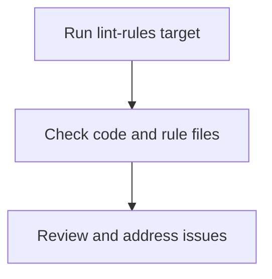

# User Story: lint-rules

## Motivation
To provide a standardized way to check code and rule files for style, formatting, and best practices, supporting code quality and maintainability.

## Actors
- Developers
- Project maintainers
- CI/CD systems

## Preconditions
- The project includes a lint-rules target or script.
- Linting configuration files are present (e.g., .flake8, .pylintrc).

## Step-by-Step Actions
1. Run the lint-rules target:
   ```bash
   make lint-rules
   ```
2. The system checks all code and rule files for style and formatting issues.
3. The user or CI system reviews the linting output and addresses any issues.

## Expected Outcomes
- Code and rule files are checked for style and formatting issues.
- Developers can address issues before merging changes.

## Best Practices
- Run linting before every commit or pull request.
- Keep linting configuration files up to date.
- Automate linting in CI/CD pipelines.

## Workflow Diagram


