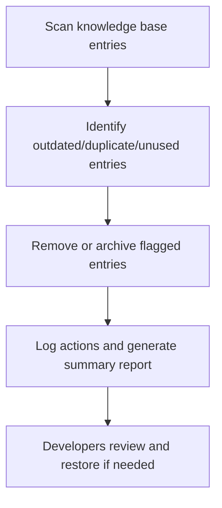

# User Story: Memory Cleanup Worker

## Motivation
To maintain a high-quality, relevant, and efficient knowledge base, the system must regularly remove outdated, duplicate, or irrelevant entries. This prevents knowledge rot, reduces confusion, and ensures that developers and automation rely on accurate information.

## Actors
- Automation system (runs the cleanup worker)
- Developers (review cleanup logs and flagged entries)

## Preconditions
- The knowledge base contains rules, memories, and metadata.
- Entries may be marked as deprecated, obsolete, or have timestamps/usage data.

## Step-by-Step Actions
1. The worker scans all memory and rule entries in the knowledge base.
2. It identifies entries that are:
   - Marked as deprecated or obsolete
   - Duplicates (by content or semantic similarity)
   - Not referenced in code or documentation for a configurable period
3. The worker removes or archives flagged entries.
4. All actions are logged, and a summary report is generated for developer review.
5. Optionally, the worker can run in "dry run" mode to preview changes without applying them.

### Workflow Diagram


## Expected Outcomes
- The knowledge base is free of outdated, duplicate, or irrelevant entries.
- Developers can review what was cleaned up and restore entries if needed.
- System performance and knowledge accuracy are improved.

## Best Practices
- Always log removals with reasons and affected entries.
- Allow for a "dry run" mode to preview changes before applying them.
- Provide a mechanism to restore or audit removed entries if necessary.
- Schedule regular cleanups and allow for manual triggering as needed.
- Save cleanup logs for further analysis:
  ```bash
  make -f Makefile.ai-memory memory-cleanup-worker > cleanup_worker_output.txt
  ```

## Troubleshooting
- **Accidental removals:** Use the restore/audit mechanism to recover entries.
- **Worker not running:** Ensure the automation system is scheduled and has access to the knowledge base.
- **Performance issues:** Optimize scan and cleanup logic for large knowledge bases.
- **Dry run not working:** Verify the worker is running in the correct mode and logging actions as expected. 