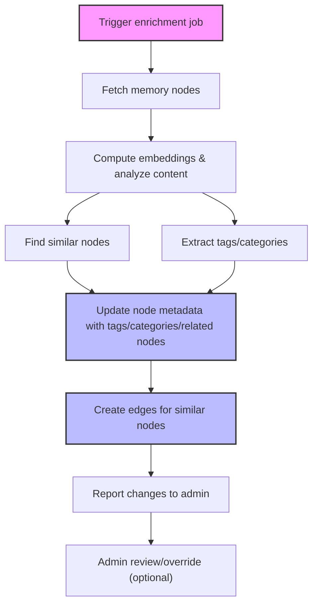

# User Story: Automated Memory Enrichment Worker (Tagging & Similarity)

## Motivation
As the memory system grows, it becomes harder to discover, group, and navigate related nodes. Manual tagging is tedious and error-prone. An automated enrichment worker ensures that all memory nodes are consistently categorized, tagged, and linked to similar content, improving search, recommendations, and knowledge graph quality.

---

## Actors
- **Admins:** Configure, trigger, and review enrichment jobs; adjust tagging logic as needed.
- **Memory Enrichment Worker:** Background service that analyzes nodes, assigns tags/categories, and links similar nodes.
- **Developers:** Benefit from improved organization and discoverability of memory nodes.
- **End Users:** Experience better search, filtering, and recommendations.

---

## Preconditions
- Memory nodes exist in the database, accessible via API or direct DB access.
- Each node has content and a `meta` field for storing tags/categories.
- Embedding model or LLM is available for semantic analysis.
- Worker can update node metadata and create edges/links between nodes.

> **Schema Note:**
> - If you want categories/tags to be first-class, queryable fields (not just in `meta`), add them as explicit columns (e.g., JSONB arrays) to your memory node model/table.
> - If you only need them for internal enrichment and don't need to filter/query by them at the DB/API level, you can store them in the `meta` field.

---

## Step-by-Step Actions

1. **Trigger:**  
   - Admin triggers an enrichment job (manually or on a schedule), or the worker runs periodically.

2. **Fetch Nodes:**  
   - Worker retrieves a batch of memory nodes (all, new, or recently updated).

3. **Analyze Content:**  
   For each node:
   - **Compute Embeddings:** Generate or retrieve vector embeddings for semantic similarity.
   - **Find Similar Nodes:** Compare embeddings to find related nodes above a similarity threshold.
   - **Extract Tags/Categories:** Use LLM, keyword extraction, or rules to suggest tags/categories based on content.
   - **Detect Duplicates:** Optionally, flag or merge near-duplicate nodes.

4. **Update Metadata:**  
   - Add or update `tags`, `categories`, or `related_nodes` in the node's `meta` field (or explicit columns if present).
   - Optionally, add a `similarity_score` or `cluster_id`.

5. **Create Edges:**  
   - For highly similar nodes, create explicit edges/links in the knowledge graph for navigation.

6. **Notify/Admin Review:**  
   - Optionally, generate a report of changes for admin review (new tags, clusters, flagged duplicates).

7. **Repeat:**  
   - Worker continues with next batch or waits for next trigger.

---

## Expected Outcomes
- All memory nodes have up-to-date tags and categories.
- Similar nodes are linked for easy navigation.
- Duplicates are flagged or merged.
- Search and recommendations are improved for all users.

---

## Best Practices
- Run enrichment after major imports, on a schedule, or after significant content changes.
- Allow admins to override or edit tags/categories.
- Log all changes for auditability.
- Use efficient batching to avoid overloading the system.
- Tune similarity thresholds and tagging logic based on feedback.

---

## Example Job Payload
```json
{
  "scope": "all",           // or "new", "namespace:xyz", etc.
  "dry_run": false,         // if true, only report changes
  "similarity_threshold": 0.85,
  "max_tags": 5
}
```

---

## Sample Workflow Diagram (Mermaid)


---

## Rationale
Automating enrichment ensures the memory system remains organized and useful as it scales, without relying on manual curation. It enables smarter search, recommendations, and knowledge graph navigation for all users. 