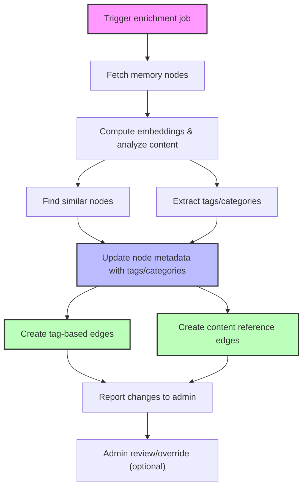

# User Story: Automated Memory Enrichment Worker (Tagging, Categories & Edge Creation)

## Motivation
As the memory system grows, it becomes harder to discover, group, and navigate related nodes. Manual tagging is tedious and error-prone. An automated enrichment worker ensures that all memory nodes are consistently categorized, tagged, and linked to similar content, improving search, recommendations, and knowledge graph quality. The addition of automatic edge creation transforms isolated memory islands into a connected knowledge graph.

---

## Actors
- **Admins:** Configure, trigger, and review enrichment jobs; adjust tagging logic as needed.
- **Memory Enrichment Worker:** Background service that analyzes nodes, assigns tags/categories, and creates edges between related nodes.
- **Developers:** Benefit from improved organization and discoverability of memory nodes.
- **End Users:** Experience better search, filtering, recommendations, and knowledge discovery.

---

## Preconditions
- Memory nodes exist in the database, accessible via API or direct DB access.
- Each node has content and explicit `tags` and `categories` columns.
- Embedding model or LLM is available for semantic analysis.
- Worker can update node metadata and create edges/links between nodes.

---

## Step-by-Step Actions

1. **Trigger:**  
   - Admin triggers an enrichment job (manually or on a schedule), or the worker runs periodically.

2. **Fetch Nodes:**  
   - Worker retrieves a batch of memory nodes (all, new, or recently updated).

3. **Analyze Content:**  
   For each node:
   - **Compute Embeddings:** Generate or retrieve vector embeddings for semantic similarity.
   - **Find Similar Nodes:** Compare embeddings to find related nodes above a similarity threshold.
   - **Extract Tags/Categories:** Use LLM, keyword extraction, or rules to suggest tags/categories based on content.
   - **Detect Duplicates:** Optionally, flag or merge near-duplicate nodes.

4. **Update Metadata:**  
   - Add or update `tags` and `categories` in the node's database columns.
   - Optionally, add a `similarity_score` or `cluster_id`.

5. **Create Edges:**  
   - **Tag-Based Edges:** Create edges between nodes that share tags (configurable similarity threshold).
   - **Content Reference Edges:** Create edges when one node's content references another node's ID.
   - **Semantic Similarity Edges:** Create edges between semantically similar nodes (future enhancement).

6. **Notify/Admin Review:**  
   - Optionally, generate a report of changes for admin review (new tags, categories, edges, flagged duplicates).

7. **Repeat:**  
   - Worker continues with next batch or waits for next trigger.

---

## Expected Outcomes
- All memory nodes have up-to-date tags and categories.
- Related nodes are automatically linked via edges for easy navigation.
- Search results include connected knowledge discovered via edges.
- Knowledge graph becomes navigable and discoverable.
- Duplicates are flagged or merged.

---

## Best Practices
- Run enrichment after major imports, on a schedule, or after significant content changes.
- Always run with `DRY_RUN=true` first to preview changes.
- Allow admins to override or edit tags/categories.
- Log all changes for auditability.
- Use efficient batching to avoid overloading the system.
- Tune similarity thresholds and tagging logic based on feedback.
- Monitor edge creation to avoid spam (limit edges per node).

---

## Example Job Payload
```json
{
  "scope": "all",                    // or "new", "namespace:xyz", etc.
  "dry_run": false,                  // if true, only report changes
  "similarity_threshold": 0.85,
  "max_tags": 5,
  "create_edges": true,              // enable edge creation
  "edge_types": ["tag_based", "content_ref"]  // types of edges to create
}
```

---

## Sample Workflow Diagram (Mermaid)


## Makefile Usage
Trigger the memory enrichment worker using the following Makefile targets:

```bash
# Process all memory nodes with edge creation (default)
make -f Makefile.ai memory-trigger-enrichment SCOPE=all

# Process only new nodes with edge creation
make -f Makefile.ai memory-trigger-enrichment SCOPE=new

# Process specific namespace with edge creation
make -f Makefile.ai memory-trigger-enrichment SCOPE=namespace:docs

# Preview enrichment without applying changes (recommended first)
make -f Makefile.ai memory-trigger-enrichment SCOPE=all DRY_RUN=true

# Disable edge creation
make -f Makefile.ai memory-trigger-enrichment SCOPE=all CREATE_EDGES=false

# Create only tag-based edges
make -f Makefile.ai memory-trigger-enrichment SCOPE=all EDGE_TYPES=tag_based

# Create only content reference edges
make -f Makefile.ai memory-trigger-enrichment SCOPE=all EDGE_TYPES=content_ref

# Monitor worker logs during enrichment
make -f Makefile.ai memory-worker-logs

# Check enrichment status and queue
make -f Makefile.ai memory-status-report

# Explore connected knowledge after enrichment
make -f Makefile.ai memory-traverse-multi-hop NODE_ID="your-node-id" --hops 2
```

**Best Practice:** Always run with `DRY_RUN=true` first to preview what tags, categories, and edges will be added before applying changes.

---

## Edge Types

### Tag-Based Edges (`shared_tag`)
- **Creation:** When nodes share tags above a similarity threshold
- **Metadata:** Includes shared tags and similarity ratio
- **Use Case:** Discover related content by topic/tag

### Content Reference Edges (`content_ref`)
- **Creation:** When one node's content mentions another node's ID
- **Metadata:** Includes reference type and matched pattern
- **Use Case:** Track explicit references between nodes

### Future Edge Types
- **Semantic Similarity:** Based on embedding similarity
- **Temporal:** Based on creation time proximity
- **Author-Based:** Based on content authorship
- **Custom Rules:** User-defined relationship patterns

---

## Search Enhancement Examples

### Before Edge Creation:
```python
# Search: "docker deployment"
# Results: Only exact matches
["Docker deployment guide", "Production deployment steps"]
```

### After Edge Creation:
```python
# Search: "docker deployment"
# Results: Direct matches + connected knowledge
[
    "Docker deployment guide",                    # Direct match
    "Kubernetes vs Docker Swarm",                # Connected via "containerization" tag
    "CI/CD pipeline setup",                      # Connected via "deployment" category
    "Infrastructure as code patterns",           # Connected via "devops" tag
    "Production monitoring best practices"       # Connected via "infrastructure" tag
]
```

---

## Rationale
Automating enrichment and edge creation ensures the memory system remains organized and useful as it scales, without relying on manual curation. It enables smarter search, recommendations, and knowledge graph navigation for all users. The connected knowledge graph transforms isolated memories into a navigable network of related information. 