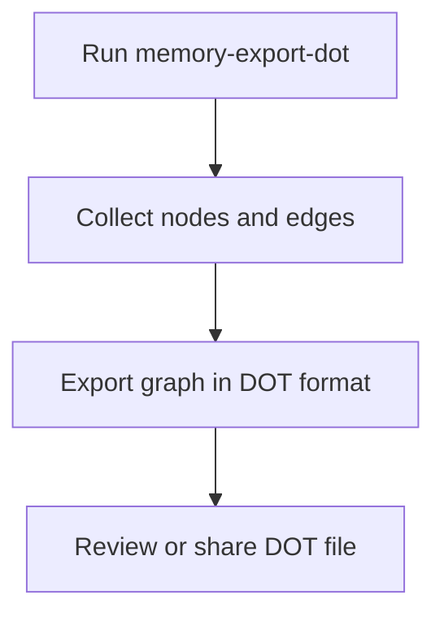

# User Story: memory-export-dot

## Motivation
To enable users and systems to export the memory knowledge graph in DOT format for visualization, analysis, or sharing.

## Actors
- Developers
- Project maintainers
- AI assistants

## Preconditions
- The project includes a memory-export-dot target or script.
- The knowledge base contains nodes and edges.

## Step-by-Step Actions
1. Run the memory-export-dot target:
   ```bash
   make memory-export-dot
   ```
2. The system collects all nodes and edges from the knowledge base.
3. The system exports the graph in DOT format.
4. The user reviews or shares the exported DOT file.

## Expected Outcomes
- The memory knowledge graph is exported in DOT format.
- The data can be used for visualization, analysis, or sharing.

## Best Practices
- Keep the export up to date with the latest data.
- Use clear labels and structure for readability.
- Save exported files for documentation or onboarding.

## Workflow Diagram


