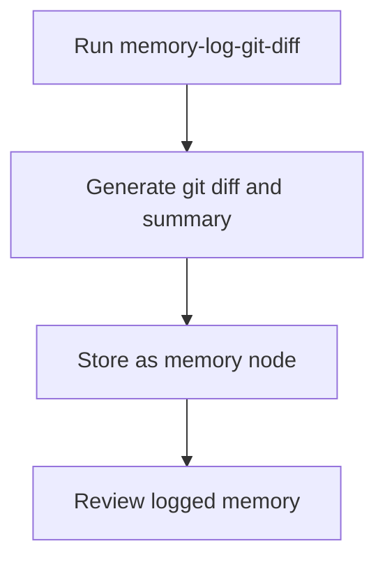

# User Story: memory-log-git-diff

## Motivation
To enable automated logging of git diffs and code changes as memory nodes, supporting traceability, onboarding, and AI-powered code review.

## Actors
- Developers
- Project maintainers
- CI/CD systems

## Preconditions
- The project includes a memory-log-git-diff target or script.
- The Memory API and git are available.

## Step-by-Step Actions
1. Run the memory-log-git-diff target:
   ```bash
   make memory-log-git-diff
   ```
2. The system generates a git diff and summarizes it using the LLM.
3. The summary and diff are stored as a memory node via the Memory API.
4. The user or system reviews the logged memory node.

## Expected Outcomes
- Git diffs and summaries are logged as memory nodes.
- The data is available for onboarding, review, or analysis.

## Best Practices
- Run memory logging after significant code changes.
- Review logged memory nodes for accuracy.
- Automate logging in CI/CD pipelines.

## Workflow Diagram


