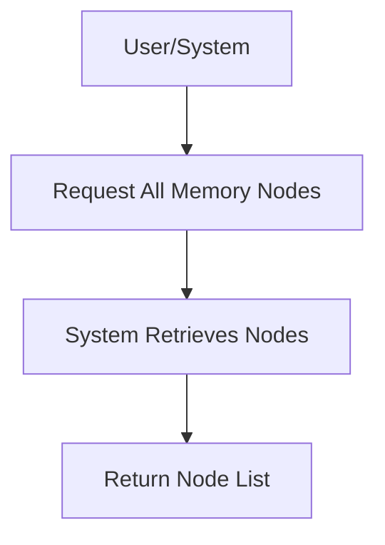

# User Story: /memory/nodes

## Motivation
To provide users and systems with the ability to list all memory nodes in the knowledge base, supporting exploration, analysis, and automation.

## Actors
- End users
- Developers
- AI assistants

## Preconditions
- The knowledge base contains memory nodes.
- The user or system has access to the /memory/nodes endpoint.

## Step-by-Step Actions
1. User or system sends a request to /memory/nodes.
2. The system retrieves all memory nodes from the knowledge base.
3. The system returns a list of memory nodes.

## Expected Outcomes
- The requester receives a list of all memory nodes.
- The data can be used for analysis, visualization, or further queries.

## Best Practices
- Support filtering and pagination for large datasets.
- Include relevant metadata for each node.
- Log access for auditing.

## Workflow Diagram

