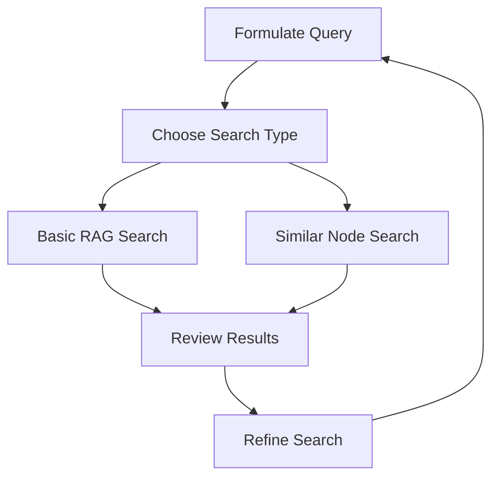

# User Story: Using Memory RAG Search

## Motivation
As a developer or user of the AI IDE API, I want to search through the memory system using natural language queries and find similar content, enabling me to discover relevant information and patterns in the knowledge base.

## Actors
- Developers
- Project Teams
- AI Assistants
- Documentation Writers

## Preconditions
- Access to the AI IDE API
- Authentication token (`.api_admin_token` or `.apitoken`)
- Makefile.ai available in your project

## Step-by-Step Guide

### 1. Basic RAG Search 🔍

The `memory-rag-search` target allows you to search the memory system using natural language queries:

```bash
# Basic search with default parameters
make -f Makefile.ai memory-rag-search QUERY="how to set up RabbitMQ"

# Search with custom namespace and number of results
make -f Makefile.ai memory-rag-search \
  QUERY="deployment best practices" \
  NAMESPACE="documentation" \
  TOP_K=10

# Search with custom auth token
make -f Makefile.ai memory-rag-search \
  QUERY="error handling patterns" \
  AUTH_TOKEN="your-token-here"
```

### 2. Finding Similar Nodes 🔄

The `memory-rag-search-similar` target helps you find nodes similar to a specific one:

```bash
# Find similar nodes to a specific node
make -f Makefile.ai memory-rag-search-similar \
  NODE_ID="your-node-id"

# Get more similar results
make -f Makefile.ai memory-rag-search-similar \
  NODE_ID="your-node-id" \
  TOP_K=10
```

### 3. Authentication Setup 🔐

The search targets require authentication. You have three options:

1. Create `.api_admin_token` file:
   ```bash
   echo "your-admin-token" > .api_admin_token
   ```

2. Create `.apitoken` file:
   ```bash
   echo "your-api-token" > .apitoken
   ```

3. Pass token directly:
   ```bash
   make -f Makefile.ai memory-rag-search \
     QUERY="your query" \
     AUTH_TOKEN="your-token"
   ```

### 4. Common Search Patterns 📋

Here are some effective search patterns:

```bash
# Search for specific code patterns
make -f Makefile.ai memory-rag-search \
  QUERY="how to implement error handling in FastAPI" \
  NAMESPACE="code"

# Search documentation
make -f Makefile.ai memory-rag-search \
  QUERY="deployment workflow documentation" \
  NAMESPACE="docs"

# Search recent changes
make -f Makefile.ai memory-rag-search \
  QUERY="recent changes to authentication system" \
  NAMESPACE="progress_reports"

# Find related content
make -f Makefile.ai memory-rag-search-similar \
  NODE_ID="node-with-interesting-content"
```

## Best Practices 💡

1. **Query Formulation**
   - Be specific in your queries
   - Include relevant technical terms
   - Use natural language questions
   - Consider the namespace context

2. **Namespace Usage**
   - Use appropriate namespaces for context
   - Default is `progress_reports`
   - Common namespaces: `code`, `docs`, `research`

3. **Result Management**
   - Start with default TOP_K (5)
   - Increase TOP_K for broader searches
   - Use jq for custom result filtering

4. **Authentication**
   - Keep tokens secure
   - Prefer token files over command line
   - Rotate tokens regularly

## Troubleshooting Guide 🔍

### Common Issues and Solutions

1. **Authentication Errors**
   ```bash
   # Check token file exists
   ls -la .api_admin_token .apitoken
   
   # Verify token content
   cat .api_admin_token
   ```

2. **No Results**
   - Try broader search terms
   - Check namespace spelling
   - Increase TOP_K value
   - Verify content exists in namespace

3. **Connection Issues**
   - Check API endpoint availability
   - Verify network connectivity
   - Check for rate limiting

## Expected Outcomes

After using the RAG search targets, you should:
- Find relevant information quickly
- Discover related content
- Access historical context
- Navigate the knowledge base effectively

## Workflow Diagram



## Quick Reference

```bash
# Basic search
make -f Makefile.ai memory-rag-search QUERY="your query"

# Advanced search
make -f Makefile.ai memory-rag-search \
  QUERY="your query" \
  NAMESPACE="your-namespace" \
  TOP_K=10

# Similar nodes
make -f Makefile.ai memory-rag-search-similar \
  NODE_ID="your-node-id"
```

## Next Steps
1. Set up persistent token authentication
2. Create search aliases for common queries
3. Integrate with your development workflow
4. Create custom result processing scripts

---

**Remember:** The memory system learns and grows with use. Regular searches help improve the system's understanding and connections between content.

Need help? Check the [Memory System Documentation](docs/MEMORY_SYSTEM.md) or contact your system administrator.

## What Fields Are Searched?

As of June 2025, RAG search covers the following fields when searching for relevant memory nodes:

- **content** (main body of the memory node)
- **meta** (additional metadata, if present)
- **tags** (list of tags, if present)
- **categories** (list of categories, if present)

When a memory node is created, the embedding is generated from a combination of all these fields. This means that RAG search will semantically match on any information present in content, meta, tags, or categories.

**Note:** For older nodes, only the content field may be indexed unless they are re-embedded. 