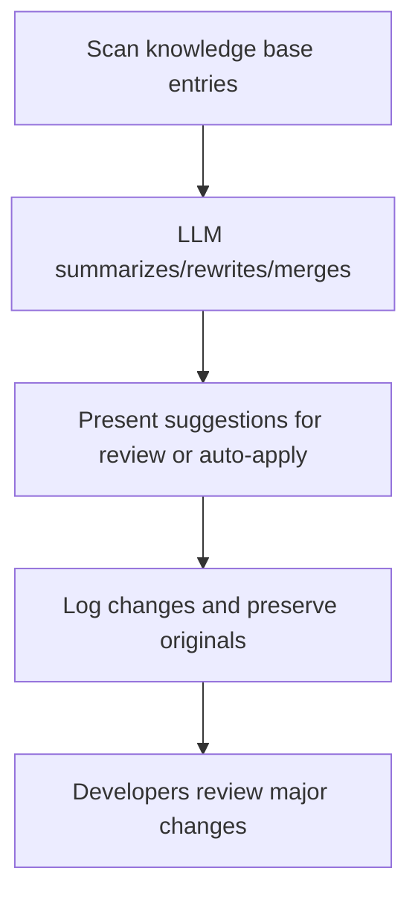

# User Story: Memory Refinement Worker

## Motivation
To ensure the knowledge base remains clear, consistent, and actionable, the system should automatically improve and clarify entries. This reduces ambiguity, merges redundant information, and enhances the overall quality of documentation and rules.

## Actors
- Automation system (runs the refinement worker)
- LLM (rewrites, summarizes, or merges entries)
- Developers (review and approve suggested changes)

## Preconditions
- The knowledge base contains rules and memories, some of which may be unclear, redundant, or inconsistent.
- LLM integration is available for text processing and rewriting.

## Step-by-Step Actions
1. The worker scans all entries in the knowledge base.
2. It uses the LLM to:
   - Summarize lengthy or rambling entries
   - Rewrite ambiguous or inconsistent rules for clarity
   - Suggest merging similar or overlapping entries
3. The worker presents changes as suggestions for developer review, or auto-applies minor improvements with logging.
4. All changes are logged, and original entries are preserved for audit/history.

### Workflow Diagram


## Expected Outcomes
- The knowledge base is easier to read, more consistent, and free of redundant or unclear entries.
- Developers can review and approve major changes, ensuring quality control.

## Best Practices
- Keep original entries for audit/history and allow rollback if needed.
- Allow human review before applying major rewrites or merges.
- Schedule regular refinement runs and allow for manual triggering.
- Log all changes and provide clear rationales for each refinement.
- Save refinement logs for further analysis:
  ```bash
  make -f Makefile.ai-memory memory-refinement-worker > refinement_worker_output.txt
  ```

## Troubleshooting
- **LLM errors or timeouts:** Check system logs and LLM service health.
- **Unintended rewrites:** Review logs and use rollback to restore originals.
- **Merge conflicts:** Present conflicts for manual resolution by developers.
- **Worker not running:** Ensure the automation system is scheduled and has access to the knowledge base. 