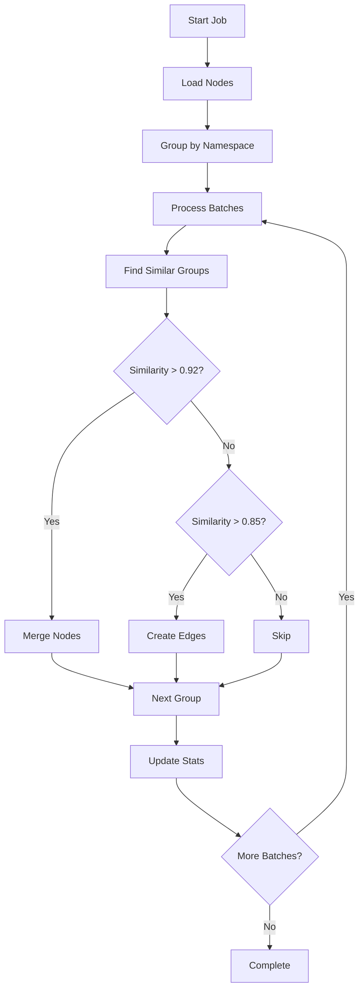

# Memory Similarity Pruning Worker

## Overview
The Memory Similarity Pruning Worker identifies and handles similar or duplicate memory nodes using multiple similarity measures. It can either merge highly similar nodes or create edges between related nodes, helping to maintain a clean and well-connected knowledge graph.

## Motivation
As the memory system grows, similar or duplicate content can accumulate, leading to:
- Redundant information
- Fragmented knowledge
- Reduced search quality
- Increased storage and processing overhead

This worker helps maintain memory hygiene by automatically identifying and handling similar content.

## Prerequisites
- Running RabbitMQ instance
- Access to memory database
- Python dependencies: numpy, sqlalchemy

## Process Flow

1. **Job Initialization:**
   ```json
   {
     "scope": "all",           // or "new", "namespace:xyz"
     "dry_run": false,         // if true, only report changes
     "vector_similarity_threshold": 0.92,
     "content_similarity_threshold": 0.85,
     "tag_overlap_threshold": 0.7
   }
   ```

2. **Node Selection:**
   - Filter nodes based on scope
   - Group by namespace
   - Skip very short content (<50 chars)
   - Process in batches of 100 nodes

3. **Similarity Detection:**
   Uses multiple measures:
   - Vector similarity (50% weight)
     - Cosine distance between embeddings
     - Primary measure for semantic similarity
   - Content similarity (30% weight)
     - Sequence matching for text comparison
     - Catches minor variations and edits
   - Tag overlap (20% weight)
     - Shared tags and categories
     - Context-aware similarity

4. **Action Determination:**
   - If similarity > 0.92: Merge nodes
     - Keep newest node as primary
     - Combine tags and categories
     - Merge metadata
     - Add superseded_by references
   - If similarity > 0.85: Create edges
     - Bidirectional "similar_to" edges
     - Include similarity scores
     - Preserve both nodes

5. **Progress Tracking:**
   - Detailed logging
   - Statistics collection
   - Error handling
   - Dry run support

## Expected Outcomes
- Reduced redundancy in memory nodes
- Better connected knowledge graph
- Improved search quality
- Optimized storage usage

## Best Practices

1. **Regular Execution:**
   - Run after large imports
   - Schedule periodic cleanup
   - Process new nodes regularly

2. **Configuration:**
   - Start with default thresholds
   - Adjust based on results
   - Use dry runs for testing
   - Consider namespace-specific runs

3. **Monitoring:**
   - Review merge decisions
   - Track similarity patterns
   - Monitor error rates
   - Adjust thresholds if needed

4. **Performance:**
   - Use appropriate batch sizes
   - Run during low-usage periods
   - Monitor memory usage
   - Consider namespace partitioning

## Example Usage

1. **Process All Nodes:**
   ```python
   job = {
       "scope": "all",
       "dry_run": False
   }
   await process_similarity_pruning_job(job)
   ```

2. **Process New Nodes:**
   ```python
   job = {
       "scope": "new",
       "dry_run": True,  # Test run first
       "content_similarity_threshold": 0.90  # Stricter matching
   }
   await process_similarity_pruning_job(job)
   ```

3. **Process Specific Namespace:**
   ```python
   job = {
       "scope": "namespace:documentation",
       "vector_similarity_threshold": 0.95,
       "tag_overlap_threshold": 0.8
   }
   await process_similarity_pruning_job(job)
   ```

## Error Handling
- Graceful failure handling
- Transaction safety
- Detailed error logging
- Statistics tracking
- Retry mechanisms

## Monitoring and Metrics
The worker provides detailed statistics:
```json
{
    "status": "success",
    "stats": {
        "total_nodes": 1000,
        "similar_groups": 50,
        "merged_nodes": 30,
        "linked_nodes": 40,
        "errors": 2,
        "duration": 120.5
    }
}
```

## Workflow Diagram


## Related
- [Memory Enrichment Worker](memory_enrichment_worker.md)
- [Memory Cleanup Worker](memory_cleanup_worker.md)
- [Memory System](../MEMORY_SYSTEM.md)
- [Memory Hygiene](../MEMORY_HYGIENE_AND_CONFIDENCE.md) 