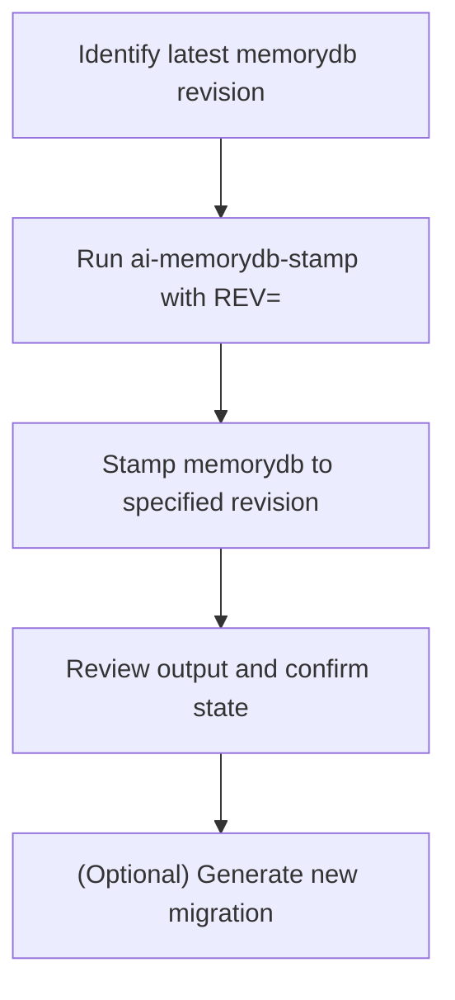

# User Story: memorydb-stamp-head (Stamp MemoryDB to a Specific Revision)

## Motivation
When the memorydb migration history becomes divergent, missing, or broken (e.g., after parallel development, lost migration files, or manual DB changes), developers need a safe, repeatable way to synchronize the memorydb schema with the latest available revision. Stamping the memorydb allows the team to recover from migration errors and keep development moving forward.

## Actors
- Developers: Resolve migration issues and synchronize memorydb schema state.
- CI/CD Systems: Ensure memorydb is at the correct revision for automated workflows.
- Project Maintainers: Document and review stamping operations for traceability.

## Preconditions
- Docker and Docker Compose are installed and running.
- The memorydb container is up and available.
- The correct revision hash is known (from `migrations_memorydb/versions/`).

## Step-by-Step Actions
1. Identify the latest available revision in `migrations_memorydb/versions/` (e.g., `20240527_fix_memory_vector_uuids`).
2. Run the memorydb stamp target:
   ```bash
   make -f Makefile.ai-db ai-memorydb-stamp REV=<revision>
   ```
   Replace `<revision>` with the actual revision hash.
3. The target stamps the memorydb with the specified revision, skipping any missing or broken migrations.
4. Review the output for confirmation or errors.
5. Optionally, generate a new migration to capture any missing schema changes.

### Workflow Diagram


## Expected Outcomes
- The memorydb is stamped to the specified revision.
- Migration errors due to missing or divergent revisions are resolved.
- Development and CI/CD workflows can proceed without downtime.

## Best Practices
- Only use stamping if you are confident the memorydb schema matches the intended state.
- Always document the use of stamping in PRs or team notes for traceability.
- After stamping, consider generating a new migration to capture any missing schema changes.
- Save stamp output for further analysis:
  ```bash
  make -f Makefile.ai-db ai-memorydb-stamp REV=<revision> > memorydb_stamp_output.txt
  ```

## Troubleshooting
- **Revision not found:** Double-check the revision hash and ensure the migration file exists in `migrations_memorydb/versions/`.
- **Stamp not applied:** Review the output for errors and ensure the memorydb container is running and accessible.
- **Schema mismatch:** If errors persist, verify the schema matches the intended state and consider generating a new migration.
- **Output errors:** Check for DB connection issues or Alembic configuration problems. 