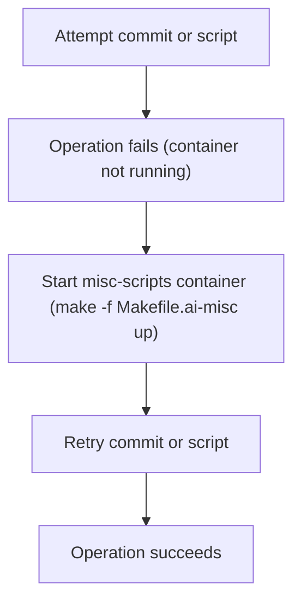

# User Story: Dev misc-scripts Container Requirement for Project Map and Commits

## Motivation
To ensure that project map updates and certain commit hooks/scripts function correctly, the dev misc-scripts container must be running. Forgetting to start this container can lead to failed commits, missing project map updates, or broken automation.

## Actors
- Developers working on the AI IDE project
- CI/CD systems that rely on project map or misc-scripts automation

## Preconditions
- Developer is making changes that trigger project map updates or use scripts in misc_scripts/
- The dev misc-scripts container is not running

## Step-by-Step Actions
1. Attempt to commit changes or run scripts that update the project map.
2. If the operation fails, start the dev misc-scripts container:
   ```bash
   make -f Makefile.ai-misc up
   # or
   docker compose up -d misc-scripts
   ```
3. Retry the commit or script operation.
4. Confirm that the project map or automation completes successfully.

### Workflow Diagram


## Expected Outcomes
- Project map updates and commit hooks work as expected when the dev misc-scripts container is running.
- Developers are aware of this requirement and avoid confusion or failed operations.

## Best Practices
- Add `make -f Makefile.ai-misc up` to your development startup routine.
- Check container status with `make -f Makefile.ai-misc misc-status`.
- Save output for further analysis:
  ```bash
  make -f Makefile.ai-misc misc-status > misc_scripts_status.txt
  ```

## Troubleshooting
- **Operation still fails:** Ensure the misc-scripts container is healthy and logs show no errors.
- **Container not starting:** Check Docker logs for errors and ensure no port conflicts.
- **Automation not working:** Verify the correct Makefile target is used and the container is up. 