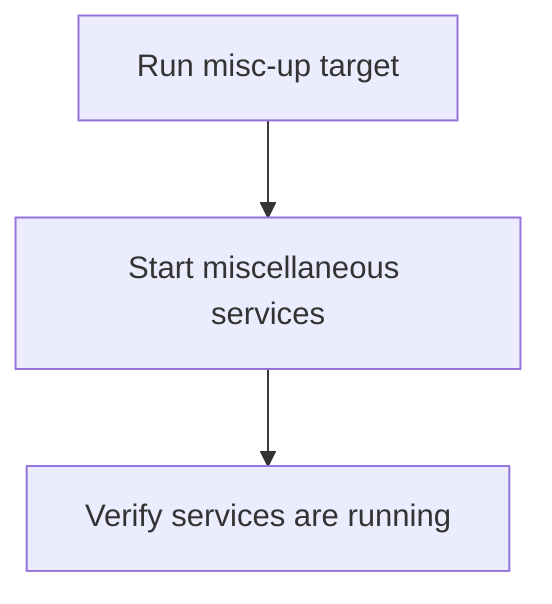

# User Story: misc-up

## Motivation
To provide a convenient way to start up miscellaneous or supporting services required for development, testing, or automation.

## Actors
- Developers
- Project maintainers
- CI/CD systems

## Preconditions
- The project includes a misc-up target in the Makefile or a script for starting services.

## Step-by-Step Actions
1. Run the misc-up target:
   ```bash
   make -f Makefile.ai-misc misc-up
   ```
2. The system starts all defined miscellaneous services (e.g., mock servers, helpers).
3. The user verifies that services are running as expected.

## Expected Outcomes
- All required miscellaneous services are started and available.
- Developers can proceed with development or testing.

## Best Practices
- Document all services started by misc-up.
- Ensure services are idempotent and can be restarted safely.
- Log service status and output for troubleshooting.

## Workflow Diagram


